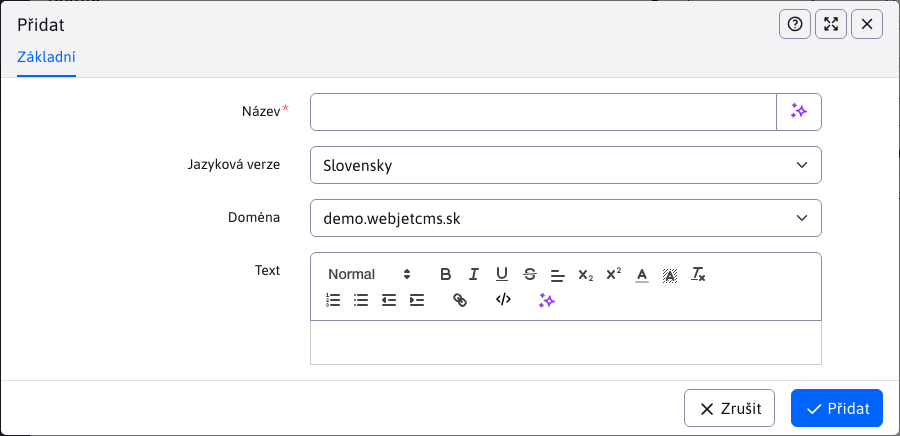
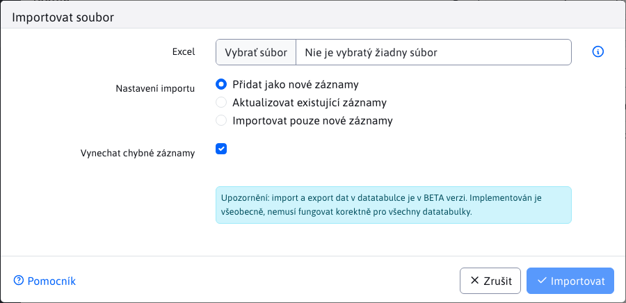

# Tooltip

V okně Tooltip můžete definovat text nápovědy/vysvětlení pro odborné výrazy, které se zobrazují na webové stránce. Obvykle se zobrazují jako text nápovědy v "bublině", když kurzor přejíždí nad odborným termínem. Definování Tooltipu prostřednictvím aplikace umožňuje globálně upravovat vysvětlení těchto odborných termínů na jednom místě. Při úpravě se pak změní ve všech použitích najednou.


## Vytvoření nápovědy k nástroji


Kliknutím na ikonu "Přidat" zobrazíte dialogové okno pro vytvoření nápovědy.

V tomto okně definujete následující parametry:
- Název - jedinečný identifikátor výrazu Tooltip/expert
- Jazykové verze - SK / CZ / EN ...
- Doména - možnost, na které doméně má být použit Tooltip
- Text - textový obsah nápovědy



Dialogové okno pro úpravu existujícího tipu vypadá stejně.

V tabulce máte k dispozici tlačítko "Duplikovat", pokud chcete zkopírovat existující tip nástroje a uložit jej pod jiným názvem, pro jinou jazykovou verzi nebo pro jinou doménu.

## Import popisků nástrojů

Na kartě Import je formulář pro nahrávání excelu s popisky. Formát excelu by měl být totožný s formátem, který získáte při exportu aktuálního seznamu do Excelu. Ikona exportu se nachází vlevo nahoře.



## Vložení nápovědy do stránky

Bublinu nad specializovaným výrazem můžete vytvořit přímo v editoru tak, že vyberete specializovaný výraz a kliknete na ikonu :
-  Vložit nápovědu

Otevře se dialogové okno a do pole Tooltip (klíč) zadejte začátek specializovaného výrazu. Server načte seznam výrazů obsahujících zadaný text, kliknutím myši vyberte přesný výraz:


Kód HTML stránky pak bude obsahovat kód typu:

```html
<p>Toto je <span class="wjtooltip" title="!REQUEST(wjtooltip:TestFinal)!">odborný výraz</span>.</p>
```

který se zpracuje na serveru a vloží se skutečný text. Pro pěkné zobrazení "bubliny" je třeba do šablony (nebo prostřednictvím skriptů aplikace, v horším případě prostřednictvím pole HTML kódu v záhlaví v editoru stránky na kartě Šablona) přidat následující kód JavaScriptu:

```javascript
<script type="text/javascript">
    $(document).ready(function() {
        $(".wjtooltip").tooltip();
    });
</script>
```


používá se rozšíření [Bootstrap Tooltip](https://getbootstrap.com/docs/4.0/components/tooltips/).
