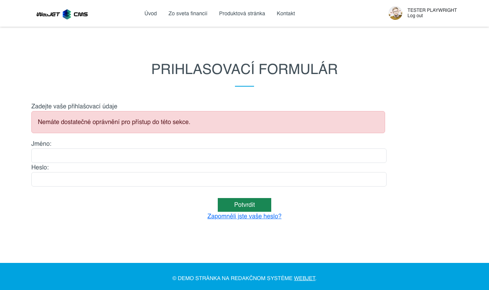

# Uživatelé

Aplikace umožňuje snadno vložit informace o přihlášeném uživateli na stránku, včetně jména, emailu, adresy a volitelných polí. Kromě toho umožňuje vložit přihlašovací formulář do zabezpečené sekce nebo registrační formulář pro nové uživatele.

## Nastavení aplikace

### Nastavení pro Registrační formulář:

Zadejte údaje pro registraci uživatele. Pro standardní nastavení můžete ponechat hodnoty, které jsou přednastavené.

- **Uživatelské skupiny**
- **Zobrazená pole**
- **Povinná pole**

#### Další nastavení:
- **DocID stránky po registraci**: Stránka, která se zobrazí po úspěšné registraci (ponechte prázdné, pokud chcete uživatele nechat na původní stránce).
- **Notifikace o registraci**: E-mailová adresa, na kterou bude zaslána notifikace o nové registraci (ponechte prázdné, pokud nechcete zasílat notifikaci).
- **Vyžadovat potvrzení e-mailové adresy**: Uživateli bude zaslán potvrzující e-mail s odkazem na ověření adresy. Pokud je e-mail třeba schválit, potvrzující e-mail se nezašle.
- **DocID stránky s e-mailem o schválení**: Stránka, ze které bude uživateli zaslán e-mail v případě potřeby schválení (ponechte prázdné pro standardní zprávu).
- **Automatické přihlášení po registraci**: Po úspěšné registraci bude uživatel automaticky přihlášen.
- **Odeslat přes AJAX**: Formulář bude odeslán na pozadí bez obnovení stránky (nelze odesílat fotografie).
- **Použij vlastní pole**:
  - **Použij pole A**: Popis k poli A.
  - **Použij pole B**: Popis k poli B.
  - **Použij pole C**: Popis k poli C.
  - **Použij pole D**: Popis k poli D.
  - **Použij pole E**: Popis k poli E.

### Nastavení pro Přihlašovací formulář:

#### Uživatelské skupiny:
- Skupiny, do kterých se může uživatel přihlásit nebo z nich odhlásit během registrace.

## Zobrazení aplikace

### Registrační formulář

### Přihlašovací formulář

### Linka pro autorizaci e-mailu

### Zapomenuté heslo

### Jméno

