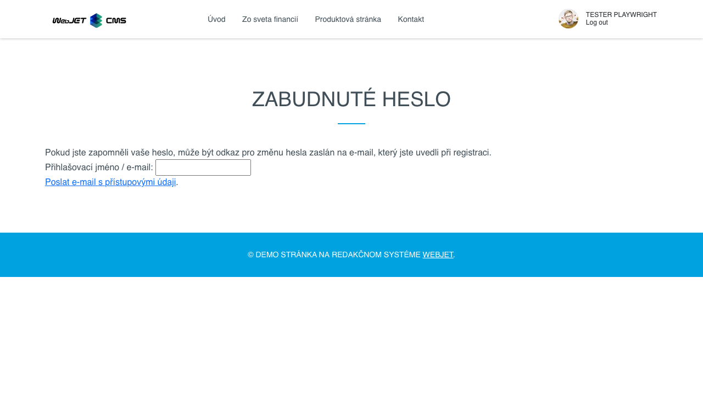

# Uživatelé

Aplikace umožňuje snadno vložit na stránku informace o přihlášeném uživateli, včetně jména, e-mailu, adresy a volitelných polí. Kromě toho umožňuje vložit přihlašovací formulář do zabezpečené sekce nebo registrační formulář pro nové uživatele.

## Nastavení aplikace

### Nastavení registračního formuláře:

Zadejte své registrační údaje. Pro výchozí nastavení můžete ponechat přednastavené hodnoty.

- **Skupiny uživatelů**
- **Zobrazená pole**
- **Povinná pole**

#### Další nastavení:
- **Stránka DocID po registraci**: Stránka, která se zobrazí po úspěšné registraci (ponechte prázdnou, pokud chcete uživatele ponechat na původní stránce).
- **Oznámení o registraci**: E-mailová adresa, na kterou bude zasláno oznámení o nové registraci (pokud nechcete být informováni, nechte prázdnou).
- **Vyžadovat potvrzení e-mailové adresy**: Uživateli bude zaslán potvrzovací e-mail s odkazem na ověření adresy. Pokud je třeba e-mail schválit, potvrzovací e-mail nebude odeslán.
- **Stránka DocID se schvalovacím e-mailem**: Stránka, ze které bude uživateli zaslán e-mail, pokud je vyžadováno schválení (pro standardní zprávu ponechte prázdné).
- **Automatické přihlášení po registraci**: Po úspěšné registraci bude uživatel automaticky přihlášen.
- **Odesílání přes AJAX**: Formulář se odešle na pozadí bez obnovení stránky (nelze odeslat žádné fotografie).
- **Použití vlastních polí**:
  - **Použijte pole A** Popis pole A.
  - **Použijte pole B** Popis pole B.
  - **Použijte pole C** Popis pole C.
  - **Použijte pole D** Popis pole D.
  - **Použijte pole E** Popis pole E.

### Nastavení přihlašovacího formuláře:

#### Skupiny uživatelů:
- Skupiny, ke kterým se uživatel může připojit nebo odpojit během registrace.

## Zobrazení aplikace

### Registrační formulář

### Registrační formulář

### E-mailový autorizační řádek

### Zapomenuté heslo

### Název

