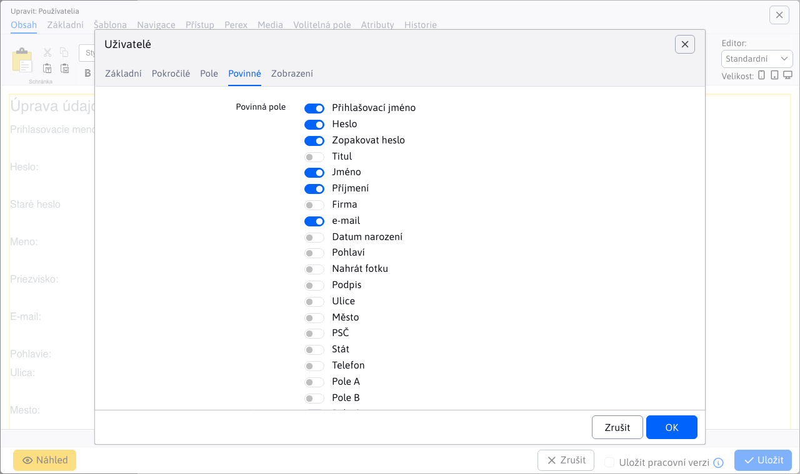

# Uživatelé

Aplikace umožňuje snadno vložit informace o přihlášeném uživateli na stránku, včetně jména, emailu, adresy a volitelných polí. Kromě toho umožňuje vložit přihlašovací formulář do zabezpečené sekce nebo registrační formulář pro nové uživatele.

## Nastavení aplikace

Jaké informace se vloží na stránku se udává výběrem **Vložit pole** z karty **Základní**. Pokud zvolíte možnost **Registrační formulář** nebo **Přihlašovací formulář** zobrazí se dodatečná nastavení/karty, která si následně popíšeme.

### Registrační formulář

**Registrační formulář** je přednastavená hodnota pro aplikaci. Nabízí široké možnosti nastavení údajů pro registraci uživatele. Pro standardní nastavení můžete ponechat hodnoty tak jak jsou přednastaveny.

Možnosti nastavení:
- **Uživatelské skupiny**
- **Skupiny uživatelů**, skupiny, do kterých se může uživatel přihlásit nebo z nich odhlásit během registrace
- **E-mailová adresa musí být unikátní**
- **DocID stránky**, stránka, která se zobrazí po úspěšné registraci (ponechte prázdné, pokud chcete uživatele nechat na původní stránce)
- **Notifikace o registraci se zašle na e-mail**, e-mailová adresa, na kterou bude zaslána notifikace o nové registraci (ponechte prázdné, pokud nechcete zasílat notifikaci)
- **Vyžadovat potvrzení e-mailové adresy**, uživateli bude zaslán potvrzující e-mail s odkazem na ověření adresy. Pokud je e-mail třeba schválit, potvrzující e-mail se nezašle.
- **DocID stránky s textem e-mailu**, stránka, ze které bude uživateli zaslán e-mail v případě potřeby schválení (ponechte prázdné pro standardní zprávu).
- **Po registraci uživatele automaticky přihlásit**, po úspěšné registraci bude uživatel automaticky přihlášen
- **Odeslat přes AJAX**, formulář bude odeslán na pozadí bez obnovení stránky (nelze odesílat fotografie)

Pro **Registrační formulář** se dodatečně ještě zobrazí karty **Zobrazeno** a **Povinné**.

#### Karta - Pole

V kartě Pole si můžete zvolit pole, která se zobrazí v registračním formuláři.

#### Karta - Povinné

V kartě Povinné si můžete zvolit pole, která se při odeslání formuláře budou vyžadovat.

!>**Upozornění:** pokud nějaké pole nastavíte jako povinné, aplikace nekontroluje, zda bylo také nastaveno jako viditelné. Na tohle si musíte dát pozor.

### Přihlašovací formulář

Pro přihlašovací formulář můžete nastavit pouze jediný parametr a to:
- **Uživatelské skupiny**, v případě nezvolení žádné možnosti se skupiny vygenerují podle stránky, na kterou se uživatel, pomocí sociálních sítí, pokouší přihlásit

## Zobrazení aplikace

### Registrační formulář

### Přihlašovací formulář

### Linka pro autorizaci e-mailu

### Zapomenuté heslo

### Jméno

