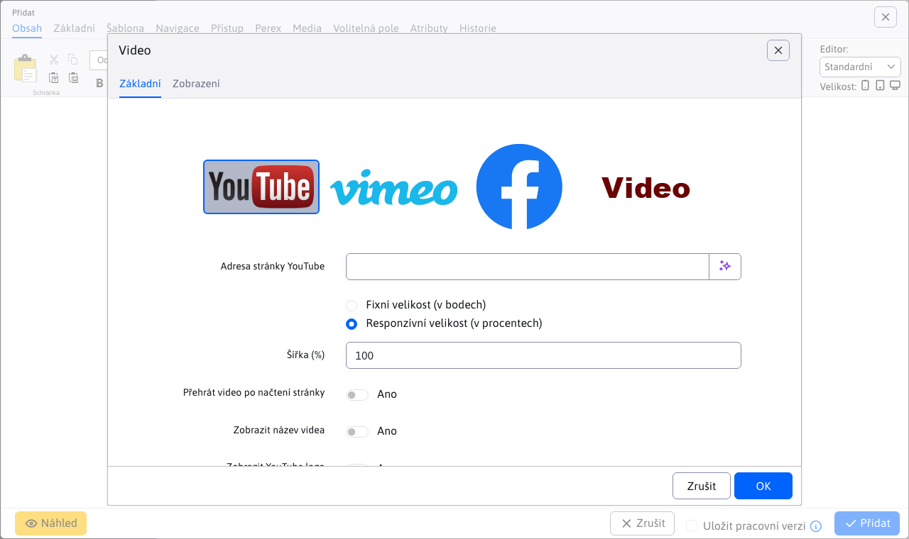
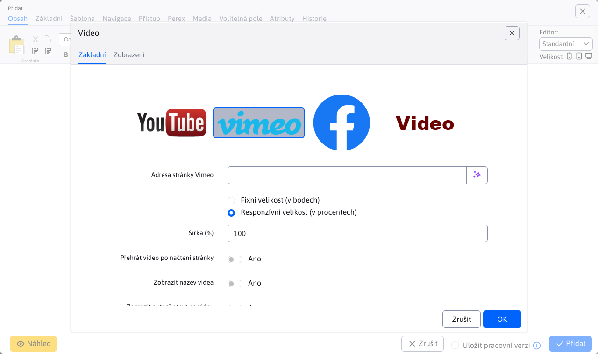
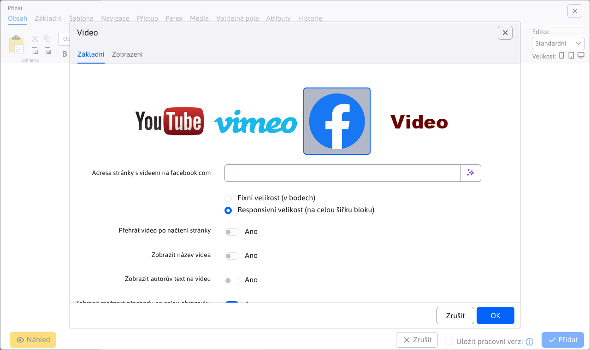
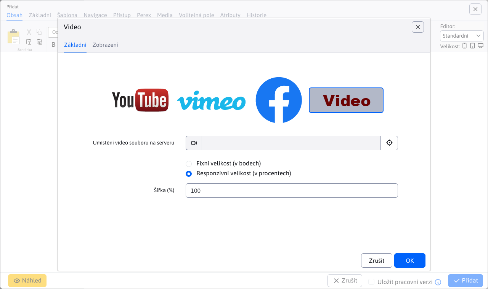

# Video

Přidejte na svou stránku poutavé video obsahy z YouTube, Vimeo, Facebook nebo nahraných mp4 souborů. S možností nastavení velikosti a vlastností přehrávání, můžete zaujmout a angažovat své návštěvníky.

## Nastavení aplikace

### Zdroj videa

V této části lze vybrat z dostupných zdrojů videa:
- YouTube
- Vimeo
- Facebook
- Video na serveru

### YouTube

YouTube video parametry:
- **Adresa stránky YouTube**, stačí jednoduše vložit odkaz na web stránku s videem
- Fixní velikost (v bodech)
  - Šířka
  - Výška
- Responzivní velikost (v procentech)
  - Šířka (%)
- Přehrát video po načtení stránky
- Zobrazit název videa
- Zobrazit YouTube logo
- Zobrazit možnost přechodu na plnou obrazovku
- Zobrazit ovládací ikony
- Zobrazit podobná videa po skončení přehrávání

### Vimeo

Vimeo video parametry:
- **Adresa stránky Vimeo**, stačí jednoduše vložit odkaz na web stránku s videem
- Fixní velikost (v bodech)
  - Šířka
  - Výška
- Responzivní velikost (v procentech)
  - Šířka (%)
- Přehrát video po načtení stránky
- Zobrazit název videa
- Zobrazit autorův text na videu
- Zobrazit možnost přechodu na plnou obrazovku
- Zobrazit fotku autora na videu
- Povolit zobrazení vodoznaku na videu

### Facebook

Facebook video parametry:
- **Adresa stránky s videem na facebook.com**, stačí jednoduše vložit odkaz na web stránku s videem
- Fixní velikost (v bodech)
  - Šířka
- Responzivní velikost (na celou šířku bloku)
- Přehrát video po načtení stránky
- Zobrazit název videa
- Zobrazit autorův text na videu
- Zobrazit možnost přechodu na plnou obrazovku

### Video

Serverové video parametry:
- **Umístění video souboru na serveru**, výběr videa pomocí průzkumníka souborů (podporováno je i přímé zadání cesty k souboru)
- Fixní velikost (v bodech)
  - Šířka
  - Výška
- Responzivní velikost (v procentech)
  - Šířka (%)

## Zobrazení aplikace

