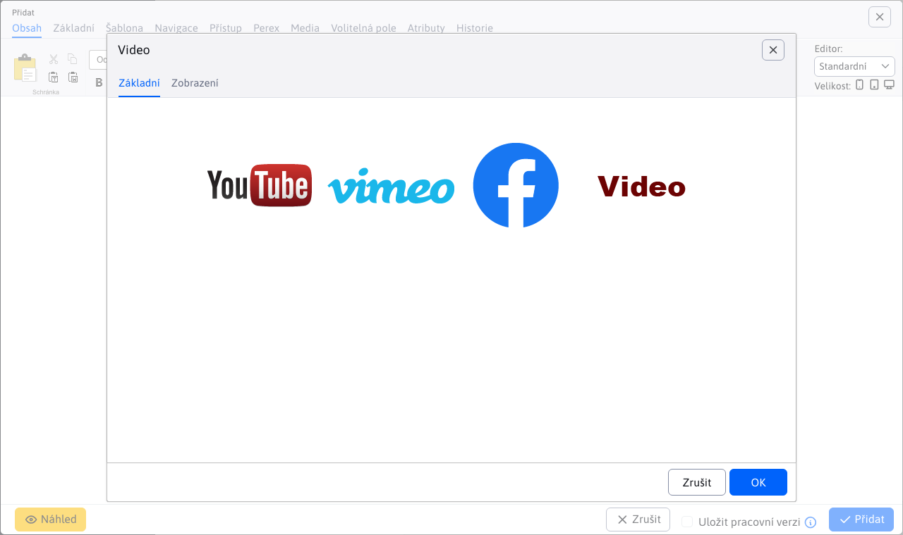
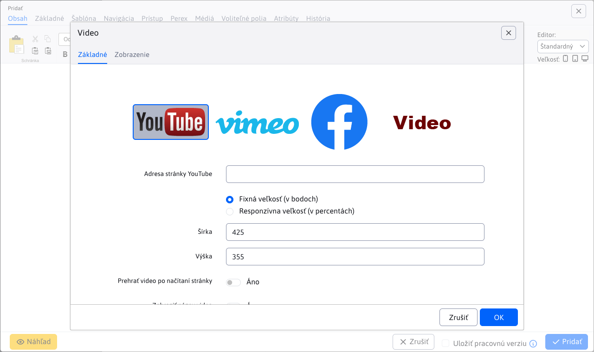
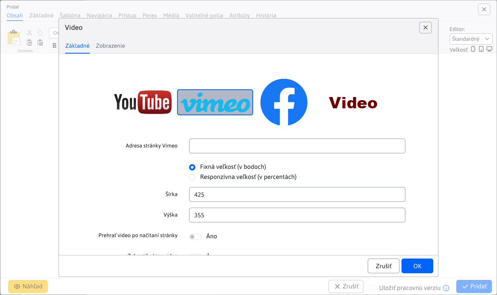
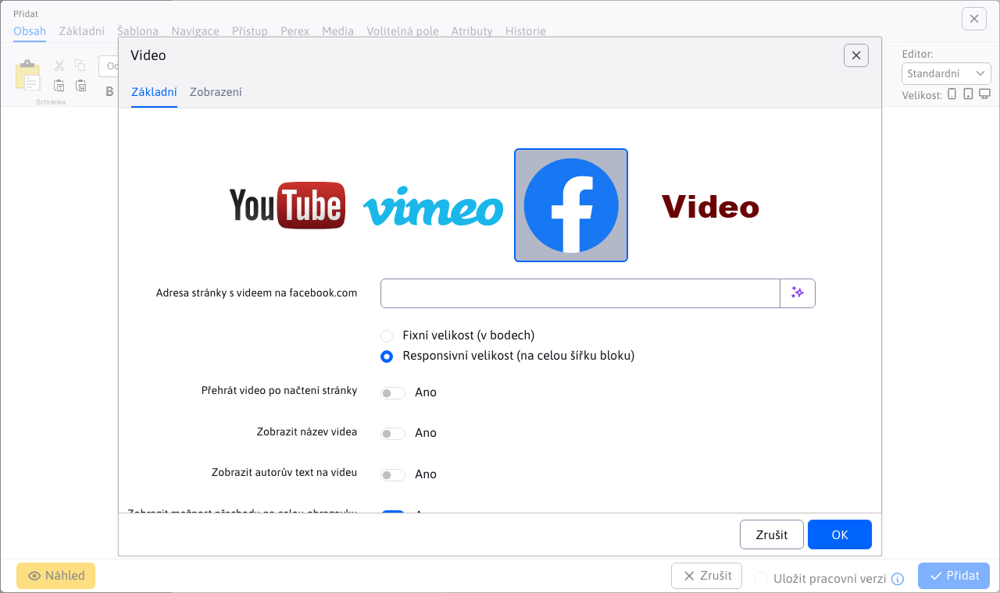
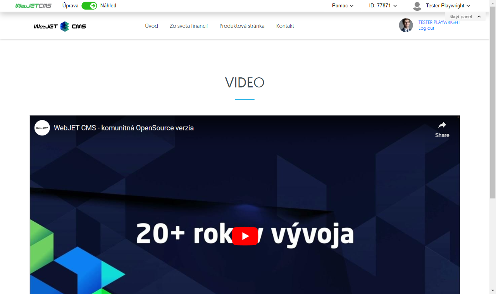

# Video

Přidejte na svou stránku poutavé video obsahy z YouTube, Vimeo, Facebook nebo nahraných mp4 souborů. S možností nastavení velikosti a vlastností přehrávání, můžete zaujmout a angažovat své návštěvníky.

## Nastavení aplikace

### Zdroj videa

V této části lze vybrat z dostupných zdrojů videa:

- YouTube
- Vimeo
- Facebook
- Video na serveru



### YouTube

YouTube video parametry:

- **Adresa stránky YouTube**, stačí jednoduše vložit odkaz na web stránku s videem
- Fixní velikost (v bodech)
  - Šířka
  - Výška
- Responzivní velikost (v procentech)
  - Šířka (%)
- Poměr stran videa - výběr poměru stran pro responzivní zobrazení videa (např. 16:9, 4:3, 1:1, 21:9, 9:16)
- Přehrát video po načtení stránky
- Zobrazit název videa
- Zobrazit YouTube logo
- Zobrazit možnost přechodu na plnou obrazovku
- Zobrazit ovládací ikony
- Zobrazit podobná videa po skončení přehrávání



### Vimeo

Vimeo video parametry:

- **Adresa stránky Vimeo**, stačí jednoduše vložit odkaz na web stránku s videem
- Fixní velikost (v bodech)
  - Šířka
  - Výška
- Responzivní velikost (v procentech)
  - Šířka (%)
- Poměr stran videa - výběr poměru stran pro responzivní zobrazení videa (např. 16:9, 4:3, 1:1, 21:9, 9:16)
- Přehrát video po načtení stránky
- Zobrazit název videa
- Zobrazit autorův text na videu
- Zobrazit možnost přechodu na plnou obrazovku
- Zobrazit fotku autora na videu
- Povolit zobrazení vodoznaku na videu



### Facebook

Facebook video parametry:

- **Adresa stránky s videem na facebook.com**, stačí jednoduše vložit odkaz na web stránku s videem
- Fixní velikost (v bodech)
  - Šířka
- Responzivní velikost (na celou šířku bloku)
- Poměr stran videa - výběr poměru stran pro responzivní zobrazení videa (např. 16:9, 4:3, 1:1, 21:9, 9:16)
- Přehrát video po načtení stránky
- Zobrazit název videa
- Zobrazit autorův text na videu
- Zobrazit možnost přechodu na plnou obrazovku



### Video

Serverové video parametry:

- **Umístění video souboru na serveru**, výběr videa pomocí průzkumníka souborů (podporováno je i přímé zadání cesty k souboru)
- Fixní velikost (v bodech)
  - Šířka
  - Výška
- Responzivní velikost (v procentech)
  - Šířka (%)
- Poměr stran videa - výběr poměru stran pro responzivní zobrazení videa (např. 16:9, 4:3, 1:1, 21:9, 9:16)


## Zobrazení aplikace



## Konfigurace

Správa zobrazení videa lze přizpůsobit následujícími konfiguračními proměnnými:

| Proměnná | Popis | Výchozí hodnota |
| --- | --- | --- |
| `videoClasses` | Čárkou oddělený seznam dostupných poměrů stran v editoru. Formát: `překladový_klíč:css_třídy` nebo jen `css_třídy`. První položka je výchozí hodnota. | 16:9, 4:3, 1:1, 21:9, 9:16 (Bootstrap 4+5 třídy) |
| `videoWrapperClass` | CSS třída pro obalovací element videa. Pro Bootstrap použijte `embed-responsive`. | `embed-responsive` |
| `videoItemClass` | CSS třída pro vnitřní `<iframe> ` element videa. Pro Bootstrap použijte ` embed-responsive-item`. | `embed-responsive-item` |

Příklad změny na vlastní CSS třídy (bez Bootstrap):

```txt
videoClasses=components.video_player.ratio-16x9:video-wrapper-16x9,components.video_player.ratio-4x3:video-wrapper-4x3
videoWrapperClass=video-wrapper
videoItemClass=video-item
```

Pokud potřebujete nastavovat CSS třídu i pro obalovač i pro samotný `iframe` element s videem, je možné rozdělit CSS třídy znakem `|`, hodnota před tímto znakem se použije na obalovač a za znakem pro `iframe` element. Příklad:

```txt
videoClasses=components.video_player.ratio-16x9:video-wrapper-16x9|video-iframe-16x9,components.video_player.ratio-4x3:video-wrapper-4x3|video-iframe-4x3
videoWrapperClass=video-wrapper
videoItemClass=video-item
```