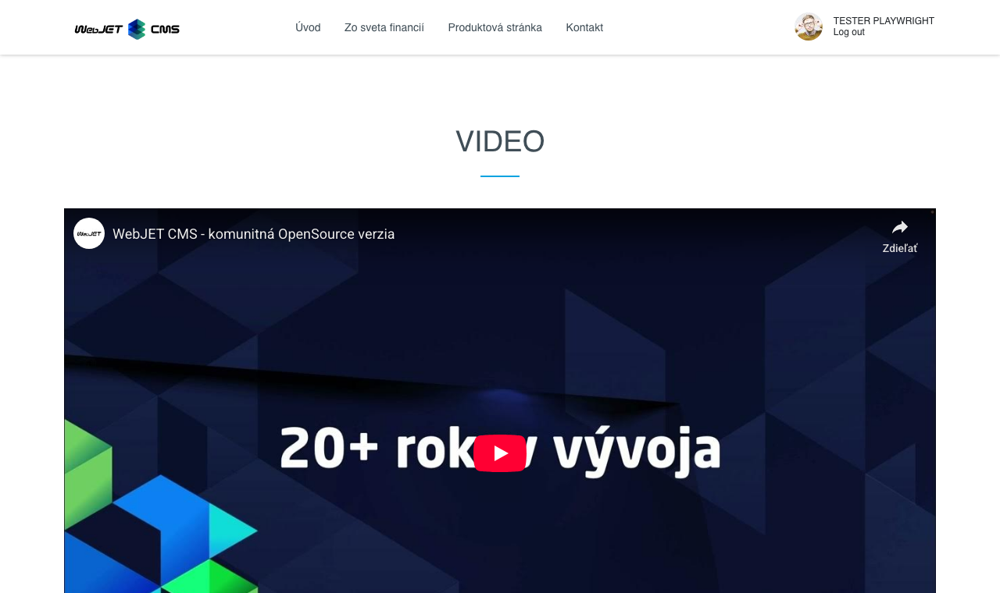

# Video

Přidejte na svou stránku poutavé video obsahy z YouTube, Vimeo, Facebook nebo nahraných mp4 souborů. S možností nastavení velikosti a vlastností přehrávání, můžete zaujmout a angažovat své návštěvníky.

## Nastavení aplikace

### Zdroj videa

V této části lze vybrat z dostupných zdrojů videa:
- YouTube
- Vimeo
- Facebook
- Video na serveru

### Parametry

V této části lze nastavit:
- Adresa stránky - při odkazech na YouTube/Vimeo/Facebook stačí jednoduše vložit odkaz na web stránku s videem, aplikace podle kódu v URL adrese vloží potřebný přehrávač.
- Fixní/Responzivní velikost
- Zarovnání videa
- Šířka

A ostatní nastavení v závislosti na vybraném zdroji

## Zobrazení aplikace

