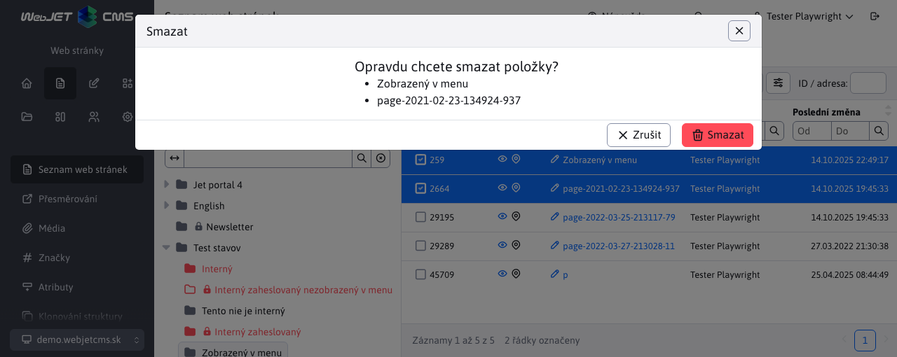

# Datové tabulky

Datové tabulky jsou základem rozhraní v CMS WebJET, podívejte se na instruktážní video, jak pracovat s tabulkami.

  <iframe width="560" height="315" src="https://www.youtube.com/embed/-NN6pMz_bKw" title="Přehrávač videí YouTube" frameborder="0" allow="accelerometer; autoplay; clipboard-write; encrypted-media; gyroscope; picture-in-picture" allowfullscreen></iframe>

## Nové funkce

V porovnání s výše uvedeným videem má standardní datová tabulka nové funkce.

### Zobrazení názvu v záhlaví okna

Při úpravě existující položky (pokud se upravuje jeden záznam) se v záhlaví dialogového okna editoru zobrazí název upravované položky (v příkladu text **Stránka produktu**) místo obecného textu **Upravit podle**.

Stejně tak se po potvrzení odstranění zobrazí seznam označených položek pro potvrzení záznamů, které chcete odstranit.

### Možnost přesunout okno

Okno editoru lze přesunout (například pokud potřebujete zobrazit informace na stránce překryté oknem). Stačí začít okno přetahovat v oblasti záhlaví (jako standardní okno v programu `Windows`).

### Vzpomínka na uspořádání

Pokud změníte uspořádání tabulky (kliknutím na název sloupce), tabulka si toto uspořádání zapamatuje v prohlížeči. Když se do této části znovu vrátíte, bude tabulka uspořádána podle vašich preferencí.

Klikněte na ikonu <i class="ti ti-adjustments-horizontal" role="presentation" ></i>, poté nastavení Zobrazení sloupců a poté tlačítko Obnovit, čímž se tabulka vrátí do své základní podoby včetně rozložení.

### Změna pořadí sloupců

Sloupce v tabulce můžete přesouvat a měnit tak jejich pořadí podle svých potřeb. Stačí uchopit záhlaví (název) sloupce a začít jej přetahovat doleva nebo doprava. Pořadí sloupců se zapamatuje v prohlížeči a při opětovném návratu do dané sekce bude pořadí sloupců zachováno.

Klikněte na ikonu <i class="ti ti-adjustments-horizontal" role="presentation" ></i>, poté nastavení Zobrazení sloupců a poté tlačítko Obnovit, čímž se tabulka vrátí do své základní podoby, včetně pořadí sloupců.

## Nastavení zobrazení sloupců

Klikněte na tlačítko <i class="ti ti-adjustments-horizontal" role="presentation" ></i> nastavení, budete mít možnost nastavit zobrazení sloupců a počet záznamů zobrazených na stránce.

Ve většině tabulek jsou ve výchozím nastavení zobrazeny všechny sloupce, ale některé, jako například tabulka v seznamu webových stránek, obsahují velmi mnoho sloupců, takže ve výchozím nastavení jsou zobrazeny pouze ty základní. Klikněte na možnost **Zobrazení sloupců** otevře dialogové okno, ve kterém můžete **vyberte sloupce, které chcete zobrazit**. Vyberte je podle libosti a klikněte na **Uložit**, vybrané sloupce v **si prohlížeč zapamatuje**. Vybrané sloupce se zobrazí i po obnovení stránky.

V okně se zobrazí následující sloupce:
- Název karty - zobrazuje název karty, na které se pole v editoru nachází. Pokud se pole v editoru nezobrazuje, je hodnota prázdná.
- Nadpis sekce - zobrazuje nadpis nad poli v editoru (je-li zadán), umožňuje rozlišit skupinu polí, např. nastavit zobrazení pro přihlášeného nebo odhlášeného uživatele.
- Název sloupce - název pole v editoru, hodnota představuje sloupec, který chcete zobrazit.

V nastavení zobrazení sloupců je k dispozici také tlačítko **Obnovit** který obnoví **výchozí nastavení seznamu sloupců**. Kromě toho jsou zde také tlačítka **Zobrazit všechny** a **Skrýt vše**, který jedním kliknutím zapne nebo vypne zobrazení všech sloupců.

**Varování:** čím více sloupců máte zobrazeno, tím déle bude počítači trvat zobrazení tabulky.

## Počet záznamů na stránku

Klikněte na tlačítko <i class="ti ti-adjustments-horizontal" role="presentation" ></i> se zobrazí možnost nastavení počtu záznamů na stránku.

Aby okno obsahovalo ideální počet řádků tabulky, vypočítá se jeho velikost a přednastaví se podle tohoto výpočtu. V nastavení počtu záznamů se jako první zobrazí možnost Automaticky (X), kde X je vypočtený počet řádků podle výšky okna.

Pod tabulkou řádků se zobrazí informace o počtu zobrazených záznamů, celkovém počtu záznamů a případně o stránkování (přechod na další stránku).

Automatické nastavení počtu řádků tabulky se používá pouze v hlavním okně, nepoužívá se ve vnořených tabulkách v editoru (např. na kartě Upravit historii webové stránky).

## Klávesové zkratky

Pro efektivnější práci můžete použít následující klávesové zkratky (`Windows/MacOS`):
- `CTRL+S/CMD+S` - uloží záznam do databáze, ale ponechá otevřené okno editoru. Funkce nemusí být k dispozici, pokud je otevřeno více dialogových oken současně.
