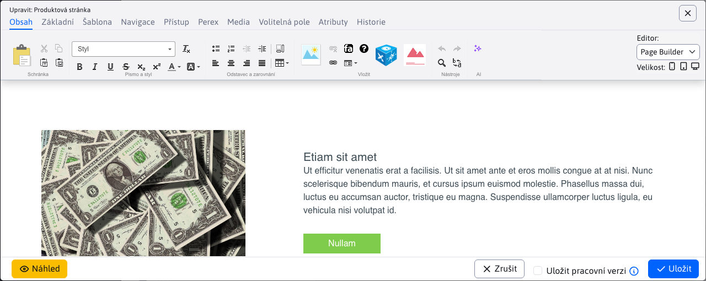

# Datatabulky

## Základy práce s data tabulkami

Datové tabulky jsou základem rozhraní v CMS WebJET, podívejte se na instruktážní video jak s tabulkami pracovat.

  <iframe width="560" height="315" src="https://www.youtube.com/embed/-NN6pMz_bKw" title="YouTube video player" frameborder="0" allow="accelerometer; autoplay; clipboard-write; encrypted-media; gyroscope; picture-in-picture" allowfullscreen></iframe>

## Nové vlastnosti

Oproti výše uvedenému videu má standardní datatabulka nové vlastnosti.

### Zobrazení názvu v hlavičce okna

Při editaci stávající položky (pokud se edituje jeden záznam) se v hlavičce dialogového okna editoru zobrazuje název editované položky (na ukázce text **Produktová stránka**) namísto obecného textu **Upravit**.

Podobně při potvrzení smazání se zobrazí seznam označených položek pro potvrzení záznamů, které chcete smazat.

### Možnost přesouvat okno

Okno editoru lze přesouvat (pokud např. potřebujete vidět informaci na stránce překrytou oknem). Stačí když v oblasti hlavičky začnete okno táhnout (jako standardní okno ve `Windows`).

### Pamatování uspořádání

Pokud tabulce změníte způsob uspořádání (kliknutím na název sloupce) tabulka si bude tento způsob uspořádání pamatovat ve vašem prohlížeči. Když se vrátíte znovu na danou část bude tabulka uspořádána podle vaší preference.

Klepnutím na ikonu <i class="ti ti-adjustments-horizontal" role="presentation" ></i>, následně na nastavení Zobrazení sloupců a následně na tlačítko Obnovit se tabulka nastaví do základní podoby včetně uspořádání.

### Změna pořadí sloupců

V tabulce můžete přesouvat sloupce a měnit tak jejich pořadí podle vašich potřeb. Stačí když chytíte hlavičku (název) sloupce a začnete jej táhnout vlevo, nebo vpravo. Pořadí sloupců se zapamatuje v prohlížeči a když se znovu vrátíte na danou část bude pořadí sloupců zachováno.

Klepnutím na ikonu <i class="ti ti-adjustments-horizontal" role="presentation" ></i>, následně na nastavení Zobrazení sloupců a následně na tlačítko Obnovit se tabulka nastaví do základní podoby včetně pořadí sloupců.

## Nastavení zobrazení sloupců

Klepnutím na tlačítko <i class="ti ti-adjustments-horizontal" role="presentation" ></i> nastavení se zobrazí možnost nastavení zobrazení sloupců a počtu zobrazených záznamů na jedné straně.

Ve většině tabulek se standardně zobrazují všechny sloupce, některé jako tabulka v seznamu webových stránek ale obsahuje velmi mnoho sloupců, proto jsou standardně zobrazeny jen ty základní. Klepnutím na možnost **Zobrazení sloupců** se otevře dialogové okno, ve kterém můžete **zvolit, které sloupce chcete zobrazit**. Libovolně je označíte a po kliknutí na **Uložit**, se zvolené sloupce ve **vašem prohlížeči zapamatují**. I po obnovení stránky se zobrazí zvolené sloupce.

V okně se zobrazují následující sloupce:
- Jméno karty - zobrazuje název karty ve které se pole nachází v editoru. Pokud se pole nezobrazuje v editoru, hodnota je prázdná.
- Nadpis sekce - zobrazuje nadpis nad poli v editoru (je-li zadán), umožňuje rozlišit skupinu polí, například. pro nastavení zobrazení pro přihlášeného, nebo odhlášeného uživatele.
- Jméno sloupce - jméno pole v editoru, hodnota reprezentuje sloupec, který chcete zobrazit.

V nastavení zobrazení sloupců je také tlačítko **Obnovit**, které obnoví **výchozí nastavení seznamu sloupců**. Kromě toho tam máme také tlačítka **Zobrazit vše** a **Skrýt všechny**, které jedním kliknutím zapnou nebo vypnou zobrazení všech sloupců.

!>**Upozornění:** čím více sloupců si necháte zobrazit, tím déle bude trvat vašemu počítači zobrazení tabulky.

## Počet záznamů na straně

Klepnutím na tlačítko <i class="ti ti-adjustments-horizontal" role="presentation" ></i> nastavení se zobrazí možnost nastavení počtu záznamů na straně.

Aby okno obsahovalo ideální počet řádků tabulky je vypočtena jeho velikost a přednastavená hodnota podle tohoto výpočtu. V nastavení počtu záznamů se zobrazí jako první možnost Automaticky (X) kde X je vypočten počet řádků podle výšky okna.

Pod tabulkou řádků se zobrazuje informace o zobrazeném počtu záznamů, celkovém počtu záznamů a případně stránkování (přechod na další strany).

Automatické nastavení počtu řádků tabulky se použije pouze v hlavním okně, není použito ve vnořených tabulkách v editoru (např. v kartě Historie editace web stránky).

Hodnota všechna je limitována nastavením konfigurační proměnné `datatablesExportMaxRows`, tedy při hodnotě Všechny se reálně načte maximální počet řádků definovaný v této konfigurační proměnné. Řádky se zobrazují přímo v prohlížeči a při vysokém počtu dojde k vysokému zatížení procesoru.

## Klávesové zkratky

Pro efektivnější práci můžete použít následující klávesové zkratky (`Windows/MacOS`):
- `CTRL+S/CMD+S` - provede uložení záznamu do databáze, ale zároveň ponechá otevřené okno editoru. Funkce nemusí být dostupná, pokud je otevřeno více dialogových oken najednou.
