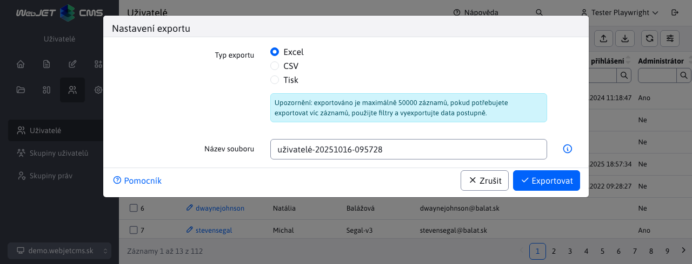

# Export a import

Datové tabulky umožňují export a import dat v záhlaví:

- Umožňuje export do **Excel(xlsx) a přímý tisk na tiskárně**
- Soubor je pojmenován podle aktuálního `title` a automaticky se přidá aktuální datum a čas.
- Exportem můžete získat **maximálně 50 000 záznamů**. Pokud potřebujete exportovat více záznamů, použijte vícenásobný export pomocí filtrování. Maximální počet záznamů lze zvýšit nastavením proměnné conf. `datatablesExportMaxRows`.
- Při exportu je v prvním řádku připraven seznam sloupců, **import proto není citlivý na pořadí sloupců**.
- Pro **výběrová pole** (select/digits) s **exportovat textovou hodnotu** a při importu se rekonstruuje zpět na ID. To umožňuje mít **různá ID vázaných záznamů** mezi prostředími (např. ID šablony webové stránky), pokud se název shoduje, je záznam správně spárován. V důsledku toho je v exportu místo hodnoty ID také lidsky čitelný text.
- Import umožňuje **importovat data jako nová** (pro přidání do databáze) nebo **porovnat existující data podle vybraného sloupce** (např. název, adresa URL atd.). Při porovnávání nejprve vyhledá záznam v databázi a poté jej aktualizuje. Pokud neexistuje, vytvoří nový záznam.
- Importováno z formátu **xlsx**.

## Export dat

Klikněte na ikonu Export  otevře dialogové okno, ve kterém se název exportního souboru automaticky nastaví podle aktuální stránky a data a času. Můžete si vybrat, zda chcete exportovat ve formátu Excel (xlsx), nebo tabulku vytisknout.

Na kartě Upřesnit tabulky se stránkováním serveru lze nastavit typ exportovaných dat. **aktuální stránka/všechny, filtrované/všechny řádky, třídění**. U tabulky s klientským stránkováním se zobrazí pouze možnost aktuální/všechny stránky.

Kliknutím na tlačítko Export se vytvoří `xlsx` stáhnout soubor, nebo v případě možnosti Tisk se zobrazí standardní okno tisku.

Při exportu do formátu Excel se **export sloupců podle editoru**, nikoliv podle zobrazených sloupců. Je to proto, aby bylo možné záznamy dodatečně importovat. První řádek souboru aplikace Excel obsahuje názvy sloupců, ale také jejich kódové označení ve formátu `Pekný názov|kodovyNazov`. Například u uživatelů se sloupec Jméno používá jak v osobních údajích, tak v kontaktních údajích. Bez kódového názvu bychom při importu nebyli schopni přesně spárovat sloupec se správným polem v editoru.

## Import dat

Klikněte na ikonu Importovat  otevře dialogové okno pro import z formátu Excel (xlsx). V nastavení importu můžete vybrat:
- Přidat jako nové záznamy - záznamy se importují jako nové, sloupec ID se ignoruje. Při importu může dojít k chybě, pokud dojde k duplicitnímu omezení (např. přihlašovací jméno v seznamu uživatelů, které musí být jedinečné).
- Aktualizovat existující záznamy - tato možnost zobrazí výběrové pole **Podle sloupce**, ve kterém můžete vybrat sloupec, na jehož základě budou data aktualizována. Při importu bude databáze obsahovat **identické záznamy (může existovat více než jeden záznam)**, pokud je například importován podle Příjmení nebo jiného sloupce, který není jedinečný) a ty se aktualizují podle údajů v Excelu. Pokud se v databázi nenajde žádný záznam podle zadaného sloupce, bude se **vytvoří jako nový záznam**.
- Importovat pouze nové záznamy - v poli **Podle sloupce** vyberte sloupec, podle kterého se identifikuje existence záznamu. Importují se pouze záznamy, které nejsou nalezeny podle zadaného sloupce.

Kliknutím na tlačítko Import spustíte import z vybraného souboru aplikace Excel.

Většina tabulek umožňuje při aktualizaci existujícího záznamu **importovat sloupce po částech**. V aplikaci Excel můžete odstranit sloupce, které chcete v databázi zachovat. Následně se při importu do stávajících záznamů přenesou pouze změny ze zachovaných sloupců v aplikaci Excel.

### Přeskočení chybných záznamů

Import nabízí možnost vynechat chybné záznamy. Pokud je tato možnost **Vypnuto** a importovaná data obsahují chybu, import se přeruší a zobrazí se chybové hlášení. Nevýhoda je při importu velkého počtu záznamů, kdy jedna chyba přeruší import dalších záznamů.

Všechny shodné záznamy před chybným záznamem byly uloženy.

Pokud je tato možnost **Povoleno**, import se při zjištění chyby nezastaví, ale pokračuje. V oznámení se zobrazí hodnoty chyby a číslo řádku:

Je možné zobrazit více oznámení, protože data jsou zpracovávána v dávkách - jsou odesílána postupně v 25 záznamech, pro každý z nich lze zobrazit chybové hlášení. Další technické informace naleznete v [Převod z aplikace Excel](../../developer/datatables/export-import.md#převod-z-Excelu).
