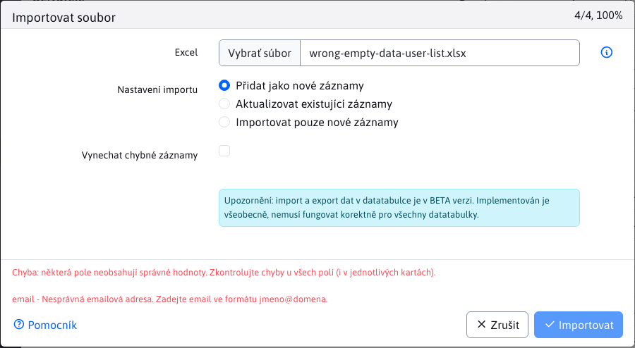

# Export a import

Datatabulky poskytují v hlavičce možnost exportu a importu dat:

- Umožňuje export do **Excelu(xlsx) a přímý tisk na tiskárnu**
- Souboru se nastaví jméno podle aktuálního `title` stránky a automaticky se doplní aktuální datum a čas.
- Exportem se najednou dá získat **maximálně 50 000 záznamů**. Při potřebě exportovat více záznamů použijte vícenásobné exportování s využitím filtrování. Maximální počet záznamů lze zvýšit nastavením konf. proměnné `datatablesExportMaxRows`.
- Při exportu se v prvním řádku připraví seznam sloupců, **import následně není citlivý na pořadí sloupců**.
- Pro **výběrová pole** (select/číselníky) se **exportuje textová hodnota** a při importu se zpět rekonstruuje na ID. Umožňuje to mít **rozdílné ID navázaných záznamů** mezi prostředími (např. ID šablony pro web stránku), pokud se shoduje jméno, korektně se záznam spáruje. V exportu je následně i lidsky srozumitelný text namísto ID hodnoty.
- Import umožňuje **importovat data jako nová** (doplní se do databáze) nebo **párovat existující data podle zvoleného sloupce** (např. jméno, URL adresa a podobně). Při párování nejprve pohledá záznam v databázi a následně jej aktualizuje. Pokud neexistuje, vytvoří nový záznam.
- Importuje se z formátu **xlsx**.

## Export dat

Po klepnutí na ikonu Exportovat  se otevře dialogové okno ve kterém se automaticky nastaví jméno souboru exportu podle aktuální stránky a data a času. Zvolit je možnost exportu ve formátu Excel (xlsx), nebo tisk tabulky.

V kartě Pokročilé je u tabulky se serverovým stránkováním možné nastavit typ exportovaných dat **aktuální strana/všechny, filtrované/všechny řádky, řazení**. U tabulky s klientským stránkováním se zobrazí pouze možnost aktuální/všechny stránky.

Po klepnutí na tlačítko Exportovat se vytvoří `xlsx` soubor ke stažení, nebo v případě možnosti Tisk se zobrazí standardní okno tisku.

Při exportu ve formátu Excel se **exportují sloupce podle editoru**, ne podle zobrazených sloupců. Je tomu tak proto, aby záznamy následně bylo možné importovat. V prvním řádku Excel souboru se nacházejí názvy sloupce ale i jeho kódové jméno ve formátu `Pekný názov|kodovyNazov`. Např. v uživatelích je použit sloupec Jméno iv osobních údajích, iv kontaktních údajích. Bez kódového názvu bychom sloupec při importu neuměli přesně spárovat na správné pole v editoru.

## Import dat

Po klepnutí na ikonu Importovat  se otevře dialogové okno pro import z Excel (xlsx) formátu. V nastavení importu lze zvolit:
- Přidat jako nové záznamy - záznamy se importují jako nové, sloupec ID se ignoruje. Při importu může nastat chyba, pokud vznikne omezení duplicity (např. přihlašovací jméno v seznamu uživatelů, které musí být jedinečné).
- Aktualizovat stávající záznamy - u této možnosti se zobrazí výběrové pole **Podle sloupce**, ve kterém je možné vybrat sloupec, na jehož základě se budou data aktualizovat. Při importu se v databázi najdou **shodné záznamy (může jich být více**, pokud se např. importuje podle Příjmení nebo jiného sloupce, který není jedinečný) a ty se aktualizují podle údajů v Excelu. Pokud se nenajde záznam v databázi podle zadaného sloupce, tak se **vytvoří jako nový záznam**.
- Importovat pouze nové záznamy - v poli **Podle sloupce** vyberte sloupec, podle kterého se identifikuje existence záznamu. Importují se pouze záznamy, které se podle zadaného sloupce nenajdou.

Klepnutím na tlačítko Importovat se spustí import z vybraného Excel souboru.

Většina tabulek při aktualizaci stávajícího záznamu umožňuje **importovat sloupce dílčí**. V Excelu můžete smazat sloupce, které chcete v databázi zachovat beze změny. Následně při importu se ve stávajících záznamech přenesou jen změny z ponechaných sloupců v Excelu.

### Přeskočit vadné záznamy

Import nabízí možnost přeskočení vadných záznamů. Pokud je tato možnost **vypnuta**, a importovaná data obsahují chybu, import se přeruší a bude zobrazeno chybové hlášení. Nevýhoda je při importování velkého množství záznamů, kde jedna chyba přeruší importování dalších záznamů.

Všechny vyhovující záznamy před chybným záznamem byly uloženy.

Pokud je tato možnost **zapnuta**, import se při nalezené chybě nezastaví, ale pokračuje dále. Chybné hodnoty is číslem řádku se zobrazí v oznámení:

Notifikací se může zobrazit více, jelikož data se zpracovávají po částech - odesílají se postupně po 25 záznamech, pro každý se může zobrazit chybové hlášení. Více technických informací naleznete v sekci [Konverze z Excelu](../../developer/datatables/export-import.md#konverze-z-excelu).
