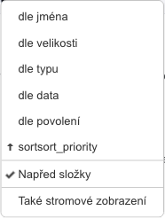
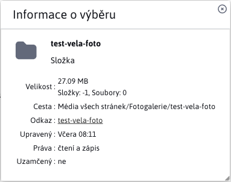
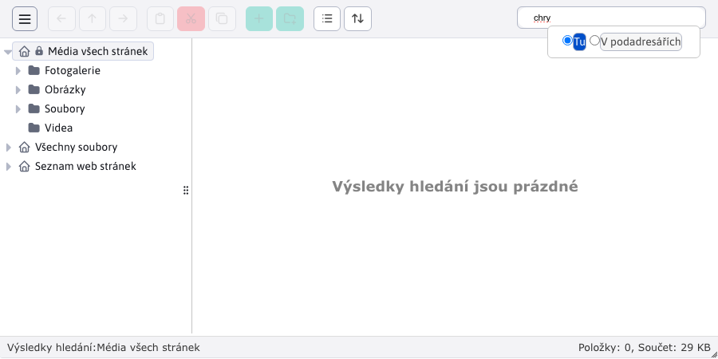
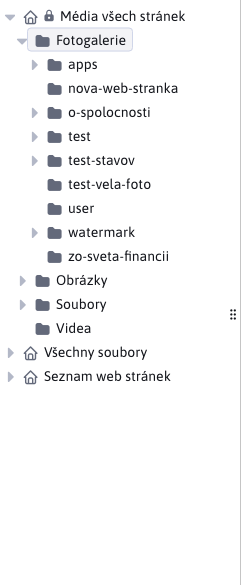
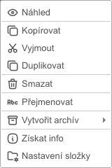
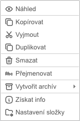

# Průzkumník

Průzkumník je aplikace pro správu a práci se soubory.

Sestává z několika částí:
- panel nástrojů
- navigační lišta
- hlavní plocha
- patička

## Panel nástrojů

Panel nástrojů nabízí široký výběr nástrojů/funkcí pro práci se soubory a složkami daných souborů. Každé tlačítko, nabízí jiný jedinečný nastroj. 

!>**Upozornění:** jednotlivá tlačítka se aktivují pouze za specifických podmínek, takže nejsou vždy dostupná. Panel nástrojů obsahuje také vyhledávání.

Dané nástroje jsou pole logiky rozděleny do 3 karet:
- Soubor
- Nástroje
- Export - Import

### Karta Soubor

Karta Soubor nabízí základní možnosti pro práci jako:
- <button class="btn btn-sm btn-outline-secondary"><i class="ti ti-arrow-left" ></i></button>, **Zpět**, navigace o krok zpět ve stromové struktuře. Možnost je k dispozici pouze tehdy, byla-li před aktuálně zvolenou složkou zvolena jiná složka.
- <button class="btn btn-sm btn-outline-secondary"><i class="ti ti-arrow-up" ></i></button>, **Přejít do nadřazené složky**, navigace ve stromové struktuře o úroveň výš. Možnost dostupná, pouze pokud aktuálně zvolenou složkou má rodičovskou složku, na kterou umíme přejít.
- <button class="btn btn-sm btn-outline-secondary"><i class="ti ti-arrow-right" ></i></button>, **Dále**, navigace o krok dopředu ve stromové struktuře. Možnost dostupná, pouze pokud použili **Zpět**.
- <button class="btn btn-sm btn-outline-secondary"><i class="ti ti-clipboard" ></i></button>, **Vložit**, vloží do aktuálně zvolené lokace zkopírovaný/vystižený soubor nebo složku.
- <button class="btn btn-sm btn-danger"><i class="ti ti-cut" ></i></button>, **Vyjmout**, zkopíruje označený soubor/složku ze zdrojové lokace. Po vložení do cílové lokace se originál ze zdrojové lokace vymaže.
- <button class="btn btn-sm btn-outline-secondary"><i class="ti ti-copy" ></i></button>, **Kopírovat**, zkopíruje označený soubor/složku

   

- <button class="btn btn-sm btn-success"><i class="ti ti-plus" ></i></button>, **Nahrát soubory**, umožní do aktuálně zvolené lokace nahrát soubory.
- <button class="btn btn-sm btn-success"><i class="ti ti-folder-plus" ></i></button>, **Nová složka**, umožní v aktuálně zvolené lokaci vytvořit novou složku.

   

- <button class="btn btn-sm btn-outline-secondary"><i class="ti ti-list" ></i></button>, **Seznam**, změní zobrazení souborů/složek v pracovní zóně na listové zobrazení.
- <button class="btn btn-sm btn-outline-secondary"><i class="ti ti-layout-grid" ></i></button>, **Ikony**, změní zobrazení souborů/složek v pracovní zóně k zobrazení pomocí ikon.

|         Seznam |         Ikony |
| :--------------------: | :--------------------: |
|  |  |

- <button class="btn btn-sm btn-outline-secondary"><i class="ti ti-arrows-up-down" ></i></button>, **Řadit**, umožňuje seřadit soubory/složky podle vybraného kritéria.

### Karta Nástroje

Nabízí rozšířené nástroje pro práci se složkami/soubory.

- <button class="btn btn-sm btn-outline-secondary"><i class="ti ti-file-download" ></i></button>, **Stáhnout**, umožňuje stažení vybraného souboru (IBA souboru).
- <button class="btn btn-sm btn-outline-secondary"><i class="ti ti-eye" ></i></button>, **Náhled**, poskytuje rozdílnou funkcionalitu v závislosti na zvoleném elementu, základem je vždy dialogové okno, které lze zvětšit/zmenšit. Najednou může být otevřeno vždy **jen jedno okno**. Při výběru jiného souboru/složky se okno aktualizuje (neotevře se nové). Pomocí šipek umíte měnit zvolený soubor/složku v aktuálně zvolené lokaci.
- Složka nebo běžný soubor, poskytne informaci o názvu a poslední úpravě.
- Textový soubor jako `text/plain`, `text/html`, `text/jsp`, `text/javascript`, `text/css`, `text/xml`, `text/x-js`, `text/markdown`, otevře soubor v dialogovém okně (soubor se však **nelze upravit**).
- Obrázek se zobrazí jako náhled v dialogovém okně.

|      Složka/soubor |     Textové soubory |         Obrázek |
| :-----------------------: | :---------------------: | :----------------------: |
|  |  |  |

- <button class="btn btn-sm btn-outline-secondary"><i class="ti ti-info-square-rounded" ></i></button>, **Získat info**, poskytuje podrobné informace o zvoleném souboru/složce, které se zobrazí v okně. Těchto oken může být více (na rozdíl oproti **Náhledu**). Pokud zvolíte více souborů/složek, získáte pouze informaci o jejich počtu a společné velikosti.

|      Složka |       Soubor |
| :------------------: | :----------------: |
|  |  |

!>**Upozornění:** velikost složky počítá velikost souborů v dané složky, nepočítá soubory v podsložkách.

 

 

- <button class="btn btn-sm btn-warning"><i class="ti ti-edit" ></i></button>, **Upravit**, umožňuje úpravy souborů a POUZE souborů. Bližší informace v části [Úprava souborů](../fbrowser/file-edit/README.md).
- <button class="btn btn-sm btn-duplicate"><i class="ti ti-copy" ></i></button>, **Duplikovat**, umožňuje duplikovat označené složky/soubory. Klonované složky/soubory se uloží do stejné lokace, ze které byly duplikovány.
- <button class="btn btn-sm btn-danger"><i class="ti ti-trash" ></i></button>, **Vymazat**, umožňuje permanentně vymazat zvolené složky/soubory.
- <button class="btn btn-sm btn-outline-secondary"><i class="ti ti-abc" ></i></button>, **Přejmenovat**, umožňuje přejmenovat složku/soubor. Zvolena může být ve stejnou chvíli pouze jedna složka/soubor.

   

   

- <button class="btn btn-sm btn-outline-secondary"><i class="ti ti-archive-off" ></i></button>, **Vytvořit archiv**, umožňuje archivovat všechny označené složky/soubory do jednoho ZIP archivu (ZIP je jediný podporován). Archiv se uloží do stejné lokace jako zvolené složky/soubory.
- <button class="btn btn-sm btn-outline-secondary"><i class="ti ti-archive" ></i></button>, **Extrahovat soubory z archivu**, umožňuje extrahování dat z označených ZIP archivů. Extrahování se provede ve stejné lokalitě, ve které se archiv nachází.

### Karta Export - Import

Klikem na kartu Export - Import se otevře dialogové okno k exportu/importu/rollback-u souborů.

### Vyhledávání

V pravé části panelu nástrojů je dostupné vyhledávání souborů . Soubory jsou vyhledávány pod názvy i přípony. Přednastaven je mód "Zde" kdy se vyhledávají pouze soubory v aktuálně zvolené složce. V módu "V podsložkách", se vyhledávají soubory i aktuální složky i ve všech podsložkách (a to ve všech úrovních vnoření).

|        Mód "Zde" |  Mód "V pod-složkách" |
| :--------------------: | :-----------------------: |
|  |  |

## Navigační lišta

Obsahuje seřazené složky se soubory ve formě stromové struktury. Pokud mají složky pod-složky (děti) je možné je rozbalit/sbalit pojď potřeby. Pro potřebu navigace v této stromové struktuře existují i nástroje **Zpět**, **Přejít do nadřazené složky** a **Dále** ze sekce [panel nástrojů](#karta-soubor).

Šířka navigační lišty není fixní, a lze ji měnit podle potřeby. Stromová struktura podporuje také `Drag and Drop`, tedy umožňuje přesouvání složek. Každý řádek se složkou může obsahovat ikony:
- <i class="ti ti-home" ></i>, hlavní složka, která již nemá nad sebou rodičovskou složku
- <i class="ti ti-lock" ></i>, uzamčená složka, povoleno je pouze čtení
- <i class="ti ti-caret-right-filled" ></i>, složka která obsahuje pod-složky, ale seznam je sbalen
- <i class="ti ti-caret-down-filled" ></i>, složka která obsahuje pod-složky, a seznam je rozbalen

## Hlavní plocha

Na hlavní ploše máme všechny složky a soubory aktuálně zvolené složky. !>**Upozornění:** nezobrazují se vnořené složky a soubory.

Jako i "Navigační lišta", "Hlavní plocha" také podporuje `Drag and Drop` akci. !>**Upozornění:** akce `Drag and Drop` funguje také mezi "Hlavní plocha" a "Navigační lišta", takže můžete složku/soubor přesunout z plochy přímo do složky navigační lišty.

**Levý klik**, slouží k označení složek a souborů.

**Dvojitý levý klik**, na:
- složku, provede její otevření
- na textový soubor typů `text/plain`, `text/html`, `text/jsp`, `text/javascript`, `text/css`, `text/xml`, `text/x-js`, `text/markdown`, spusť akci úpravy
- na jiné nepodporované soubory jako `.tld`, neudělá nic

**Pravý klik** slouží hlavně k zobrazení nejpoužívanějších nástrojů z [Panela nástrojů](#panel-nástrojů). Zobrazí se malé okno s dostupnými nástroji, které se mohou lišit podle toho, na jak elementu se provedli pravý klik.

| Pravý klik na plochu | Pravý klik na složku | Pravý klik na soubor |
| :-------------------: | :---------------------: | :-----------------: |
|  |     |    |

Jak můžete vidět z předchozí série obrázků, zobrazené nástroje se liší v závislosti na zvoleném elementu. Například pro soubor máme zobrazenou možnost **Stáhnout** ale pro složku ne, nakolik povoleno je POUZE stahování souborů. Také jste si mohli všimnout nástrojů, které jsme si v sekci [Panela nástrojů](#panel-nástrojů) nezmínili, nakolik nemají vlastní tlačítko v panelu. Jedná se o nástroje:
- <i class="ti ti-reload" ></i>, **Obnovit**, je to akce nad hlavní plochou, která provede opětovné načtení dat aktuální složky.
- <i class="ti ti-file-plus" ></i>, **Nový textový soubor**, je to akce nad hlavní plochou, umožňuje okamžitě v aktuální složce vytvořit textový soubor těchto typů `TEXT, CSS, HTML`.
- <i class="ti ti-folder-cog" ></i>, **Nastavení adresáře**, je to akce nad složkou, bližší informace v části [Nastavení adresáře](../fbrowser/folder-settings/README.md).
- <i class="ti ti-maximize" ></i>, **Zobrazit soubor**, otevře soubor v nové kartě.
- <i class="ti ti-file-upload" ></i>, **Aktualizovat soubor**, je to akce nad souborem, umožňuje nahrát nový soubor, který nahradí zvolený soubor (na kterém jsme volali tuto akci).
- <i class="ti ti-file-settings" ></i>, **Nastavení souboru**, je to akce nad souborem, bližší informace v části [Nastavení souboru](../fbrowser/file-settings/README.md).

## Konfigurace

- `elfinderMoveConfirm` - standardně se zobrazí potvrzení přesunu souboru nebo složky, při použití funkce "drag & drop" nebo kopírování/vložení přes kontextové menu. Chcete-li potvrzování přesunu souboru nebo složky vypnout změňte hodnotu konfigurační proměnné `elfinderMoveConfirm` na `false`.

