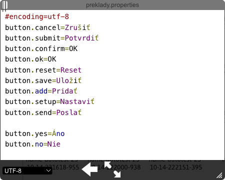
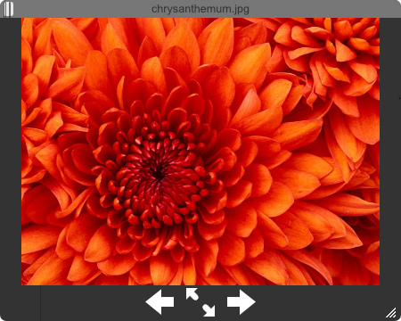
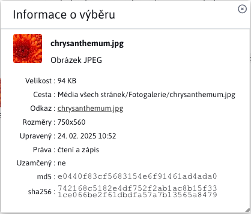
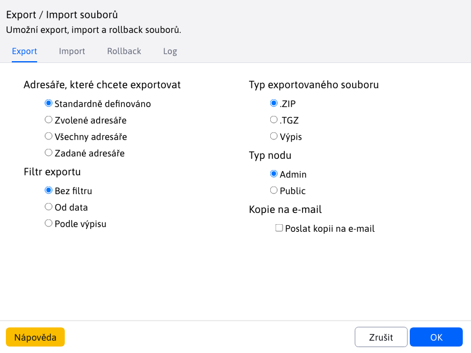

# Průzkumník

Průzkumník souborů je aplikace pro správu souborů a práci s nimi.

Skládá se z několika částí:
- panel nástrojů
- navigační panel
- hlavní oblast
- zápatí

## Panel nástrojů

Panel nástrojů nabízí široký výběr nástrojů/funkcí pro práci se soubory a složkami souborů. Každé tlačítko nabízí jiný jedinečný nástroj. !>**Varování:** jednotlivá tlačítka se aktivují pouze za určitých podmínek, takže nejsou vždy k dispozici. Panel nástrojů obsahuje také vyhledávání.

Uvedené nástroje jsou rozděleny do 3 záložek podle logického pole:
- Soubor
- Nástroje
- Export - import

### Karta Soubor

Karta Soubor nabízí základní možnosti práce jako:
- <button class="btn btn-sm btn-outline-secondary"><i class="ti ti-arrow-left" ></i></button>, **Zpět na**, čímž se ve stromové struktuře vrátíte o krok zpět. Možnost je k dispozici pouze v případě, že před aktuálně vybranou složkou byla vybrána jiná složka.
- <button class="btn btn-sm btn-outline-secondary"><i class="ti ti-arrow-up" ></i></button>, **Přejít do nadřazené složky** a přejít o úroveň výš ve stromové struktuře. Možnost je k dispozici pouze v případě, že aktuálně vybraná složka má nadřazenou složku, do které můžeme přejít.
- <button class="btn btn-sm btn-outline-secondary"><i class="ti ti-arrow-right" ></i></button>, **Další**, přičemž se ve stromové struktuře pohybuje o krok vpřed. Tato možnost je k dispozici pouze v případě, že jste použili **Zpět na**.
- <button class="btn btn-sm btn-outline-secondary"><i class="ti ti-clipboard" ></i></button>, **Vložit**, umístí kopírovaný/získaný soubor nebo složku do aktuálně vybraného umístění.
- <button class="btn btn-sm btn-danger"><i class="ti ti-cut" ></i></button>, **Převzato z**, zkopíruje označený soubor/složku ze zdrojového umístění. Po vložení do cílového umístění se originál ze zdrojového umístění odstraní.
- <button class="btn btn-sm btn-outline-secondary"><i class="ti ti-copy" ></i></button>, **Klikněte pro kopírování**, zkopíruje vybraný soubor/složku

   

   

- <button class="btn btn-sm btn-success"><i class="ti ti-plus" ></i></button>, **Nahrávání souborů**, umožňuje nahrávat soubory do aktuálně vybraného umístění.
- <button class="btn btn-sm btn-success"><i class="ti ti-folder-plus" ></i></button>, **Nová složka**, umožňuje vytvořit novou složku v aktuálně vybraném umístění.

   

   

- <button class="btn btn-sm btn-outline-secondary"><i class="ti ti-list" ></i></button>, **Seznam**, změní zobrazení souborů/složek v pracovní oblasti na zobrazení listů.
- <button class="btn btn-sm btn-outline-secondary"><i class="ti ti-layout-grid" ></i></button>, **Ikony**, změní zobrazení souborů/složek v pracovní oblasti na zobrazení založené na ikonách.

| Seznam | Ikony |
| :--------------------: | :--------------------: |
|  |  |

- <button class="btn btn-sm btn-outline-secondary"><i class="ti ti-arrows-up-down" ></i></button>, **Seřadit podle**, umožňuje třídit soubory/složky podle zvolených kritérií.

### Karta Nástroje

Nabízí pokročilé nástroje pro práci se složkami/soubory.

- <button class="btn btn-sm btn-outline-secondary"><i class="ti ti-file-download" ></i></button>, **Stáhnout**, umožňuje stáhnout vybraný soubor (soubor IBA).
- <button class="btn btn-sm btn-outline-secondary"><i class="ti ti-eye" ></i></button>, **Náhled**, poskytuje různé funkce v závislosti na vybraném prvku, základem je vždy dialogové okno, které lze zvětšit/zmenšit. Lze jej vždy otevřít současně **pouze jedno okno**. Při výběru jiného souboru/složky se okno obnoví (neotevře se nové). Pomocí kláves se šipkami můžete změnit vybraný soubor/složku v aktuálně vybraném umístění.
- Složka nebo aktuální soubor, poskytuje informace o názvu a poslední změně.
- Textový soubor jako `text/plain`, `text/html`, `text/jsp`, `text/javascript`, `text/css`, `text/xml`, `text/x-js`, `text/markdown`, otevře soubor v dialogovém okně (soubor je však **nelze nastavit**).
- Obrázek se zobrazí jako náhled v dialogovém okně.

| Složka/soubor | Textové soubory | Obrázek |
| :-----------------------: | :---------------------: | :----------------------: |
|  |  |  |

- <button class="btn btn-sm btn-outline-secondary"><i class="ti ti-info-square-rounded" ></i></button>, **Získat informace**, poskytuje podrobné informace o vybraném souboru/složce, které se zobrazí v okně. Těchto oken může být více než jedno (na rozdíl od okna **Náhled**). Pokud vyberete více souborů/složek, zobrazí se pouze informace o jejich počtu a společné velikosti.

| Složka | Soubor |
| :------------------: | :----------------: |
|  |  |

 

 

- <button class="btn btn-sm btn-warning"><i class="ti ti-edit" ></i></button>, **Upravit podle**, umožňuje upravovat soubory a soubory IBA. Další informace naleznete na adrese [Úprava souborů](../fbrowser/file-edit/README.md).
- <button class="btn btn-sm btn-duplicate"><i class="ti ti-copy" ></i></button>, **Duplikát**, umožňuje duplikovat vybrané složky/soubory. Klonované složky/soubory se uloží do stejného umístění, ze kterého byly duplikovány.
- <button class="btn btn-sm btn-danger"><i class="ti ti-trash" ></i></button>, **Odstranit**, umožňuje trvale odstranit vybrané složky/soubory.
- <button class="btn btn-sm btn-outline-secondary"><i class="ti ti-abc" ></i></button>, **Přejmenování**, umožňuje přejmenovat složku/soubor. V jednom okamžiku lze vybrat pouze JEDNU složku/soubor.

   

   

- <button class="btn btn-sm btn-outline-secondary"><i class="ti ti-archive-off" ></i></button>, **Vytvořit archiv**, umožňuje archivovat všechny označené složky/soubory do jediného archivu ZIP (podporován je pouze formát ZIP). Archiv se uloží do stejného umístění jako vybrané složky/soubory.
- <button class="btn btn-sm btn-outline-secondary"><i class="ti ti-archive" ></i></button>, **Extrahování souborů z archivu**, umožňuje extrahovat data z označených archivů ZIP. Extrakce se provádí ve stejném umístění, ve kterém se nachází archiv.

### Karta Export - Import

Kliknutím na kartu Export - Import se otevře dialogové okno pro export/import/zpětný návrat souboru.

### Vyhledávání

Vyhledávání souborů je k dispozici v pravé části panelu nástrojů. . Soubory jsou vyhledávány podle názvu i přípony. Výchozí režim je "Zde", kdy jsou prohledávány pouze soubory v aktuálně vybrané složce. V režimu "V podsložkách" se prohledávají soubory jak v aktuální složce, tak ve všech podsložkách (a na všech úrovních vnoření).

| Režim "Zde"        | Režim "V podsložkách" |
| :--------------------: | :-----------------------: |
|  |  |

## Navigační panel

Obsahuje seřazené složky souborů ve stromové struktuře. Pokud mají složky podsložky (potomky), lze je podle potřeby rozbalit/sbalit. K dispozici jsou také nástroje pro navigaci v této stromové struktuře **Zpět na**, **Přejít do nadřazené složky** a **Další** z oddílu [panel nástrojů](#soubor-karet).

Šířka navigačního panelu není pevně daná a lze ji měnit podle potřeby. Stromová struktura podporuje také `Drag and Drop`, tj. umožňuje přesouvat složky. Každý řádek složky může obsahovat ikony:
- <i class="ti ti-home" ></i>, hlavní složka, která již nemá nadřazenou složku.
- <i class="ti ti-lock" ></i>, uzamčená složka, pouze pro čtení
- <i class="ti ti-caret-right-filled" ></i>, složka, která obsahuje podsložky, ale jejich seznam je sbalený.
- <i class="ti ti-caret-down-filled" ></i>, složku, která obsahuje podsložky, a seznam se rozbalí.

## Hlavní oblast

Na hlavní ploše máme všechny složky a soubory aktuálně vybrané složky. !>**Varování:** Vnořené složky a soubory se nezobrazují.

Kromě "navigačního panelu" podporuje "hlavní plocha" také `Drag and Drop` Akce. !>**Varování:** akce `Drag and Drop` funguje také mezi "Hlavní plochou" a "Navigačním panelem", takže můžete přesunout složku/soubor z plochy přímo do složky navigačního panelu.

**Kliknutí levým tlačítkem myši**, který se používá k označování složek a souborů.

**Dvojité kliknutí levým tlačítkem myši**na:
- a provede její otevření
- do textového souboru typu `text/plain`, `text/html`, `text/jsp`, `text/javascript`, `text/css`, `text/xml`, `text/x-js`, `text/markdown`, spustit akci úprav
- na nepodporované soubory jiné než `.tld`, neudělá nic

**Klikněte pravým tlačítkem myši** slouží hlavně k zobrazení nejpoužívanějších nástrojů ze seznamu [Panely nástrojů](#panel-nástrojů). Zobrazí se malé okno s dostupnými nástroji, které se mohou lišit v závislosti na tom, jak bylo na prvek kliknuto pravým tlačítkem myši.

| Kliknutí pravým tlačítkem myši na plochu | Kliknutí pravým tlačítkem myši na složku | Kliknutí pravým tlačítkem myši na soubor |
| :-------------------: | :---------------------: | :-----------------: |
|  |     |    |

Jak je vidět z předchozí série obrázků, zobrazené nástroje se liší v závislosti na vybraném prvku. Například pro soubor máme k dispozici zobrazenou možnost **Stáhnout** ale ne pro složku, protože je povoleno pouze stahování souborů. Možná jste si také všimli nástrojů, které jsme uvedli v části [Panely nástrojů](#panel-nástrojů) nejsou uvedeny, protože nemají vlastní tlačítko na panelu. Jedná se o nástroje:
- <i class="ti ti-reload" ></i>, **Obnovit**, je to akce nad hlavní plochou, která provede opětovné načtení dat aktuální složky.
- <i class="ti ti-file-plus" ></i>, **Nový textový soubor**, akce nad hlavní plochou, umožňuje okamžitě vytvořit v aktuální složce textový soubor následujících typů `TEXT, CSS, HTML`.
- <i class="ti ti-folder-cog" ></i>, **Nastavení adresáře**, jedná se o akci nad složkou, více informací viz. [Nastavení adresáře](../fbrowser/folder-settings/README.md).
- <i class="ti ti-maximize" ></i>, **Zobrazit soubor**, otevře soubor na nové kartě.
- <i class="ti ti-file-upload" ></i>, **Aktualizace souboru**, je to akce nad souborem, umožňuje nahrát nový soubor, který nahradí vybraný soubor (nad kterým jsme tuto akci vyvolali).
- <i class="ti ti-file-settings" ></i>, **Nastavení souborů**, jedná se o akci nad souborem, více informací viz. [Nastavení souborů](../fbrowser/file-settings/README.md).

## Konfigurace

- **elfinderMoveConfirm** - ve výchozím nastavení se při přetahování nebo kopírování/vkládání přes kontextovou nabídku zobrazí potvrzení o přesunu souboru nebo složky. Chcete-li potvrzení přesunu souboru nebo složky vypnout, změňte hodnotu konfigurační proměnné `elfinderMoveConfirm` na adrese `false`.

