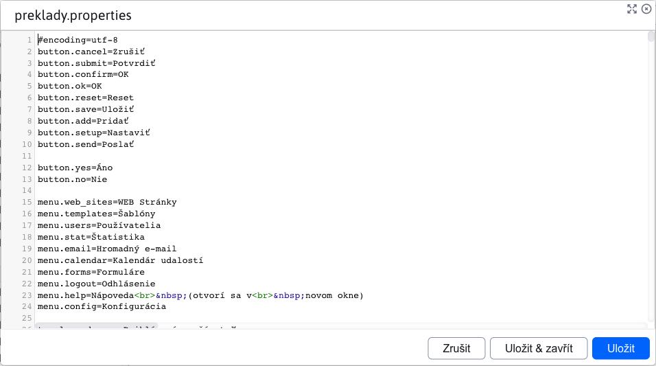
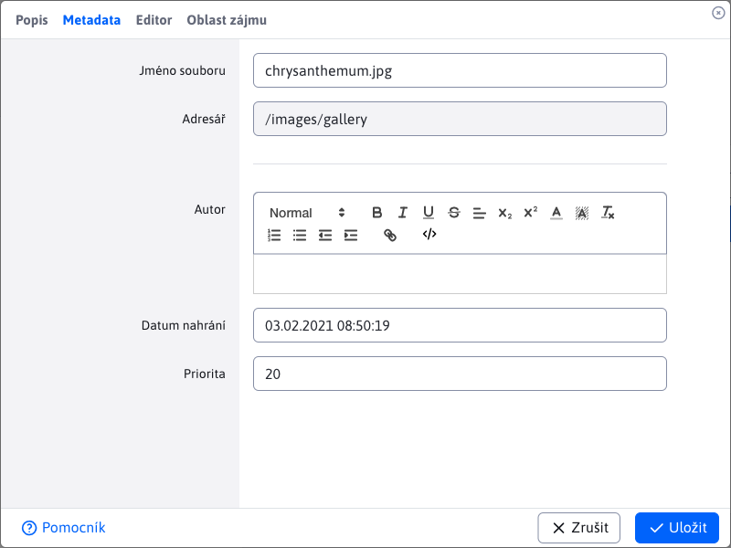

# Úprava souborů

Protože úpravy souborů v aplikaci [Explorer](../../fbrowser/README.md) má více stavů, věnujeme se mu v této samostatné části.

Při úpravách textových souborů jako `.text .json .properties` se zobrazí dialogové okno podobné tomu, které se zobrazí **Náhled**. Rozdíl je v tom, že tento dialog lze otevřít pro více souborů současně a umožňuje úpravu samotného souboru.

Úpravy obrázků se liší podle umístění souboru.

Pokud cesta k obrázku obsahuje `/gallery`, takže to znamená, že jde o obrázek z galerie. V tomto případě se otevře v novém okně prohlížeče v aplikaci [Galerie](../../../../redactor/apps/gallery/README.md), kde se automaticky otevře editor obrázku.

Pokud cesta k obrázku neobsahuje `/gallery`, otevře se dialogové okno editoru obrázků.

