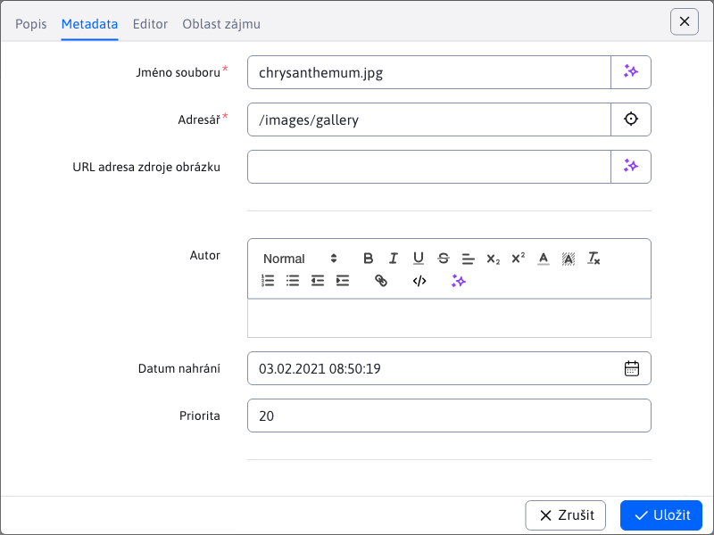

# Úprava souborů

Protože úpravy souborů v aplikaci [Průzkumník](../../fbrowser/README.md) má více stavů, věnujeme se mu v této samostatné části.

Při úpravách textových souborů jako `.text .json .properties` se zobrazí dialogové okno podobné tomu, které se zobrazí **Náhled**. Rozdíl je v tom, že tento dialog lze otevřít pro více souborů současně a umožňuje úpravu samotného souboru.

Úpravy obrázků se liší podle umístění souboru.

Pokud je cesta k obrázku **Obsahuje** Část `/gallery`, takže to znamená, že jde o obrázek z galerie. V tomto případě se otevře v novém okně prohlížeče v aplikaci [Galerie](../../../../redactor/apps/gallery/README.md), kde se automaticky otevře editor obrázku.

Pokud je cesta k obrázku **neobsahuje** Část `/gallery`, otevře dialogové okno editoru obrázků, které je stejné jako editor aplikace. [Galerie](../../../../redactor/apps/gallery/README.md).

