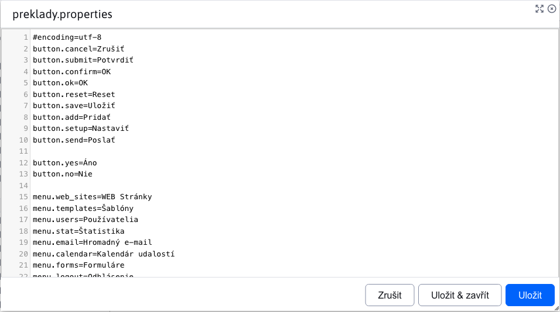

# Úprava souborů

Nakolik úprava souborů v aplikaci [Průzkumník](../../fbrowser/README.md) má několik stavů, věnujeme se jí v této samostatné sekcí.

Při úpravě textových souborů jako `.text .json .properties` se vyvolá dialogové okno, podobně jako v případě **Náhled**. Rozdíl je v tom, že toto dialogové okno může být otevřeno pro více souborů současně a umožňuje úpravu samotného souboru.

Úprava obrázků se liší podle lokality souboru.

Pokud cesta obrázku **obsahuje** část `/gallery`, tak to znamená, že je to obrázek z galerie. V takovém případě, se otevře v novém okně prohlížeče aplikace [galerie](../../../../redactor/apps/gallery/README.md), kde se pro daný obrázek automaticky otevře editor.

Pokud cesta obrázku **neobsahuje** část `/gallery`, otevře se dialogové okno s editorem obrázků, který je stejný jako v případě editoru aplikace [galerie](../../../../redactor/apps/gallery/README.md).

