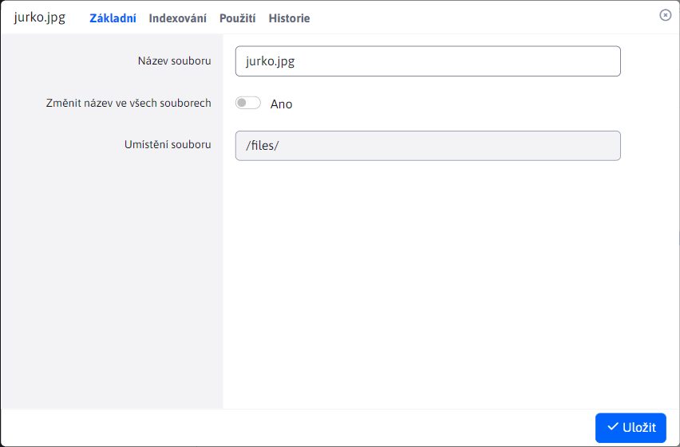
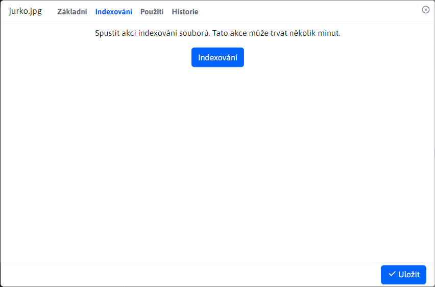
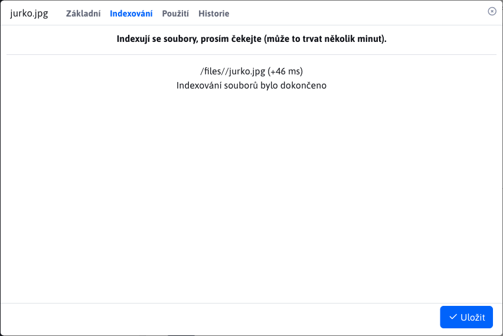
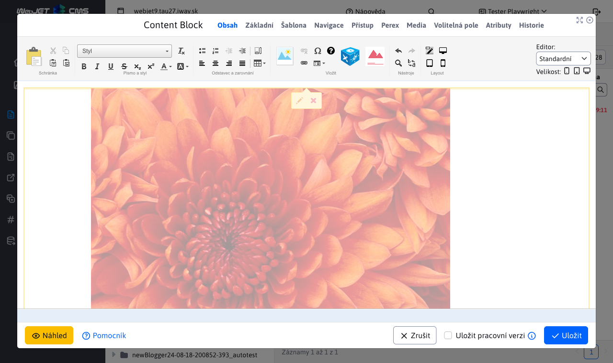
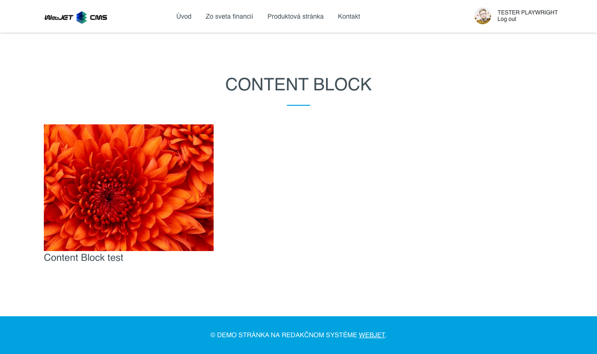

# Nastavení souboru

Nastavení souboru zobrazíte kliknutím pravým tlačítkem na soubor a volbou Nastavení souboru. Okno obsahuje následující karty:
- Základní
- Indexování (**Upozornění:** zobrazena pouze za speciálních okolnosti)
- Použití

## Základní

Karta **Základní** informuje o názvu a umístění souboru. Název souboru lze změnit.

Parametrem "Změnit název ve všech souborech" se přepíše název souboru za nový, aby linka na tento soubor byla aktuální po změně jeho názvu.

## Indexování

Karta **Indexování** se zobrazí POUZE pokud umístění daného souboru začíná hodnotou `/files`. Slouží k akci indexování souboru.

Po stisku tlačítka "Indexuj" se spustí indexování, které může trvat několik minut.

## Použití

Karta **Použití** zobrazuje použití složky ve formě vnořené data-tabulky. Každý záznam představuje web stránku využívající daný soubor. Data-tabulka obsahuje sloupce:
- Název, web stránky
- URL adresa, web stránky

Obě hodnoty jsou současně linky směřující na rozdílné lokace.

**Název** web stránky je linka na [Seznam web stránek](../../../../redactor/webpages/README.md), kde se daná web stránka vyhledá a automatický otevře editor.

**URL adresa** web stránky je linka přímo na danou web stránku.

