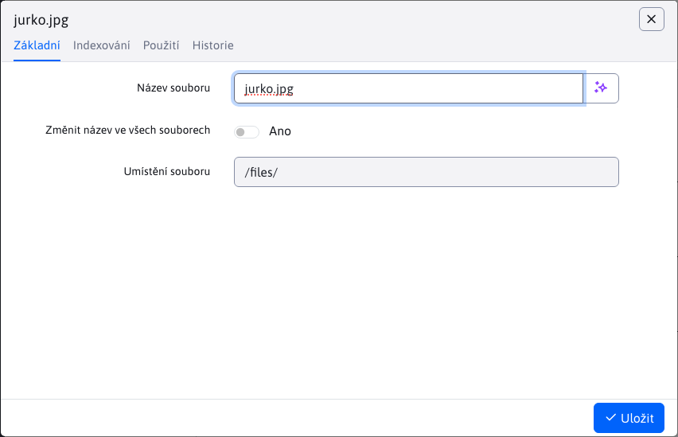
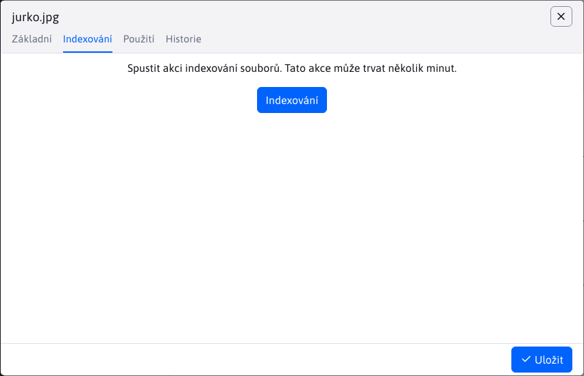
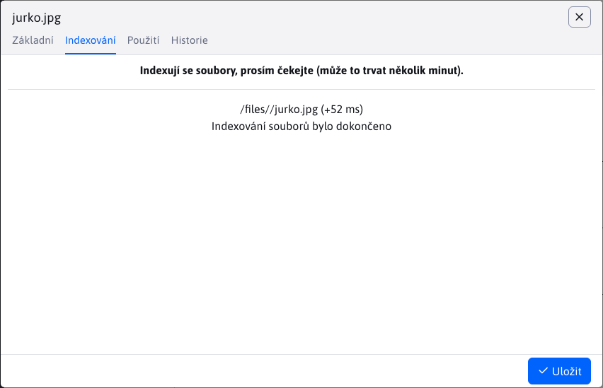
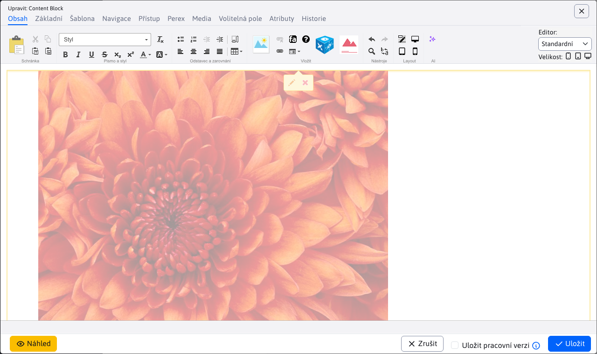

# Nastavení souborů

Chcete-li zobrazit nastavení souboru, klikněte na soubor pravým tlačítkem myši a vyberte možnost Nastavení souboru. Okno obsahuje následující karty:
- Základní
- Indexování (**Varování:** vykazuje se pouze za zvláštních okolností)
- Použití

## Základní

Karta **Základní** informuje o názvu a umístění souboru. Název souboru lze změnit.

Parametr "Změnit název ve všech souborech" přepíše název souboru novým názvem, takže odkaz na tento soubor bude po změně názvu aktuální.

## Indexování

Karta **Indexování** se zobrazí POUZE tehdy, pokud umístění souboru začíná hodnotou `/files`. Používá se pro akce indexování souborů.

Stisknutím tlačítka "Index" zahájíte proces indexování, který může trvat několik minut.

## Použití

Karta **Použití** ukazuje použití složky ve formě vnořené datové tabulky. Každá položka představuje webovou stránku používající daný soubor. Datová tabulka obsahuje sloupce:
- Název, webová stránka
- Adresa URL, webová stránka

Obě hodnoty jsou současně přímky směřující do různých míst.

**Název** je odkaz na webovou stránku [Seznam webových stránek](../../../../redactor/webpages/README.md), kde se vyhledá webová stránka a automaticky se otevře editor.

**Adresa URL** je odkaz přímo na webovou stránku.

