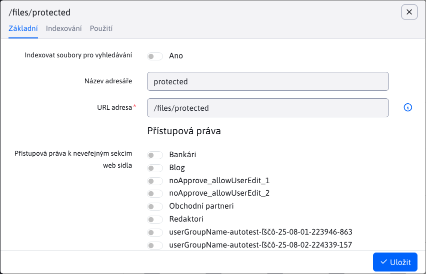
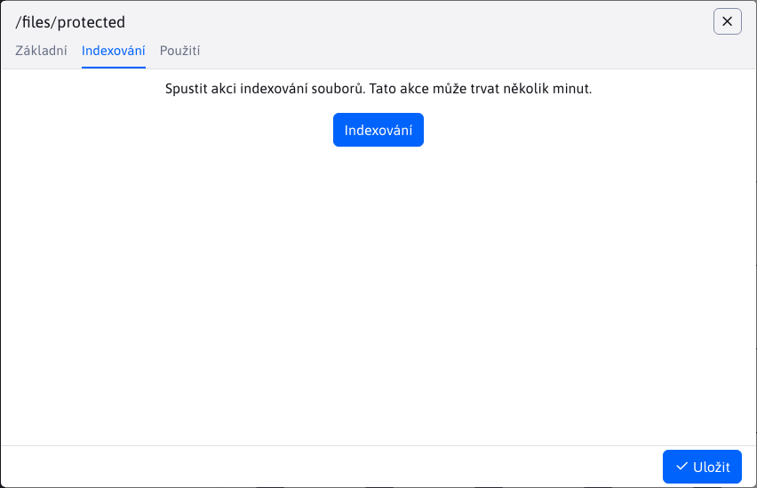
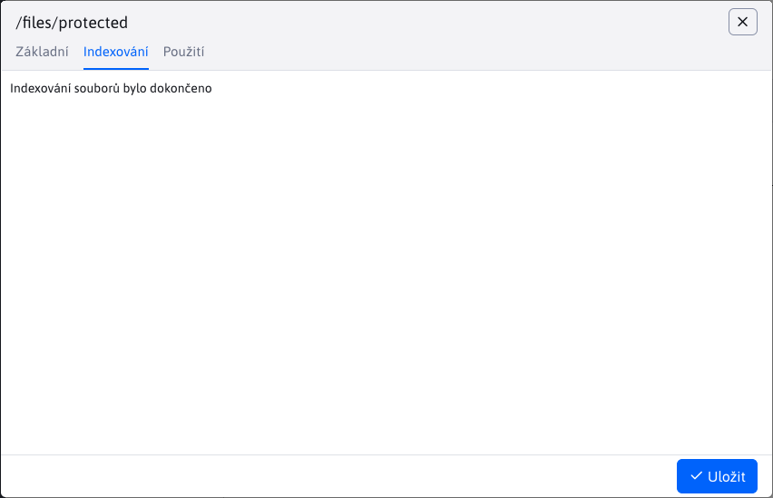
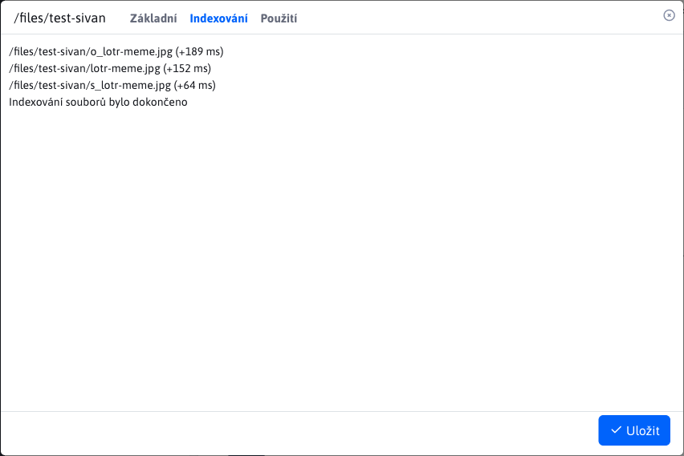
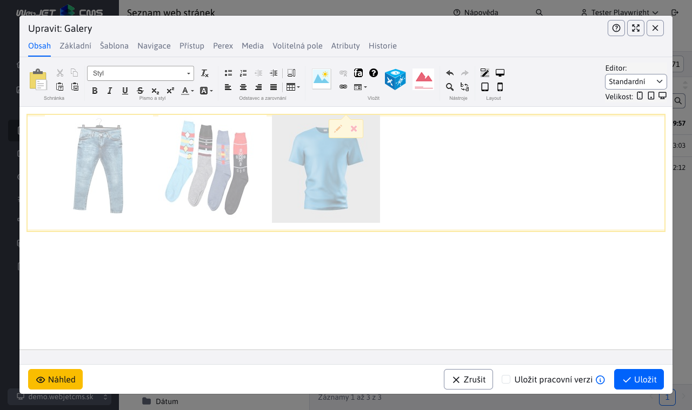
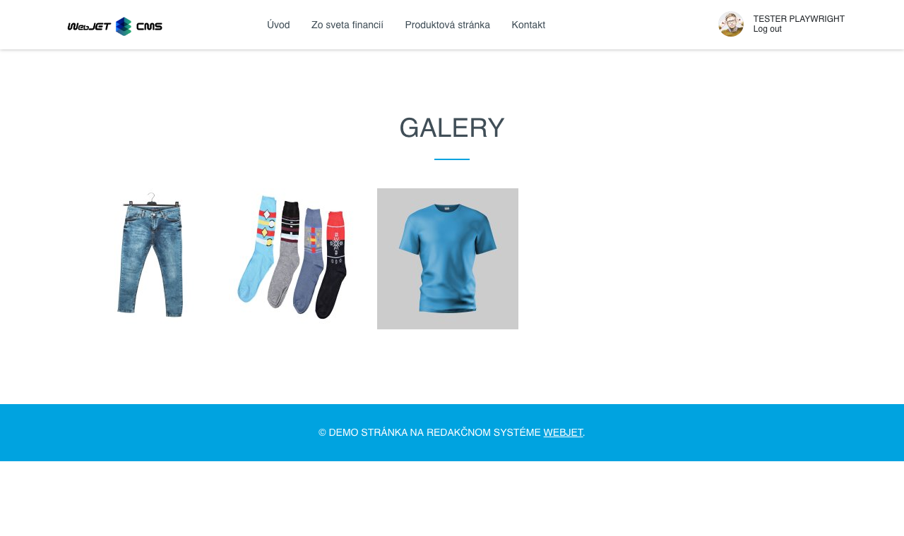
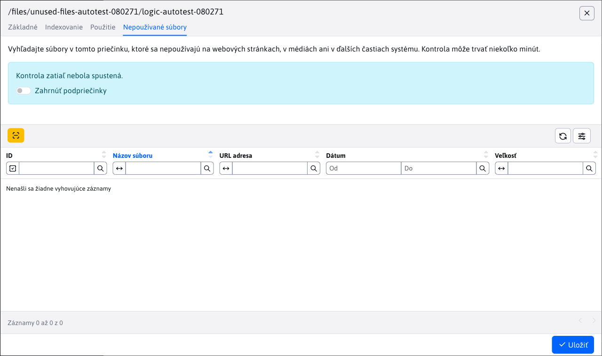

# Nastavení složky

Nastavení složky zobrazíte kliknutím pravým tlačítkem na složku a volbou Nastavení složky. Okno obsahuje následující karty:

- Základní
- Indexování (**Upozornění:** zobrazena pouze za speciálních okolnosti)
- Použití
- Nepoužívané soubory

## Základní

Karta **Základní** poskytuje základní informace o složce i možnost omezit přístupová práva pomocí Skupiny uživatelů.

Možností "Indexovat soubory pro vyhledávání" povolujete indexování souborů dané složky.

## Indexování

Karta **Indexování** se zobrazí POUZE pokud URL adresa dané složky začíná hodnotou `/files`. Slouží k akci indexování souborů. Indexování se provede POUZE pokud je povoleno v kartě [Základní](#základní).

Po stisku tlačítka "Indexuj" se spustí indexování, které může trvat několik minut.

Indexování není povoleno, nebo nebyly nalezeny soubory k indexování | Indexování je povoleno a byly nalezeny soubory k indexování
:-----------------------------------------------------------------:|:-----------------------------------------------------------------:

 | 

## Použití

Karta **Použití** zobrazuje použití složky ve formě vnořené datatabulky. Každý záznam představuje web stránku. Datatabulka obsahuje sloupce:

- Název, web stránky
- URL adresa, web stránky

Obě hodnoty jsou současně linky směřující na rozdílné lokace.

**Název** web stránky je linka na [Seznam web stránek](../../../../redactor/webpages/README.md), kde se daná web stránka vyhledá a automatický otevře editor.

**URL adresa** web stránky je linka přímo na danou web stránku.

## Nepoužívané soubory

Karta **Nepoužívané soubory** slouží k vyhledání a odstranění souborů, pro které se ve známých částech systému nenašlo použití. Pomáhá uvolnit místo na disku a udržovat pořádek ve složkách tím, že upozorní na soubory, které již pravděpodobně nejsou potřebné.

!> Karta je dostupná pouze uživateli s právem na správu souborů, který má zároveň právo zapisovat do zvolené složky. Ostatním uživatelům se karta nezobrazí.

### Spuštění kontroly

Nová kontrola se **nespustí automaticky** – vždy ji musíte spustit ručně. Pokud je však pro aktuálního administrátora, doménu a složku dostupná poslední kontrola, po otevření karty se automaticky obnoví její stav, nastavení přepínače **Zahrnout podsložky** a výsledek. Pokud kontrola ještě probíhá, obnoví se i sledování jejího stavu. Postup spuštění nové kontroly:

1. V případě potřeby povolte přepínač **Zahrnout podsložky**. Ve výchozím nastavení je vypnutý, takže se kontrolují pouze soubory přímo ve zvolené složce. Po zapnutí se kontrolují i ​​všechny jeho podsložky.
2. Spusťte kontrolu tlačítkem <button class="btn btn-sm btn-warning" type="button"><i class="ti ti-line-scan"></i></button> **Spustit kontrolu**.
3. Počkejte na dokončení. Kontrola probíhá na pozadí, okno složky zůstává použitelné a jeho stav se průběžně aktualizuje.

Stav kontroly se zobrazuje v informačním pruhu nad tabulkou:

Stav | Význam
:----|:------
Kontrola zatím nebyla spuštěna. | Výchozí stav před prvním spuštěním.
Kontrolují se nepoužívané soubory… | Kontrola právě probíhá.
Počet nalezených nepoužívaných souborů: N | Kontrola skončila a našla N souborů.
Nebyly nalezeny žádné nepoužívané soubory. | Kontrola skončila, všechny soubory se používají.

### Výsledek a mazání

Výsledek se zobrazí v tabulce, která obsahuje tyto sloupce:

- **Název souboru** – kliknutím na něj otevřete náhled souboru
- **URL adresa** – úplná virtuální cesta k souboru
- **Datum** – datum poslední změny souboru
- **Velikost**

Soubory z výsledku odstraníte dvěma způsoby:

- Označené soubory smažete tlačítkem <button class="btn btn-sm buttons-selected btn-danger" type="button"><i class="ti ti-trash"></i></button> **Smazat označené**.
- Celý zobrazený výsledek najednou smažete tlačítkem <button class="btn btn-sm btn-danger" type="button"><i class="ti ti-recycle"></i></button> **Smazat všechny**.

!> Mazání je nevratné. Před potvrzením si proto zkontrolujte, zda se skutečně jedná o soubory, které již nepotřebujete. Přečtěte si také část [Omezení](#omezení), protože použití z některých zdrojů systém nemusí rozpoznat.

?> Každý administrátor spouští vlastní kontrolu s vlastním výsledkem. Výsledky se mezi administrátory ani doménami nesdílejí a může je načíst pouze uživatel, který kontrolu spustil. Dokončený výsledek je uložen v aplikační paměti 30 minut a při opětovném otevření stejné složky se automaticky načte. Po uplynutí této doby je třeba kontrolu spustit znovu. Soubory, které mezitím přestaly existovat, se při opětovném načtení výsledku nezobrazí.

### Co se kontroluje

Kontrola porovnává soubory s jejich použitím v publikovaných webových stránkách a ve vybraných částech systému:

- externí odkazy stránek,
- bannery,
- kalendář,
- diskusní fórum,
- galerie,
- média,
- tipy dne,
- odkazy v souborech šablon a komponent příslušné instalace.

Systémové a skryté cesty se do výsledku **nezařazují**, konkrétně:

- `/WEB-INF`, `/META-INF`, `/admin`, `/wjerrorpages`,
- složka `/components` (kromě složky komponent aktuální instalace),
- skryté složky (obsahující `/.`) a složky `CVS`.

### Souběžná práce více administrátorů

S kartou může najednou pracovat více administrátorů. Aby se nestalo, že se soubor kontroluje přesně v okamžiku, kdy jej jiný administrátor maže, systém dodržuje jednoduchá pravidla:

- **Kontroly se navzájem nikdy neblokují.** Stejná složka může současně kontrolovat více administrátorů a každý dostane vlastní výsledek.
- **Mazání se uzamkne ke složce.** Dokud ve složce probíhá mazání, jiná kontrola nebo mazání téže složky se nespustí.
- **Konfliktní akce se nezařadí do fronty.** Pokud je akce zablokována, systém ji rovnou odmítne (nečeká se na uvolnění). Po dokončení probíhající operace ji jednoduše spusťte znovu.

Následující tabulka ukazuje, co je povoleno a co je dočasně zablokováno:

Souběžné operace | Chování
:-----------------|:---------
Dvě kontroly stejné složky | ✅ Povoleno – každý administrátor dostane vlastní výsledek.
Kontrola a mazání ve stejné složce | ⛔ Druhá operace je zablokována.
Kontrola *se* podsložkami + mazání v jeho podsložce | ⛔ Druhá operace je zablokována.
Kontrola *bez* podsložek + mazání v jeho podsložce | ✅ Povoleno – kontrola se podsložka netýká.
Kontrola podsložky + mazání v rodičovské složce | ✅ Povoleno.
Dvě mazání ve stejné složce | ⛔ Druhá operace je zablokována.
Mazané v různých složkách (např. rodič a podsložka) | ✅ Povoleno – uzamyká se vždy konkrétní složka.

?> Pokud jeden požadavek maže soubory z více složek, systém nejprve zkontroluje a rezervuje všechny dotčené složky. Při konfliktu odmítne celý požadavek ještě před odstraněním prvního souboru.

### Omezení

Před spuštěním kontroly a mazání je dobré znát tato omezení:

- **Kontrola může chvíli trvat.** Při velkém počtu souborů nebo webových stránek může trvat i několik minut. Najednou běží nejvýše dvě kontroly, další čekají v pořadí. I čekající kontrola dočasně blokuje mazání ve složkách, které pokrývá.
- **Rozpoznává se pouze použití ze známých zdrojů.** Kontrola zná standardní umístění a databázová pole WebJET CMS. Pokud soubor používáte z vlastního kódu, externího systému, konfiguračního souboru nebo jiného nestandardního zdroje, systém to nemusí rozpoznat a soubor může omylem označit za nepoužívaný.
- **Mezi kontrolou a mazáním se použití neověřuje znovu.** Mazání vychází z výsledku poslední kontroly a nesrovnává velikost ani datum změny souboru. Pokud mezitím někdo soubor začne používat nebo změní, mazání o tom neví.
- **Před každým mazáním proběhne bezpečnostní kontrola.** Systém ověří cestu souboru, jeho typ a vaše právo na zápis. Soubor, který mezitím přestal existovat, se považuje za bezpečně odstraněný; soubor, který se nepodaří odstranit, zůstane ve výsledku.
- **Koordinace platí pouze v rámci jednoho serveru.** Při provozu na více serverech (uzlech) se operace spuštěné na různých serverech navzájem neblokují.
