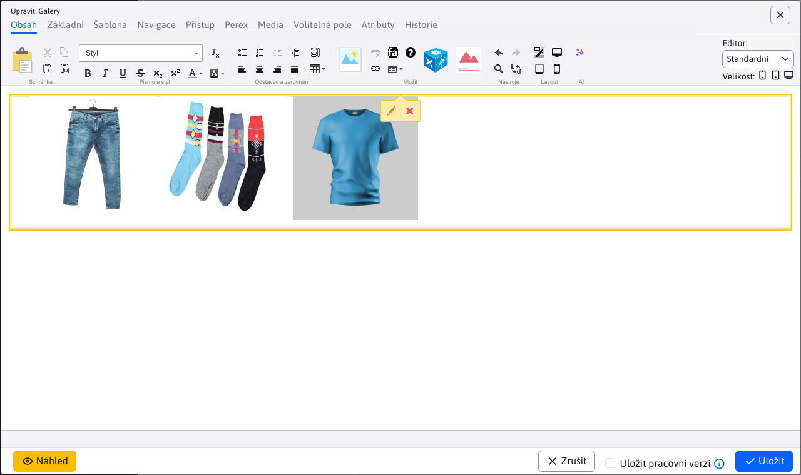

# Nastavení složky

Chcete-li zobrazit nastavení složky, klikněte pravým tlačítkem myši na složku a vyberte možnost Nastavení složky. Okno obsahuje následující karty:
- Základní
- Indexování (**Varování:** vykazuje se pouze za zvláštních okolností)
- Použití

## Základní

Karta **Základní** poskytuje základní informace o složce a možnost omezit přístupová práva pomocí skupiny uživatelů.

Pomocí možnosti "Indexovat soubory pro vyhledávání" povolíte indexování souborů ve složce.

## Indexování

Karta **Indexování** se zobrazí POUZE tehdy, pokud adresa URL složky začíná hodnotou `/files`. Používá se pro akce indexování souborů. Indexování se provádí POUZE tehdy, je-li povoleno na kartě [Základní](#Základní).

Stisknutím tlačítka "Index" zahájíte proces indexování, který může trvat několik minut.

| Indexování není povoleno nebo nebyly nalezeny žádné soubory k indexování | Indexování je povoleno a byly nalezeny soubory k indexování |
| :----------------------------------------------------------------: | :-----------------------------------------------------: |
|                 |          |

## Použití

Karta **Použití** ukazuje použití složky ve formě vnořené datové tabulky. Každý záznam představuje jednu webovou stránku. Datová tabulka obsahuje sloupce:
- Název, webová stránka
- Adresa URL, webová stránka

Obě hodnoty jsou současně přímky směřující do různých míst.

**Název** je odkaz na webovou stránku [Seznam webových stránek](../../../../redactor/webpages/README.md), kde se vyhledá webová stránka a automaticky se otevře editor.

**Adresa URL** je odkaz přímo na webovou stránku.

