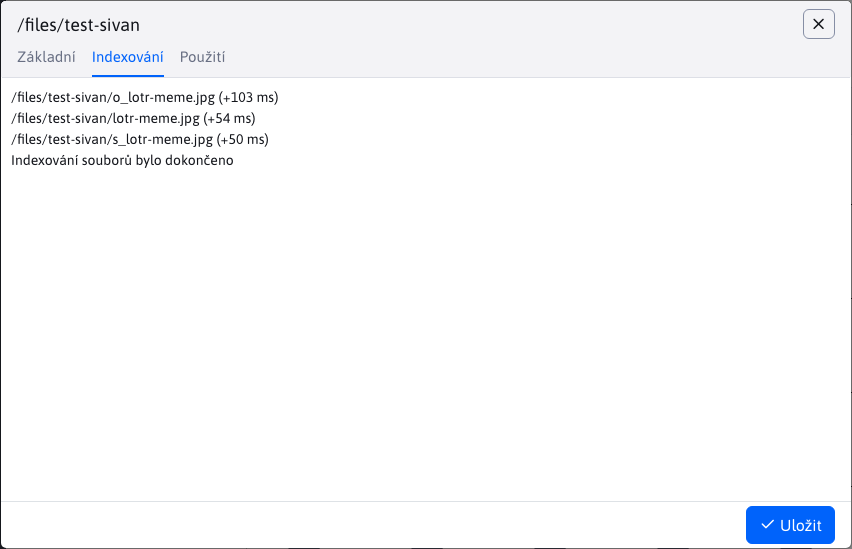

# Nastavení složky

Nastavení složky zobrazíte kliknutím pravým tlačítkem na složku a volbou Nastavení složky. Okno obsahuje následující karty:
- Základní
- Indexování (**Upozornění:** zobrazena pouze za speciálních okolnosti)
- Použití

## Základní

Karta **Základní** poskytuje základní informace o složce i možnost omezit přístupová práva pomocí Skupiny uživatelů.

Možností "Indexovat soubory pro vyhledávání" povolujete indexování souborů dané složky.

## Indexování

Karta **Indexování** se zobrazí POUZE pokud URL adresa dané složky začíná hodnotou `/files`. Slouží k akci indexování souborů. Indexování se provede POUZE pokud je povoleno v kartě [Základní](#základní).

Po stisku tlačítka "Indexuj" se spustí indexování, které může trvat několik minut.

| Indexování není povoleno, nebo nebyly nalezeny soubory k indexování | Indexování je povoleno a nalezeny soubory k indexování |
| :----------------------------------------------------------------: | :-----------------------------------------------------: |
|                 |          |

## Použití

Karta **Použití** zobrazuje použití složky ve formě vnořené datatabulky. Každý záznam představuje web stránku. Datatabulka obsahuje sloupce:
- Název, web stránky
- URL adresa, web stránky

Obě hodnoty jsou současně linky směřující na rozdílné lokace.

**Název** web stránky je linka na [Seznam web stránek](../../../../redactor/webpages/README.md), kde se daná web stránka vyhledá a automatický otevře editor.

**URL adresa** web stránky je linka přímo na danou web stránku.

