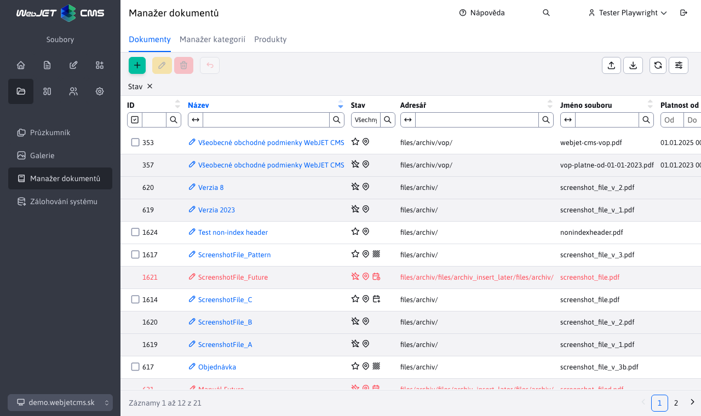
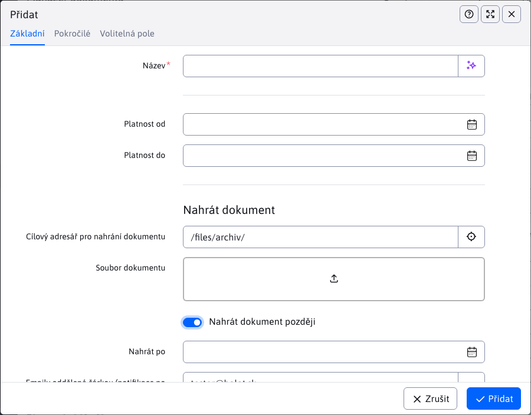
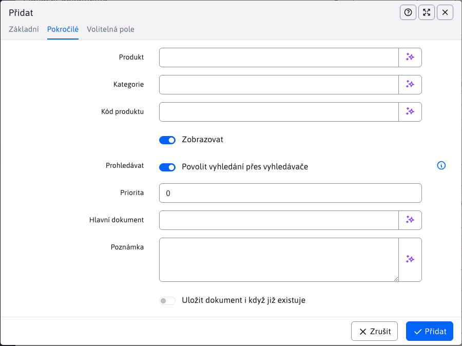
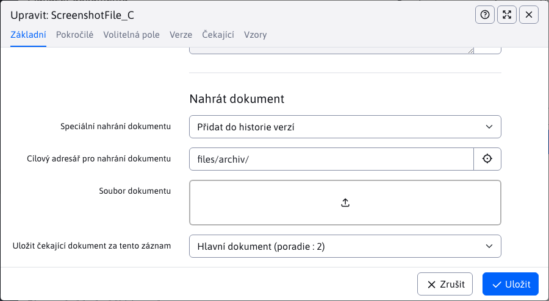

# Manažer dokumentů

Aplikace pro management dokumentů a jejich verzí na jednom místě. Umožňuje nastavovat i publikování dokumentů do budoucna a jednotlivé dokumentů zařadit do kategorií a přiřadit je k produktům. Pro práci s aplikací budete potřebovat právo Manažer dokumentů (`cmp_file_archiv`).

## Dokumenty

Vzobrazeném seznamu vidíme všechny dokumenty, které byly vloženy do manažera v aktuálně zvolené doméně. Přednastaveno je filtrování, které zobrazuje pouze **hlavní dokumenty**, jinak řečeno aktuální verze dokumentů.

### Stav dokumentů

Stav dokumentů zobrazuje sloupec **Stav**, který obsahuje ikony reprezentující jednotlivé stavy dokumentů, které mohou získat.

- <i class="ti ti-star" ></i> - **Aktuální verze dokumentu** nebo jinak řečeno **hlavní dokument**, který se aktuálně používá a může (no nemusí) mít jeden nebo více **historických verzí**. Hodnota sloupce **Reference** je -1.
- <i class="ti ti-star-off" ></i> - **Historická verze dokumentu**, která se používala v minulosti a nyní už je nahrazena **hlavním dokumentem**. Tyto historické verze se v tabulce označují šedou barvou pro jejich lepší rozlišení. Hodnota sloupce **Reference** je větší 0;
- <i class="ti ti-map-pin" ></i> - **Zobrazuje dokument** neboli **mají** povoleno zobrazování souborů
- <i class="ti ti-map-pin-off" ></i> - **Nezobrazuje dokument** neboli **nemají** povoleno zobrazování souborů
- <i class="ti ti-texture" ></i> - **Vzor** jiného hlavního dokumentu (který není vzor). Pokud referovaný hlavní dokument je formulář, tak vzor může být například vzorově vyplněný formulář.
- <i class="ti ti-calendar-time" style="color : #ff4b58!important" ></i> - **Dokument čeká na nahrání (v budoucnosti)** jedná se o dokument, který byl nahrán se zpožděním. To znamená, že se automaticky nahraje v budoucnosti ve zvoleném datu a čase. Až se dokument úspěšně nahraje, tak už **nebude** nadále mít tento stav. Dokumenty s tímto stavem jsou označeny červenou barvou, jelikož jsou speciální.
- <i class="ti ti-calendar-plus" ></i> - **Má novou verzi dokumentu, která čeká na nahrání (v budoucnu)** dokument má novou verzi, která jej má v budoucnu nahradit jako **hlavní dokument**.Dokument bude automatický nahrazen následně se z této veze stane**historická verze**.

## Vložení nového dokumentu do manažera

V této části si nejprve projdeme obsah jednotlivých karet a následně vysvětlíme postup a možné problémy při vkládání nového dokumentu do manažera.

### Karta - Základní

Karta obsahuje základní informace pro vložení dokumentu.

- **Název** - zadejte jméno dokumentu, které se bude na stránce zobrazovat (jako odkaz na dokument). Pole je **povinné**. Může obsahovat diakritiku, mezery, speciální znaky.
- **Platnost od** - nastavení data a času začátku platnosti dokumentu
- **Platnost do** - nastavení data a času konce platnosti dokumentu
- **Cílový adresář pro upload dokumentu** - vyberte adresář, do kterého chcete dokument nahrát (později Vám to poslouží při filtrování zobrazení dokumentů na stránce). Přednastavený cílový adresář nastavíte konfigurační proměnnou `fileArchivDefaultDirPath` Uživatel si bude moci zvolit i podsložku.
- **Soubor** - pole pro nahrání souboru, který reprezentuje dokument. Více o poli `UPLAOD` se dočtete[zde](../../../developer/datatables-editor/field-file-upload.md). Povolené přípony souboru nastavíte pomocí konfigurační proměnné `fileArchivAllowExt`.
- **Nahrát dokument později** - v případě potřeby nahrání dokumentu do manažera v přesný čas a datum, je možné nastavit nahrání dokumentu automaticky v budoucnosti. Výběrem možnosti se Vám zobrazí ukrytá pole
  - **Nahrát po** - výběr data a času, po kterém se má dokumentu nahrát
  - **Emaily oddělené čárkou (notifikace po nahrání)** - zadejte emaily oddělené čárkou, na které chcete zaslat notifikaci o úspěšném/neúspěšném nahrání dokumentu

### Karta - Pokročilé

- **Produkt** - zadejte libovolný název produktu. Pole Vám bude automaticky nabízet jiné již zadefinované produkty v manažeru. Ke zprávě můžete využít sekci [Produkty](./product-manager.md).
- **Kategorie** - zadejte libovolný název kategorie. Pole Vám bude automaticky nabízet jiné již zadefinované kategorie v manažeru. Ke zprávě můžete využít sekci [Kategorie](./category-manager.md).
- **Kód produktu** - zadejte libovolný název kódu produktu
- **Zobrazit** - nastavení pro zobrazení dokumentu na stránce (pokud nechcete dokumentu na stránce zobrazit, odškrtněte toto nastavení)
- **Procházet** - umožňuje povolit indexování souborů. Nové soubory mají tuto možnost ve výchozím nastavení zapnutou. Více
- **Priorita** - pomocí priority umíte libovolně nastavit pořadí zobrazení dokumentů na stránce
- **Hlavní dokument** - reference na hlavní dokument. Pole nabízí cesty k jednotlivým hlavním dokumentům, na které se aktuální dokument může odkazovat, čímž se stává **vzorem**. Nabízené jsou pouze cesty dokumentů, které splňují:
  - nejde o stejný dokument, který se upravuje
  - dokument musí být hlavní (nelze referencovat historický)
  - dokument nesmí čekat na nahrání (musí být již nahrán)
  - nemůže to být vzor
- **Poznámka** - poznámka se zobrazí na stránce při odkazu na dokument
- **Uložit dokument i když již existuje** - manažer standardně nedovoluje přidání téhož dokumentu vícekrát (aby se zabránilo duplicitě). Chcete-li to povolit, musíte zaškrtnout tuto možnost.

!>**Upozornění:** pole **Produkt** / **Kategorie** / **Kód produktu** Vám později poslouží při filtrování zobrazení souborů na stránce

### Karta - Volitelná pole

V kartě Volitelná pole umíte dokumentu nastavovat volitelné atributy (hodnoty, texty) podle vaší potřeby. Typy (text, číslo, výběrové pole...) a názvy polí lze nastavit dle potřeby, více informací je v sekci [Volitelná pole](../../../frontend/webpages/customfields/README.md).

### Postup vložení nového dokumentu

Nejprve je třeba vyplnit povinná pole **Název**. **Cílový adresář pro upload dokumentu** je také povinná hodnota, která se před-vyplní automaticky, ale umíte ji změnit. Následně musíte vložit soubor (reprezentující dokument) s povolenou příponou.

Pokud jste nahráli soubor se špatným formátem, validace záznam neuloží, a připomene, které přípony souboru jsou povoleny k nahrání.

Na pozadí se kontroluje, zda nahrávaný soubor/dokument, již existuje v manažeru.

!>**Upozornění:** nekontroluje se název dokumentu ale jeho **obsah**. To znamená, že pokud dokumenty jsou stejné, nepomůže jejich přejmenování.

V případě, že se detekuje již existující dokument, uložení bude přerušeno a zobrazí se chybová hláška. Zobrazena bude i notifikace obsahující seznam všech dokumentů se stejným obsahem. Chcete-li tento dokument přesto uložit, musíte povolit možnost **Uložit dokument i když již existuje** z karty pokročilé.

## Publikování naplánovaných verzí

Pokud jste při vytváření nového hlavního dokumentu zvolili možnost **Nahrát dokument později**, váš dokument bude nahrán až po zadaném datu a čase. Totéž platí i pro dokumenty typu **Vzor**. Ano, můžete naplánovat také nahrání vzoru do budoucnosti.

K automatickému nahrání dokumentu slouží vytvořena [Automatizovaný úkol](../../../admin/settings/cronjob/README.md). Tento úkol s označením `sk.iway.iwcm.components.file_archiv.FileArchivatorInsertLater`, se automatický provádí (**pouze pokud je povolena**) v časovém intervalu, který si umíte upravit. Vždy po časovém intervalu zkontroluje, zda nějaký dokument očekává nahrání a jeho zadaná hodnota **Nahrát po** obsahující datum/čas nahrání již nastala. Pokud ano, automaticky nahrá tento dokument.

## Úprava historické verze dokumentu v manažeru

!>**Upozornění:** manažer **nepovoluje** úpravu historické verze dokumentu. Můžete otevřít editor, prohlédnout si uložené hodnoty, ale vaše změny nebudete schopni uložit.

## Úprava aktuální verze dokumentu v manažeru

Manažer umožňuje různé akce a úpravy nad hlavními dokumenty. Složení karty **Základní** se změnilo a přidaly se nové karty**Verze**, **Čekající** a **Vzory**. O funkcionalitách jednotlivých přidaných karet si povíme později. K této akci a všem akcím editace, potřebujete mít právo `cmp_fileArchiv_edit_del_rollback`.

!>**Upozornění:** pokud chcete při editaci vkládat nové soubory, musíte mít navíc k právu `cmp_fileArchiv_edit_del_rollback` povolenou i konfigurační proměnnou`fileArchivCanEdit`.

!>**Upozornění:** pro dokumenty typu **vzor** se karta **Vzory** nezobrazuje, nakolik vzorové dokumenty nemohou mít svůj vzor.

Pokud jste dokument přidali jako naplánovanou verzi do budoucna, editor Vám umožní změnit datum/čas nahrání i emaily pro notifikace. Pokud se dokument již nahrál, tato pole budou zablokována a jejich další změna nebude možná.

Nejdůležitější změna v kartě základní je přidání sekce **Nahrát dokument**, kde si umíte vybrat speciální akci, která se má provést nad daným dokumentem. Tyto akce si popíšeme v následujících kapitolách a jde o akce:
- **Nahrát novou verzi**
- **Nahradit aktuální dokument**
- **Přidat do historie verzí**

### Fyzicky přejmenovat dokument/soubor

Karta základní nabízí možnost fyzicky**přejmenovat dokument** (čili reálný soubor reprezentující náš dokument) ne jeho virtuální jméno. Při zvolení této možnosti Vám zobrazí nové pole **Nové jméno dokumentu bez přípony** kde zadáte nové jméno pro dokument.

!>**Upozornění:** Po této změně je třeba aktualizovat všechny statické odkazy na tento dokument.

### Akce - Nahrát novou verzi

Tato akce vytvoří novou aktuální verzi dokumentu. Z právě aktuální verze (kterou lze nahradit) se stane historická verze dokumentu. Stačí nahrát nový dokument, jelikož cílový adresář je před-vyplněný (ale může být změněn). K možnosti **Nahrát dokument později** se dostaneme až v následující části.

!>**Upozornění:** povoleno je nahrát pouze dokument se stejným typem, jako právě nahrazovaný aktuální dokument.

Třeba si uvědomit, že nahrávaný dokument bude po uložení automaticky fyzicky přejmenován podle názvu aktuálně nahrazovaného dokumentu. Chcete-li aby se dokument jmenoval jinak, musíte použít možnost **Fyzicky přejmenovat dokument** a zadat nové jméno.

!>**Upozornění:** tato akce není povolena pro historické dokumenty a dokumenty čekající na nahrání. Při výběru akce se žádné z daných polí pro tyto dokumenty nezobrazí.

Po úspěšném nahrání si původní (nyní již historickou verzi) umíte prohlédnout v kartě **Verze**.

Karta **Verze** obsahuje všechny historické verze právě upravovaného aktuálního dokumentu.**nepodporuje akce** nad daty. Jednotlivé záznamy lze otevřít jako při editaci, ale nebude schopen své změny uložit.

**Číslování verzí**

Všimněte si, že reálné jméno historických verzí se změnilo. Protože při nahrání nové verze se nahrávaný soubor reprezentující dokument **vždy pojmenuje stejně** a souborový systém neumožňuje 2 souborům mít stejné jméno ve stejné lokaci, tak se historický automaticky přejmenuje s přidáním patičky`_v_X` (X je nahrazeno za číslo). Toto číslo se zvětšuje s každým souborem, který má stejné jméno ve stejné složce.

**Pořadí uspořádání**

Hlavní dokument má vždy hodnotu pořadí uspořádání -1. Když se hlavní dokument stane historickou verzí, nastaví se mu hodnota 2 a všem starším historickým verzím se tato hodnota zvětší o 1. Pomocí této hodnoty umíte říci, který dokument je nejstarší (má **největší** číslo) a který je nejnovější, což je aktuální hlavní dokument s hodnotou -1. Tato hodnota je velmi důležitá při akci typu [Vrácení poslední změny spát](#vrácení-poslední-změny-spát).

### Akce - Nahrát novou verzi do budoucnosti

Postup je praktický identický jako v případě **Akce - Nahrát novou verzi**. Rozdíl při zvolení možnosti **Nahrát dokument později**, kdy máme možnost zadat do pole**Nahrát po** datum/čas kdy se nová verze dokumentu nahraje. Takto přidána nová verze dokumentu, nenahradí okamžitě hlavní dokument, ale bude čekat na nahrání. Nová verze se nahraje jak to je popsáno v sekci [publikování-naplánovaných-verzí](#publikování-naplánovaných-verzí)

Všechny čekající verze daného dokumentu jsou dostupné přímo v jeho kartě **Čekající**. Na rozdíl od historických verzí v kartě verze, tabulka v kartě čekající umožňují akce nad čekajícími verzemi. Můžete je vymazat nebo upravit. Samozřejmě, to vše platí i pro dokumenty typu **Vzor**, tedy si umíte naplánovat novou verzi vzoru.

### Akce - Nahradit aktuální dokument

Tato akce dělá přesně to, co název napovídá. Nenahraje novou verzi dokumentu, ale vymění právě aktuální hlavní dokument za jiný, čili se vymění soubor reprezentující dokument. Dokument může mít jiný název, ale automaticky se zachová název původního dokumentu.

Tato akce funguje i pro dokumenty typu**Vzor** jakož i pro dokumenty, které čekají na nahrání. Tak víte například. vyměnit dokument, který se má nahrát v budoucnosti bez potřeby vymazání původního dokumentu a vytváření nového záznamu.

!>**Upozornění:** povoleno je nahrát pouze dokument se stejným typem, jako právě nahrazovaný aktuální dokument.

### Akce - Přidat do historie verzí

Akce umožňuje doplnit historickou verzi dokumentu. Použití může být například v případě, že Vám mezi historickými verzemi chybí nějaká verze a vy ji chcete doplnit, aniž byste ovlivnili aktuální dokument. Navíc k této akci potřebujete další právo `cmp_fileArchiv_advanced_settings`.

!>**Upozornění:** povoleno je nahrát pouze dokument se stejným typem, jaký má hlavní dokument.

Kromě nahrání potřebného dokumentu, musíte zvolit za jaký dokument se tento vloží. Buď se vloží přímo za hlavní dokument, nebo již za existující historický dokument. Možnosti obsahují v závorce i pořadí, kterým bude dokument disponovat po vložení se konkrétní dokument. Všem dokumentům, za tímto pořadím (včetně původně daného) se zvýší pořadí o 1. Je třeba si uvědomit, že **pořadí dokumentu** je důležitý faktor při akci typu [Vrácení poslední změny spát](#vrácení-poslední-změny-spát) a proto je třeba si dobře promyslet, za jaký dokument se tento vloží.

!>**Upozornění:** tato akce není povolena pro historické dokumenty a dokumenty čekající na nahrání. Při výběru akce se žádné z daných polí pro tyto dokumenty nezobrazí.

## Vrácení poslední změny spát

Vrácení poslední změny spát nebo `rollback` je akce, která umožňuje vrácení historické verze zpět jako hlavní verzi dokumentu a funguje i pro dokumenty typu **Vzor**. K této akci potřebujete mít právo `cmp_fileArchiv_edit_del_rollback`.

Pro fungování akce `rollback` je třeba splnit tyto požadavky:
- musí se jednat o hlavní dokument
- dokument již musí být nahrán (nesmí čekat na nahrání)
- musí mít alespoň jeden historický dokument (jinak by tato akce neměla smysl)
- dokument nesmí mít **naplánovanou verzi**, která se má nahrát v budoucnosti

### Průběh vrácení

Po označení hlavního dokumentu akci spustíte tlačítkem . Zobrazí se ještě dialogové okno, kde musíte tuto akci potvrdit.

Po potvrzení se spustí akce, kdy aktuální hlavní dokument **bude vymazán** a nahradí jej historický dokument s nejmenší hodnotou **Pořadí uspořádání**, neboli hodnotou 2. Takže jsme zpětně nahradili aktuální dokument nejmladším historickým dokumentem. Všem ostatním historickým dokumentům (pokud nějaké zůstaly) se následně sníží **Pořadí uspořádání** o hodnotu 1. Takže dokumentu co měl pořadí 3 se po akci snížilo pořadí na 2, čímž se stal následujícím dokumentem, kterým by se použil při této akci. Takto se umíme vracet k původním verzím dokud nám nezbude žádný historický dokument.

## Vzory

To, jak se vzory nastavují, jsme si už vysvětlili. Jeden hlavní dokument může mít několik vzorů, takže jsou v poměru `1:N`. Všechny **hlavní** vzory (tedy hlavní dokumenty, ne historické verze) se zobrazují v poslední kartě editoru **Vzory**. Chcete-li vidět historické verze vzorů, prohlédněte si je v kartě **Verze** daného vzoru.

Tato karta se nezobrazuje dokumentem, které jsou vzory, protože vzor nemůže mít svůj vlastní vzor. Tabulka v kartě umožňuje úpravu i mazání dostupných vzorů.

Vzory jsou definovány tím, že se odkazují na hlavní dokument. Tento odkaz je ve sloupci **Hlavní dokument**. V případě, že hlavní dokument změní lokalitu (hodnota **Adresář**) nebo fyzicky přejmenuje (hodnota **Reálné jméno**) tak **všem** vzorem odkazujícím na daný dokument se automaticky upraví hodnota **Hlavní dokument**. A to se týká hlavních vzorů ale i jejich historických verzí.

!>**Upozornění:** pokud hlavní dokument má na sebe alespoň jeden odkazující vzor, tak tento hlavní dokument se nemůže sám stát vzorem.

## Mazání

Podmínky a následky akce mazání se liší podle toho, jaký typ dokumentu chceme vymazat. V této kapitole si všechny typy vysvětlíme. Společné mají však to, že vymazáním se vymaže i fyzický dokument (resp. soubor který jej reprezentuje), který byl dostupný pomocí [Průzkumníka](../fbrowser/README.md). K této akci mazání potřebujete mít právo `cmp_fileArchiv_edit_del_rollback`.

### Mazání hlavního čekajícího dokumentu

Pokud máte hlavní dokument, který očekává nahrání v budoucnosti, umíte jej vymazat přímo v hlavně tabulce. Nemá to žádné jiné následky, protože čekající dokument nemůže mít ani historické verze ani vzory.

### Mazání vzorů

Mazání je povoleno pouze pro hlavní vzory. Historické verze nelze vymazat. Pokud vymažete hlavní vzor, vymažete i všechny historické verze. Hlavní dokument, na který se vzor odkazoval nebude nijak ovlivněn.

!>**Upozornění:** hlavní vzor nelze vymazat, pokud má čekající verzi na nahrání.

V takovém případě buď počkáte, než se všechny naplánované verze nahrají NEBO v záložce **Čekající** daného vzoru, vymažete všechny čekající verze. Toto mazání čekajících verzí lze provést **POUZE** skrz tabulku v kartě.

### Mazání hlavního dokumentu

Vymazáním hlavního dokumentu (který není vzor) se vymažou i všechny historické verze a také všechny vzory, které odkazují na tento dokument.

!>**Upozornění:** hlavní dokument nelze vymazat, pokud má čekající verzi na nahrání.

Stejně jako při mazání vzorů lze tyto naplánované verze vymazat. **POUZE** pomocí tabulky v kartě **Čekající**.

## Vyhledávání a indexování

Zvolením možnosti **Procházet** povolíte vyhledávání dokumentu přes aplikaci **Vyhledávání** a indexování v externích vyhledávačích. Ve výchozím nastavení je tato možnost povolena pro nové dokumenty. Pokud se dokument stane **historickou verzí**, toto povolení se automaticky deaktivuje, avšak je možné jej opětovně povolit podle potřeby.

### Vyhledávače typu Google

Pokud možnost **Procházet** není povolena, pro takový dokument se přidá `HTTP` hlavička `X-Robots-Tag` s hodnotou `noindex, nofollow`, aby se zabránilo indexování takového dokumentu ve vyhledávačích typu Google.
