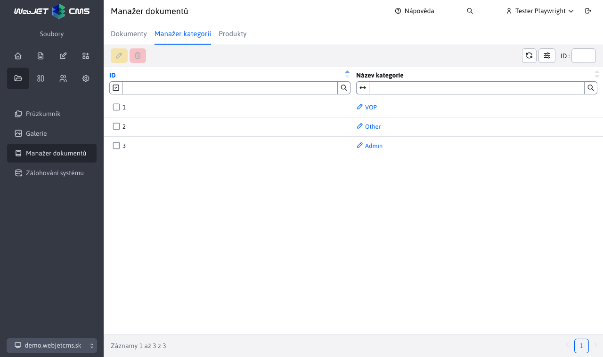

# Kategorie

Sekce kategorie slouží k řízení**již existujících** kategorií, které byly definovány v[Manažeři dokumentů](./README.md). Povoleny jsou jen 2 akce a to**úprava** a **mazání**. Pro práci s touto sekcí potřebujete právo Manažer dokumentů-Kategorie (`menuFileArchivManagerCategory`).

## Úprava kategorie

Při úpravě kategorie prakticky přejmenujeme již existující kategorii. To znamená, že všem dokumentům s touto kategorií se zemní hodnota, na novou zadanou.

Použití je v případě, že chceme globálně v celém manažeru dokumentů změnit jméno stávající kategorie, bez nutnosti upravovat jednotlivé záznamy.

## Vymazání kategorie

Vymazáním zvolené (zvolených) kategorií, nastane vlastně akce **úpravy**, kdy se všem záznamům z manažera dokumentů vymaže daná nastavená kategorie. Tato kategorie zmizí iz tabulky, jelikož již nebude nikde použita.
