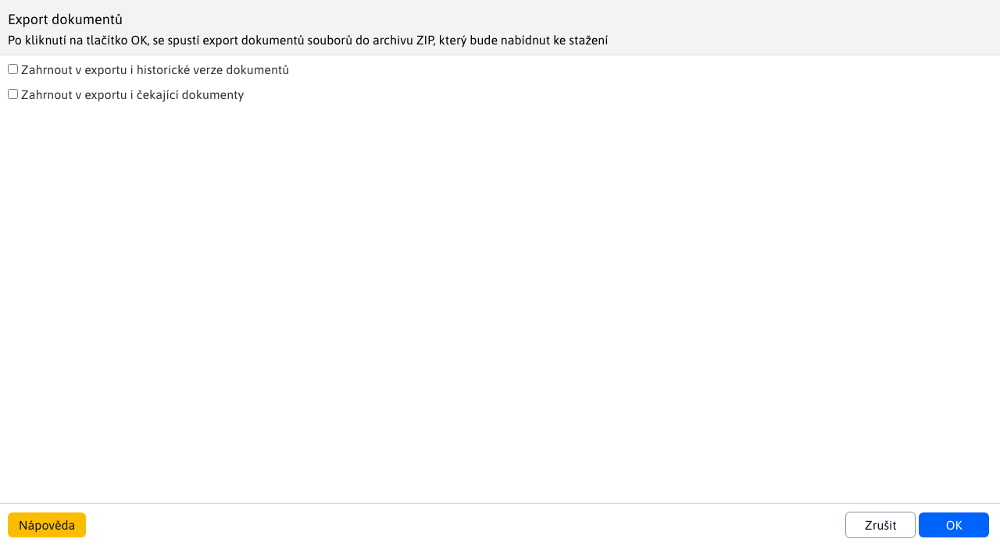
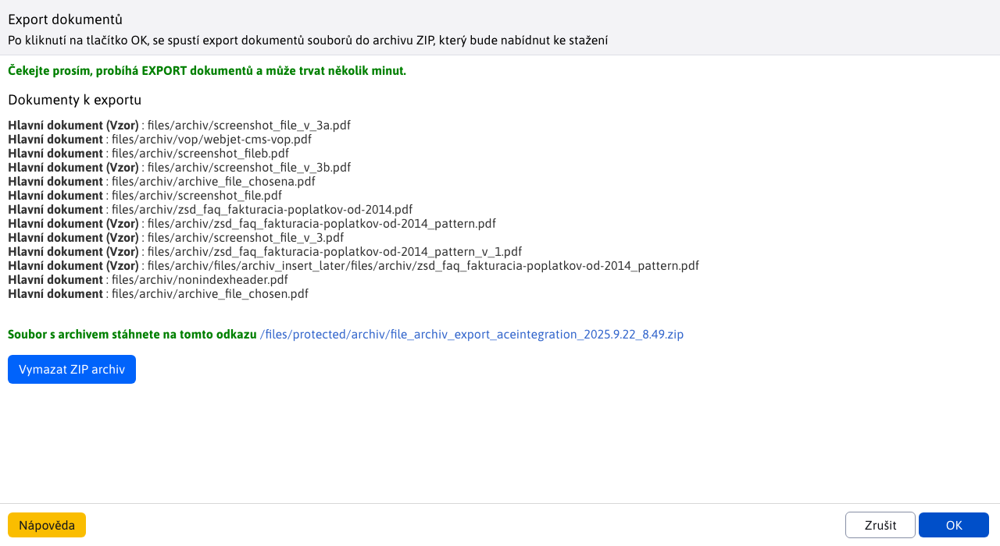
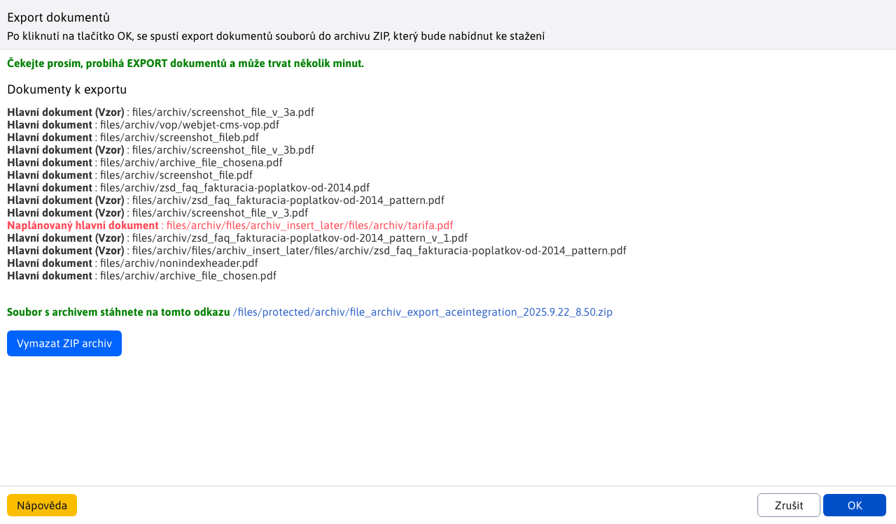
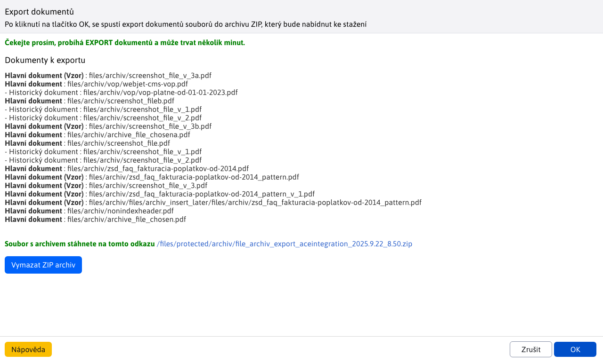

# Export dokumentů

Upravený export slouží k exportování dokumentů z [Manažera dokumentů](./README.md) do `ZIP` souboru. Přednastaveno, exportují se **pouze** hlavní dokumenty včetně vzorů. Pro práci s exportem potřebujete právo Manažer dokumentů-Export dokumentů (`menuFileArchivExportFiles`).

## Exportování hlavních dokumentů/vzorů

Pro exportování hlavních souborů (včetně vzorů) Vám stačí stisknout tlačítko s názvem `OK`. Tímto se spustí přednastavený export, který může trvat i několik minut při velkém množství dat. V okně se vypíše seznam jednotlivých exportovaných **hlavních** dokumentů a to včetně i hlavních dokumentů typu **Vzor**.

!>**Upozornění:** historické a čekající verze dokumentů se **neexportují**

## Exportování hlavních a čekajících dokumentů/vzorů

Pro exportování hlavních dokumentů/vzorů **včetně čekajících**, musíte zvolit možnost **Zahrnout v exportu i čekající dokumenty** a následně stisknout tlačítko s názvem `OK`. Tímto se spustí export, který může trvat i několik minut při velkém množství dat. V okně se vypíše seznam jednotlivých exportovaných dokumentů/vzorů. čekající dokumenty/vzory jsou zvýrazněny červenou barvou pro lepší přehled.

## Exportování hlavních a historických dokumentů/vzorů

Pro exportování hlavních dokumentů/vzorů **včetně historických** verzí, musíte zvolit možnost**Zahrnout v exportu i historické verze dokumentů** a následně stisknout tlačítko s názvem `OK`. Tímto se spustí export, který může trvat i několik minut při velkém množství dat. V okně se vypíše seznam jednotlivých exportovaných dokumentů/vzorů tak, aby k hlavnímu dokumentu byly vizuálně přiřazeny jeho historické verze.

## Exportování všech dokumentů/vzorů

Pro exportování všech dokumentů musíte zvolit obě možnosti**Zahrnout v exportu i čekající dokumenty** a **Zahrnout v exportu i historické verze dokumentů**. Následně stisknout tlačítko s názvem `OK`. Tímto se spustí export, který může trvat i několik minut při velkém množství dat.

## Stažení souboru

Soubor stáhnete kliknutím na přiloženou linku, která může vypadat jako`/files/archiv/file_archiv_export_aceintegration_2025.2.27_14.39.zip`.

## Vymazání souboru

Nakolik se vytvořen `ZIP` soubor ke stažení vytváří v hlavní lokaci kde začínají archivní soubory, máte možnost tento vytvořený soubor vymazat a to kliknutím na tlačítko s názvem **Vymazat ZIP archiv**. Po úspěšném smazání se zobrazí hláška.

