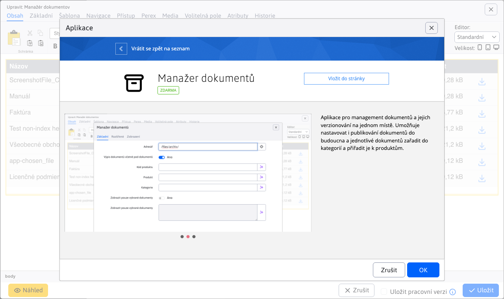
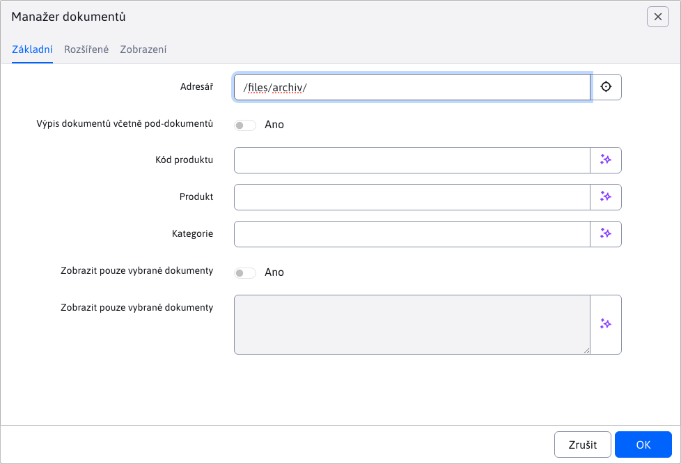
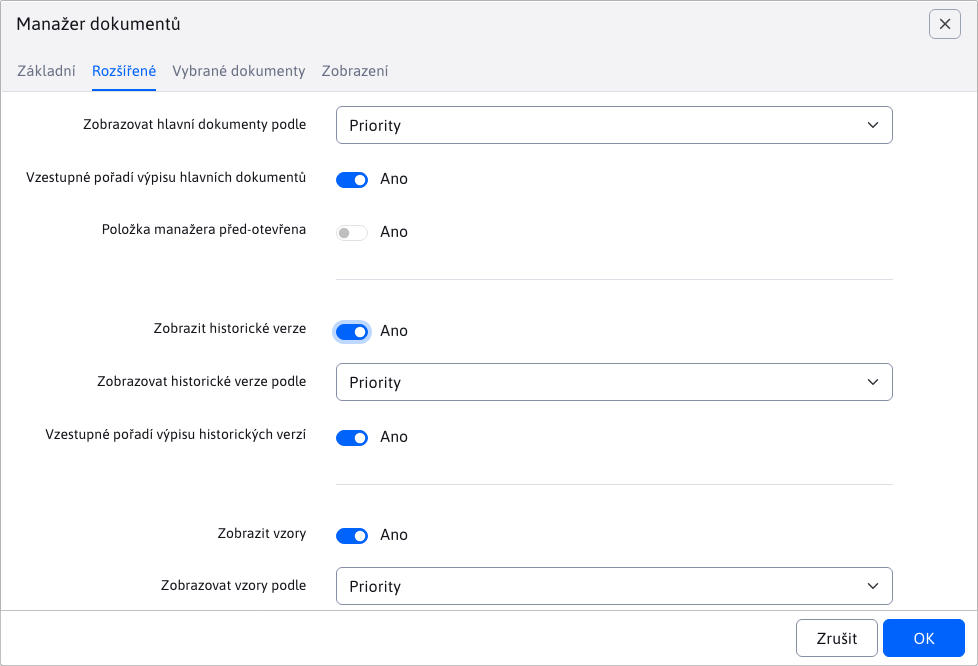
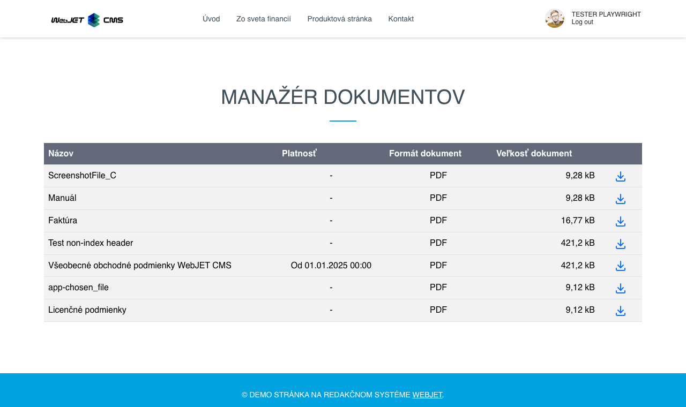
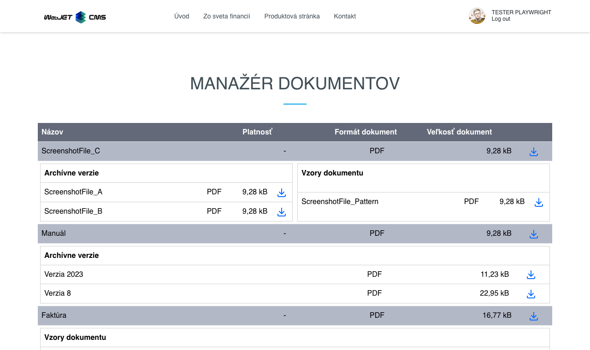

# Aplikace Manažer dokumentů

Aplikace slouží k přehlednému zobrazení zvolených (filtrovaných) dokumentů z[Manažera dokumentů](./README.md).

## Použití aplikace

Aplikaci můžete do své stránky přidat přes obchod s aplikacemi



nebo přímo jako kód do stránky

```html
!INCLUDE(sk.iway.iwcm.components.file_archiv.FileArchiveApp, dir=&quot;/files/archiv/&quot;, subDirsInclude=true, productCode=, product=, category=, showOnlySelected=false, globalIds=, orderMain=priority, ascMain=true, open=false, archiv=true, order=priority, asc=true, showPatterns=true, orderPatterns=priority, ascPatterns=true)!
```

v kódu si můžete všimnout množství parametrů, které si vysvětlíme v další části.

## Nastavení aplikace

Pomocí nastavení umíte filtrovat zobrazení pouze určitých dokumentů i stylu, jak se mají zobrazovat.

### Karta - Základní

Karta **Základní** slouží k nastavení filtrování dokumentů pro zobrazení.

!>**Upozornění:** dokumenty, které teprve čekají na nahrání, se v aplikaci **nezobrazují**.

- **Adresář** - umíte nastavit, zobrazení dokumentů pouze z konkrétní složky. Přednastavená hodnota je kořenová složka pro nahrání dokumentů. Můžete tuto hodnotu změnit, ale nemůžete jít výše než kořenovou složku.
- **Výpis dokumentů včetně pod-dokumentů** - přednastaveno je zobrazení dokumentů **POUZE** ze zvoleného (bez podsložek).**všechny** dokumenty ze zvolené složky ale **AJ** pod-složek.

!>**Upozornění:** zvolením možnosti**Výpis dokumentů včetně pod-dokumentů** na složce, která je vysoko ve stromové struktuře se vystavujete riziku práce s velkým množstvím dat. Proto se tato možnost doporučuje při menších množstvích nebo s užším filtrováním.
- **Kód produktu** - zobrazíte pouze dokumenty s daným kódem produktu.
- **Produkt** - pole automatický nabízí zadefinované produkty v manažeru, podle kterých můžete filtrovat.
- **Kategorie** - pole automatický nabízí zadefinované kategorie v manažeru, podle kterých můžete filtrovat.



**Zobrazit jen vybrané dokumenty** - jedná se o speciální možnost, kdy se budou ignorovat všechny dosavadní filtry jako**Adresář** / **Kód produktu** atd., a zobrazí se pouze dokumenty, které mají zadané `globalId` v poli **Zobrazit jen vybrané dokumenty**

Všechny dosavadní filtry si zachovají hodnoty, ale nemají žádný vliv a jsou zablokovány. Navíc se ještě zobrazí nová karta **Vybrané dokumenty**.


### Karta - Vybrané dokumenty

Karta se zobrazí pouze v případě, je-li zvolena možnost **Zobrazit jen vybrané dokumenty**. V kartě je vnořená tabulka, která zobrazuje zadefinované dokumenty z pole **Zobrazit jen vybrané dokumenty** pomocí `globalId` hodnot. Takto získáte náhled dokumentů, které jste zvolili k zobrazení.


### Karta - Rozšířené

Karta slouží k nastavení stylu zobrazení a řazení dokumentů.

- **Zobrazovat hlavní dokumenty podle** - výběr hodnoty, podle které se mají hlavní dokumenty řadit
- **Vzestupné pořadí výpisu hlavních dokumentů** - pokud je možnost zvolena, hlavní dokumenty se budou řadit vzestupně, jinak naopak
- **Položka manažera předotevřená** - pokud možnost zvolíte, manažované položky se při zobrazování automaticky otevřou

***

- **Zobrazit historické verze** - zvolením možnosti se povolí zobrazení historický verzí dokumentů (pokud nějaké má). Také se odkryjí možnosti pro řazení těchto historických verzí
- **Zobrazovat historické verze podle** - výběr hodnoty, podle které se mají historické verze řadit
- **Vzestupné pořadí výpisu historických verzí** - pokud je možnost zvolena, historické verzí se budou řadit vzestupně, jinak naopak

***

- **Zobrazit vzory** - zvolením možnosti se povolí zobrazení vzorů daného dokumentu (pokud nějaké má). Zobrazují se pouze hlavní vzory, nikoli jejich historické verze. Také se odkryjí možnosti pro řazení těchto vzorů
- **Zobrazovat vzory podle** - výběr hodnoty, podle které se mají vzory řadit
- **Vzestupné pořadí výpisu vzorů** - pokud je možnost zvolena, vzorové dokumenty se budou řadit vzestupně, jinak naopak



## Aplikace

Samotná aplikace ve stránce zobrazuje zadané nebo vy-filtrované hlavní dokumenty.



Pokud jste nezvolili možnost **Položka manažera předotevřená**, položka za uzavřená a teprve po kliknutí na ni se zobrazí dostupné **Historické dokumenty** a **Vzory dokumentu**.



Samozřejmě, tyto tabulky se zobrazí pouze v případě, že:
- je povolena možnost **Zobrazit historické verze** případně **Zobrazit vzory**
- daný hlavní dokument má nějaké historické dokumenty nebo vzory

Hlavní dokument může mít obě tabulky současně, nebo ani jednu, v závislosti na tom, zda jsou povoleny nebo mají nějaké hodnoty.

**Zobrazit vzory** zobrazuje pouze hlavní vzory, neboť i vzory mohou mít historické verze.

Ikona <i class="ti ti-download" style="color: #00a3e0;" ></i> je dostupná pro hlavní dokumenty, historické dokumenty i pro vzory. Klepnutím na ni se zobrazí daný dokument v novém okně, kde si jej umíme prohlédnout nebo stáhnout.


