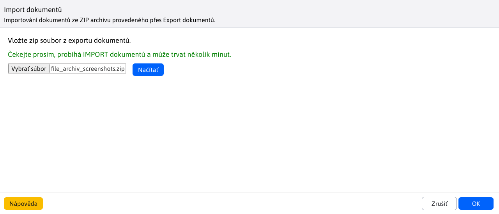

# Import dokumentů

Upravený import slouží k importování dokumentů/vzorů ze`ZIP` souboru zpět do[Manažera dokumentů](./README.md). Pro práci s importem potřebujete právo Manažer dokumentů-Import dokumentů (`menuFileArchivImportFiles`).

Po vyjmutí `ZIP` souboru spusťte proces tlačítkem **Načíst** (případně tlačítkem `OK`). Protože tento proces může trvat několik minut v závislosti na množství dat, zobrazí se upozornění.

Systém zkontroluje zda jsou mezi importovanými dokumenty/vzory takové, které již existují. Pokud ano, zobrazí je. Vy máte následně možnost zvolit ty, které chcete nahradit. Přednastaveno je to tak, že jsou vybrány všechny, ale vy můžete vybrat pouze část nebo i žádný z nich.

Pokračujete stisknutím tlačítka `OK`, kde se následně vypíší dokumenty/vzory, které byly nahrazeny (pokud jste nějak zvolili) a ty, které se v manažera dokumentů nenacházely vůbec a musely být importovány.

