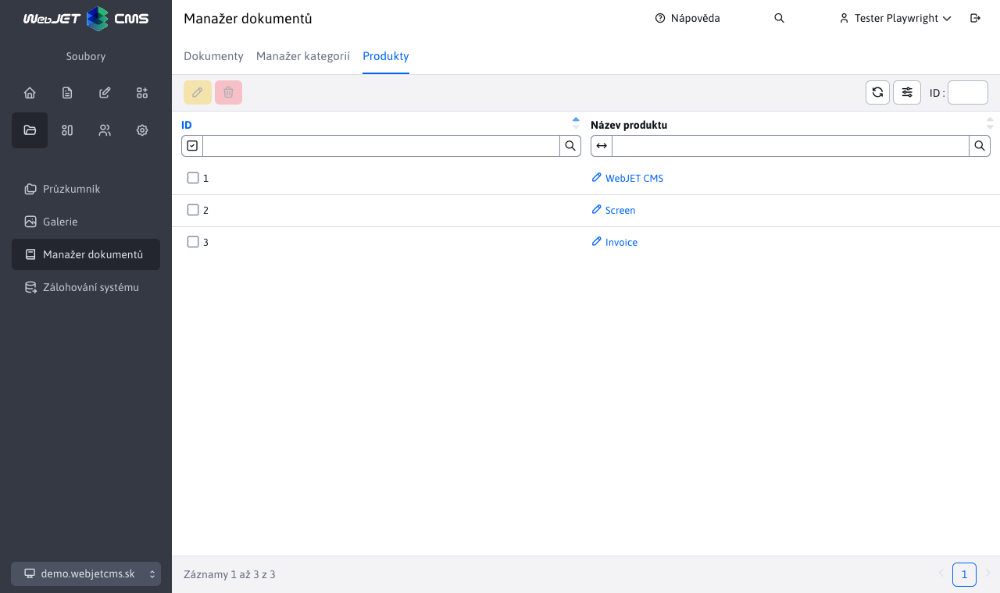

# Produkty

Sekce produkty slouží k řízení **již existujících** produktů, které byly definovány v [Manažeři dokumentů](./README.md). Povoleny jsou jen 2 akce a to **úprava** a **mazání**. Pro práci s touto sekcí potřebujete právo Manažer dokumentů-Kategorie (`menuFileArchivManagerCategory`).

## Úprava produktu

Při úpravě produktu prakticky přejmenujeme již existující produkt. To znamená, že všem dokumentům s tímto názvem produktu se zemní hodnota, na novou zadanou.

Použití je v případě, že chceme globálně v celém manažeru dokumentů změnit jméno stávajícího produktu, bez nutnosti upravovat jednotlivé záznamy.

## Vymazání produktu

Vymazáním zvoleného názvu (názvů) produktů, nastane vlastně akce **úpravy**, kdy se všem záznamům z manažera dokumentů vymaže daná nastavená hodnota produktu.
