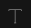

# Editor obrázků

Editor obrázků umožňuje provádět pokročilé úpravy obrázků na serveru přímo v prohlížeči. Používá se v galerii, ale lze jej vyvolat i při úpravách webové stránky kliknutím na obrázek a následným kliknutím na ikonu pro úpravu obrázku nebo z průzkumníka kliknutím pravým tlačítkem myši na obrázek a výběrem možnosti Upravit.

K dispozici jsou následující nástroje:
- , **Změna velikosti**: můžete upravit velikost obrázku. Upozorňujeme, že ve výchozím nastavení se obrázek zobrazuje v maximální velikosti 1000 pixelů na šířku, takže změna velikosti nemusí být viditelná, protože obrázek může být reálně větší než zobrazená velikost.
  - Velikost lze měnit na základě definovaných šablon velikosti (pokud opakovaně potřebujete nastavit přesnou velikost obrázku). Seznam možností se nastavuje v konfigurační proměnné `imageEditorSizeTemplates`, ve výchozím nastavení nastaveno na `80x80;640x480;800x600;`.
  - Možnost vázané rozměry zachovává poměr stran, při použití šablony se nastaví šířka a výška se vypočítá podle poměru stran aktuálního obrázku.
- , **Plodiny**: Kliknutím na tuto možnost ořízněte fotografii v galerii.
  - Fotografii lze oříznout do libovolného obdélníku nebo si můžete vybrat z předdefinovaných poměrů stran: čtverec, 3:2, 4:3, 5:4, 7:5, 16:9.
  - Poměry stran lze definovat v konfigurační proměnné `imageEditorRatio`, ve výchozím nastavení nastaveno na `3:2, 4:3, 5:4, 7:5, 16:9`.
- , **Otočte se**: Tato funkce umožňuje převrátit fotografii vodorovně (Převrátit X) nebo svisle (Převrátit Y) a vytvořit tak zrcadlový obraz.
- , **Otočte se**: V této funkci můžete pomocí posuvníku vybrat hodnotu ve stupních od -360 do 360 nebo pomocí tlačítek otočit fotografii o 30 stupňů ve směru nebo proti směru hodinových ručiček.
- , **Draw** Odpověď: Tato funkce umožňuje nakreslit na fotografii volnou nebo rovnou čáru. Můžete si vybrat barvu a tloušťku čáry (rozsah).
- , **Tvar**: Pomocí této funkce můžete do fotografie přidat různé tvary, například kruhy, obdélníky nebo trojúhelníky. Můžete libovolně měnit barvu tahu a výplně a zároveň určovat tloušťku tahu. Vytvořené objekty lze přesouvat, měnit jejich měřítko, zvětšovat a otáčet, včetně objektů vytvořených pomocí funkce Draw.
- , **Ikona**: Funkce Ikona umožňuje přidat k fotografii různé ikony a samolepky z předdefinované knihovny nebo vlastní nahrané ikony. Barvu můžete měnit podle potřeby. Vytvořené objekty lze přesouvat, měnit jejich měřítko, zvětšovat a otáčet.
- , **Text**: Tato funkce slouží k přidání textu k fotografii. Text můžete naformátovat na tučný, kurzívou nebo podtržený. Lze zvolit barvu a velikost.
- , **Maska**: Funkce Maska umožňuje použít na fotografii různé masky, které lze použít ke skrytí nebo zvýraznění částí fotografie.
- , **Filtr**: Pomocí této funkce můžete na fotografii použít různé filtry a upravit její vzhled. Na výběr jsou tyto filtry: černobílý filtr, sépie, rozmazání, reliéf, negativ, zaostření. Můžete upravit odstranění bílé, jas, šum, zrno a barevný filtr. Pro každou barvu můžete také nastavit Odstín, Násobení a Prolnutí.
  - **Tónování**: Umožňuje použít barevný odstín na fotografii. Intenzitu barvy můžete nastavit pomocí krytí (průhlednosti).
  - **Násobení**: Tento efekt zvyšuje tmavost obrázku kombinací barev fotografie s barevnou vrstvou. Výsledná barva je vždy tmavší.
  - **Míchání**: Umožňuje kombinovat dvě vrstvy obrázků pomocí různých režimů:
    - **Přidat**: Přidá barvy obou vrstev. Výsledek je jasnější.
    - **Diff**: Zobrazuje rozdíly mezi vrstvami.
    - **Odečtěte**: Odečte barvy jedné vrstvy od druhé. Výsledek je tmavší.
    - **Násobit**: Kombinuje barvy vrstev a vytváří tmavší výsledek.
    - **Obrazovka**: Invertuje barvy, vynásobí je a znovu invertuje. Výsledek je světlejší.
    - **Odlehčit**: Zobrazuje světlejší barvy ze dvou vrstev.
    - **Ztmavit**: Zobrazí tmavší barvy obou vrstev.
