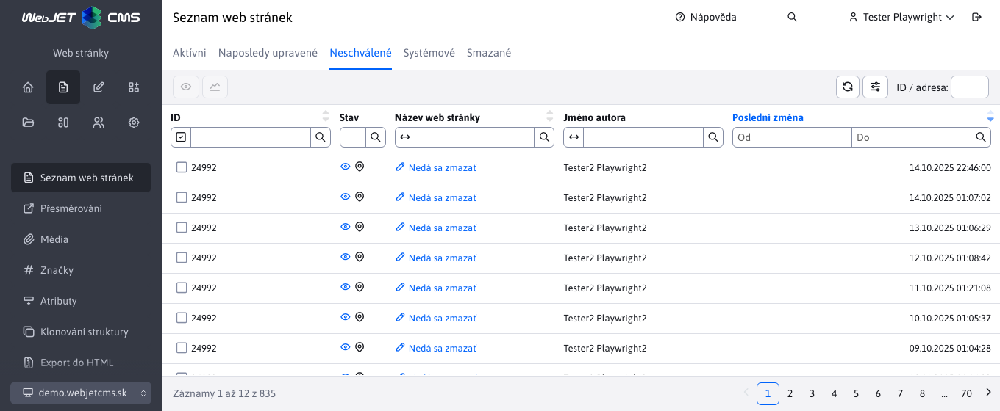

# Webové stránky

## Základní ovládací prvky

### Výběr domény

U webových stránek s více doménami se výběr domény zobrazuje nahoře. Ve stromové struktuře webu se zobrazí pouze složky s vybranou doménou a složky, které nemají nastavenou doménu.

### Zobrazení složek Systém a Koš

Na kartě Systém nebo Koš se zobrazí speciální složky Systém (obsahuje stránky potřebné pro šablonu, například záhlaví a zápatí) a Koš (obsahuje odstraněné stránky).

Zobrazení na kartě Systém závisí na konfiguraci systému WebJET:
- ve výchozím nastavení zobrazí obsah složky `/System` (globální složka pro všechny domény)
- pokud je režim zapnutý **Systém místních složek** (nastavte konfigurační proměnnou `templatesUseDomainLocalSystemFolder` na adrese `true`) a pro aktuálně vybranou doménu existuje místní systémová složka, obsah složky
- pokud je zapnutý režim vyhledávání v systému složek **rekurzivní ve stromové struktuře** (nastavte konfigurační proměnnou `templatesUseRecursiveSystemFolder` na adrese `true`) zobrazí strukturu složek obsahující složku Systém.

Na této kartě se kromě systému složek zobrazuje také složka `/files` s fulltextovým indexem pro vyhledávání souborů (pokud je aktivní fulltextové vyhledávání). Tato složka obsahuje text extrahovaný ze souborů a tento text se používá při vyhledávání souborů.

Na kartě Koš je zobrazen obsah složky. `/System/Kôš`.

Tyto složky se na kartě Složky nezobrazují (jsou filtrovány), ale pokud z nějakého důvodu potřebujete vidět přesnou stromovou strukturu bez filtrování, klikněte na kartu Složky pomocí příkazu `shift`. V tomto případě je filtrování zakázáno a zobrazí se všechny složky v aktuálně vybrané doméně a složky, které nemají nastavenou doménu.

### Zapamatování naposledy otevřené složky

Seznam webových stránek si pamatuje naposledy otevřenou složku v rámci jednoho přihlášení, po návratu do seznamu webových stránek se složka znovu otevře. Paměť složky se vymaže při přepnutí domény nebo při zadání adresy. `/admin/v9/webpages/web-pages-list/?groupid=0`, tj. adresa stránky s parametrem `groupid=0`.

Při procházení stromové struktury se zároveň v adresním řádku prohlížeče zobrazí adresa stránky s parametrem `groupid`, který představuje ID složky. Při obnovení stránky nebo odeslání odkazu se otevře struktura složek podle ID v adresním řádku. Na domovské stránce můžete přidat záložku do bloku Záložky. [přidat adresu stránky s ID složky](https://youtu.be/G5Ts04jSMX8) a vytvořit odkaz na vnořenou strukturu složek na domovské stránce.

### Karty webových stránek

V pravé části lze zobrazit následující karty:
- **Webové stránky** - zobrazí standardní seznam webových stránek ve vybrané složce ve stromové struktuře.
- **Naposledy upraveno** - zobrazí seznam naposledy upravených stránek.
- **Čeká se na schválení** - pokud schválíte změny webových stránek, zobrazí se na této kartě stránky, které čekají na vaše schválení.
- **Složky** - přepne zobrazení ze seznamu webových stránek na seznam složek. Kliknutím na složku ve stromové struktuře se zobrazí vybraná složka a její podsložky. Pokud ve stromové struktuře vyberete více složek (např. stisknutím tlačítka `CTRL`), zobrazí se označené složky. Tabulkové zobrazení složek umožňuje například provádět hromadné operace se složkami (např. změnu šablony), používat funkci Upravit buňku nebo funkci Duplikovat.

**Oznámení**: nejprve musíte povolit zobrazení složek v [nastavení zobrazení stromové struktury](#nastavení-zobrazení-stromové-struktury).

### Zobrazení stránek i z podadresářů

V případě potřeby můžete také zobrazit webové stránky z podadresářů přepnutím tlačítka **Zobrazení stránek i z podadresářů** v záhlaví datového souboru. Po přepnutí do režimu zobrazení stránek z podadresářů se ve stromové struktuře zobrazí stránky z aktuálně vybraného adresáře včetně jeho podadresářů. Můžete kliknout na jiný adresář ve stromové struktuře, což opět způsobí zobrazení stránek z vybraného adresáře a jeho podadresářů.

V nastavení tabulky můžete zapnout zobrazení sloupce **Rodičovská složka** ve kterém se zobrazí adresář, ve kterém se stránka nachází.

### Obnovení webových stránek a adresářů z koše

Seznam webových stránek nabízí také speciální ikonu  obnovit webovou stránku nebo celou složku z koše. Tyto ikony se zobrazují pouze za určitých okolností. Podrobnější vysvětlení logiky naleznete v části [Obnovení webových stránek a složek z koše](./recover.md)

### Speciální ikony

Tabulka Data v seznamu stránek obsahuje následující speciální ikony:
- <i class="ti ti-eye fa-btn" role="presentation" ></i> - Zobrazit stránku - po výběru jednoho nebo více řádků a kliknutí na ikonu se vybraná webová stránka otevře v novém okně/záložce.
- <i class="ti ti-a-b fa-btn" role="presentation" ></i> - Uložit jako test AB - vytvoří verzi B stránky pro [AB testování](../apps/abtesting/README.md).
- <i class="ti ti-chart-line fa-btn" role="presentation" ></i> - Statistiky stránek - zobrazuje [provoz](../apps/stat/README.md) označené webové stránky.
- <i class="ti ti-link-off fa-btn" role="presentation" ></i> - Kontrola odkazů a prázdných stránek - kontroly [platnost odkazů](linkcheck.md) na stránkách v aktuální složce a podsložkách zobrazí stránky, které nemají zadaný žádný text.
-  - Zobrazit webové stránky z podadresářů - přepnutím přepínače do polohy zapnuto se v tabulce zobrazí webové stránky z podadresářů.

### Ikony a barvy ve stromové struktuře a seznamu stránek

Ve stromové struktuře složek a stránek lze zobrazit následující typy ikon a barev:
- <i class="ti ti-folder-filled" role="presentation" ></i> ikona plné složky = složka se zobrazí v nabídce.
- <i class="ti ti-folder" role="presentation" ></i> prázdná ikona složky = nezobrazuje se v nabídce
- <i class="ti ti-map-pin" role="presentation" ></i> stránka se zobrazí v nabídce
- <i class="ti ti-map-pin-off" role="presentation" ></i> stránka se nezobrazuje v nabídce
- <i class="ti ti-folder-x" role="presentation" ></i> nemáte oprávnění k úpravě/odstranění složky, nezobrazí se ani žádný seznam webových stránek v této složce (i když složka skutečně obsahuje webové stránky). To se používá v případě, že máte oprávnění pouze k některé z podsložek.
- <i class="ti ti-lock" role="presentation" ></i> zámek = k dispozici pouze pro přihlášeného návštěvníka
- červená barva = veřejně nedostupné (interní adresář) nebo stránka s vypnutým zobrazením.
- <i class="ti ti-star" ></i>, **tučné písmo** = hlavní stránka adresáře
- <i class="ti ti-external-link" ></i> šipka ven = stránka je přesměrována
- <i class="ti ti-eye-off" ></i> přeškrtnuté oko = stránku nelze prohledávat.
- <i class="ti ti-a-b" ></i> Varianta B stránky žádosti [AB testování](../apps/abtesting/README.md)

## Nastavení zobrazení stromové struktury

V případě potřeby můžete kliknout na ikonu ve stromové struktuře. <i class="ti ti-adjustments-horizontal" ></i> Nastavení zobrazíte dialogové okno nastavení:
- **ID** - Před názvem se také zobrazí ID adresáře ve tvaru #ID. Toto zobrazení je užitečné, pokud potřebujete ručně zadat ID adresáře do aplikace nebo pokud migrujete stránky mezi prostředími a potřebujete rychle zkontrolovat nastavení vložených aplikací.
- **Pořadí uspořádání** - Za názvem zobrazte pořadí uspořádání ve formuláři (order).
- **Webové stránky** - Zobrazuje také webové stránky ve stromové struktuře. **Varování:** snižuje výkon a rychlost načítání dat. Tuto možnost doporučujeme povolit pouze v případě, že potřebujete přesouvat webové stránky pomocí funkce `Drag&Drop`.
- **Stromová struktura složek jako tabulka** - Zobrazí kartu Složky v datové tabulce. Umožňuje používat funkce datové tabulky, jako jsou hromadné operace, duplikování, úpravy buněk atd. se složkami se stromovou strukturou.
- **Poměr šířky sloupců strom:tabulka** - Nastaví poměr šířek sloupců zobrazené stromové struktury a datové tabulky pro lepší využití šířky monitoru. Výchozí poměr je 4:8. Upozornění: Některé poměry a nevhodná velikost monitoru mohou způsobit nesprávné zobrazení panelu nástrojů/tlačítek.

