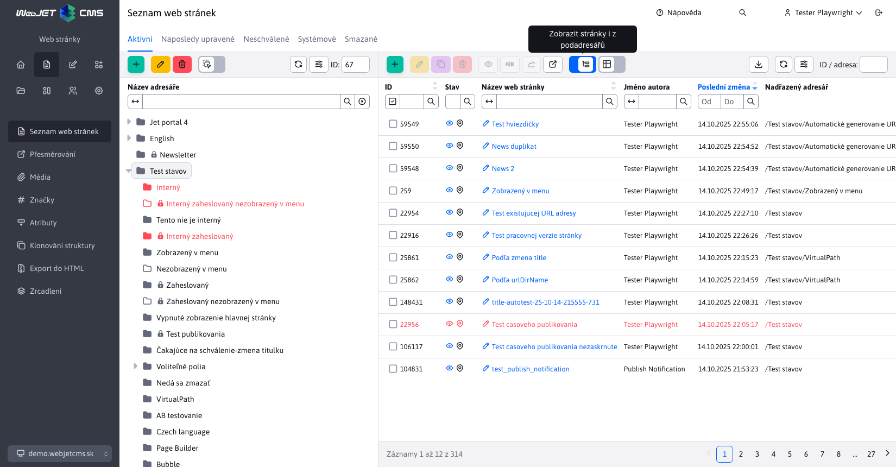

# Web stránky

## Základní práce

### Výběr domény

V levém menu se pro více doménová web sídla zobrazuje výběr domény. Ve stromové struktuře stránek se zobrazují pouze složky se zvolené domény a složky, které nemají doménu nastavenou.

### Zobrazení složek Systém a Koš

Speciální složky Systém (obsahuje stránky potřebné pro šablonu jako hlavička a patička) a Koš (obsahuje smazané stránky) se zobrazují v kartě Systém nebo Koš.

Zobrazení v kartě Systém je závislé na konfiguraci WebJETu:
- standardně zobrazí obsah složky `/System` (globální složku pro všechny domény)
- je-li zapnut režim **lokálního Systém složky** (nastavená konfigurační proměnná `templatesUseDomainLocalSystemFolder` na `true`) a pro aktuálně zvolenou doménu existuje lokální System složka zobrazí její obsah
- je-li zapnut režim hledání Systém složky **rekurzivně ve stromové struktuře** (nastavená konfigurační proměnná `templatesUseRecursiveSystemFolder` na `true`) zobrazí složkovou strukturu obsahující složku System

Kromě Systém složky se v této kartě zobrazuje i složka `/files` s plně textovým indexem pro vyhledávání v souborech (je-li plně textové vyhledávání aktivní). V této složce se nacházejí texty získané ze souborů, přičemž text se používá při vyhledávání v souborech.

V kartě Koš se zobrazuje obsah složky `/System/Kôš`.

Tyto složky se nezobrazují v kartě Složky (jsou filtrovány), pokud ale z nějakého důvodu potřebujete vidět přesnou stromovou strukturu bez filtrování, klikněte na kartu Složky se stisknutou klávesou `shift`. V takovém případě se vypne filtrování a zobrazí se všechny složky v aktuálně zvolené doméně a složky, které doménu nemají nastavenou.

### Zapamatování naposledy otevřené složky

Seznam web stránek si v rámci jednoho přihlášení pamatuje naposledy otevřenou složku, při návratu na seznam web stránek se složka znovu otevře. Zapamatování složky se smaže při přepnutí domény, nebo při zadání adresy `/admin/v9/webpages/web-pages-list/?groupid=0`, neboli adresa stránky s parametrem `groupid=0`.

Zároveň při procházení stromové struktury se v adresním řádku prohlížeče zobrazuje adresa stránky s parametrem `groupid`, který reprezentuje ID složky. Při obnově stránky, nebo zaslání odkazu, se otevře složková struktura podle ID v adresním řádku. Na úvodní stránce si můžete do bloku Záložky [přidat adresu stránky is ID složky](https://youtu.be/G5Ts04jSMX8) a vytvořit tak na úvodní stránce odkaz do vnořené složkové struktury.

### Karty web stránek

V pravé sekci lze zobrazit následující karty:
- **Web stránky** - zobrazuje standardní seznam web stránek ve vybrané složce ve stromové struktuře.
- **Naposledy upraveno** - zobrazuje seznam vašich posledně upravených stránek.
- **Čekající na schválení** - pokud schvalujete změny ve web stránkách zobrazí se v této kartě stránky, které čekají na vaše schválení.
- **Složky** - přepne zobrazení ze seznamu web stránek na seznam složek. Klepnutím na složku ve stromové struktuře se zobrazí zvolená složka a její pod složky. Pokud označíte ve stromové struktuře více složek (např. pomocí stisku klávesy `CTRL`) zobrazí se označené složky. Tabulkové zobrazení složek umožňuje např. provádět hromadné operace se složkami (např. změna šablony), použít funkci Upravit v zobrazení mřížky nebo funkci Duplikovat.

!>**Upozornění**: zobrazení složek musíte nejprve zapnout v [nastavení zobrazení stromové struktury](#nastavení-zobrazení-stromové-struktury).

### Zobrazit stránky iz podadresářů

V případě potřeby můžete zobrazit web stránky iz podadresářů přepnutím přepínače **Zobrazit stránky iz podadresářů** v hlavičce datatabulky. Po přepnutí do režimu zobrazení stránek z podadresářů se zobrazí stránky z aktuálně zvoleného adresáře ve stromové struktuře včetně jeho podadresářů. Ve stromové struktuře můžete kliknout na jiný adresář, což znovu způsobí zobrazení stránek z vybraného adresáře a jeho podadresářů.

V nastavení tabulky si můžete zapnout zobrazení sloupce **Nadřazená složka** ve kterém budete vidět adresář ve kterém se stránka nachází.

### Obnovení web stránek a adresářů z koše

Seznam web stránek nabízí také speciální ikonu  k obnovení web stránky nebo celé složky z koše. Tyto ikony se zobrazují pouze za specifických okolností. Blíže objasněná logika se nachází v sekci [Obnovení web stránek a složek z koše](./recover.md)

### Speciální ikony

Data tabulka v seznamu stránek obsahuje následující speciální ikony:
- <i class="ti ti-eye fa-btn" role="presentation" ></i> - Zobraz stránku - po označení jednoho nebo více řádků a kliknutí na ikonu se otevře v novém okně/kartě zvolená web stránka.
- <i class="ti ti-a-b fa-btn" role="presentation" ></i> - Uložit jako AB test - vytvoří B verzi stránky pro [AB testování](../apps/abtesting/README.md).
- <i class="ti ti-chart-line fa-btn" role="presentation" ></i> - Statistika stránky - zobrazí [návštěvnost](../apps/stat/README.md) označené web stránky.
- <i class="ti ti-link-off fa-btn" role="presentation" ></i> - Kontrola odkazů a prázdných stránek - zkontroluje [platnost odkazů](linkcheck.md) ve stránkách v aktuální složce a podsložkách, zobrazí stránky, které nemají zadaný žádný text.
-  - Zobrazit stránky iz podadresářů - přepnutím přepínače do zapnuté polohy zobrazíte v tabulce i web stránky z podadresářů

### Ikony a barvy ve stromové struktuře a seznamu stránek

Ve stromové struktuře složek a stránek se mohou zobrazit následující typy ikon a barev:
- <i class="ti ti-folder-filled" role="presentation" ></i> plná ikonka složky = složka je zobrazena v menu
- <i class="ti ti-folder" role="presentation" ></i> prázdná ikonka složky = není nezobrazen v menu
- <i class="ti ti-map-pin" role="presentation" ></i> stránka je zobrazena v menu
- <i class="ti ti-map-pin-off" role="presentation" ></i> stránka není zobrazena v menu
- <i class="ti ti-folder-x" role="presentation" ></i> nemáte práva na editaci/smazání složky, v této složce nebudete vidět ani žádný seznam web stránek (i když složku ve skutečnosti web stránky obsahuje). Používá se v případě, kdy máte povolena práva pouze na některou z podsložek.
- <i class="ti ti-lock" role="presentation" ></i> zámek = dostupné pouze pro přihlášeného návštěvníka
- červená barva = nedostupné pro veřejnost (interní adresář) nebo stránka s vypnutým zobrazením
- <i class="ti ti-star" ></i>, **tučné písmo** = hlavní stránka adresáře
- <i class="ti ti-external-link" ></i> šipka ven = stránka je přesměrována
- <i class="ti ti-eye-off" ></i> přeškrtnuté oko = stránku nelze vyhledat
- <i class="ti ti-a-b" ></i> B varianta stránky pro aplikaci [AB testování](../apps/abtesting/README.md)

## Nastavení zobrazení stromové struktury

V případě potřeby můžete ve stromové struktuře klepnutím na ikonu <i class="ti ti-adjustments-horizontal" ></i> Nastavení zobrazit dialogové okno nastavení:
- **ID** - Před názvem zobrazí i ID adresáře ve formě #ID. Zobrazení je vhodné, pokud potřebujete ručně do některé aplikace zadat ID složky, nebo migrujete stránky mezi prostředími a potřebujete rychle zkontrolovat nastavení vložených aplikací.
- **Pořadí uspořádání** - Za názvem zobrazí pořadí uspořádání ve formě (pořadí).
- **Web Stránky** - Zobrazí ve stromové struktuře i web stránky. **Upozornění:** snižuje výkon a rychlost načítání dat. Možnost doporučujeme zapnout jen pokud potřebujete přesouvat web stránky pomocí funkce `Drag&Drop`.
- **Složky stromové struktury jako tabulku** - Zobrazí kartu Složky v datatabulce. Umožňuje používat funkce datatabulky jako hromadné operace, duplikovat, upravit v zobrazení mřížky atp. se složkami stromové struktury.
- **Poměr šířky sloupců strom:tabulka** - Nastaví poměr šířky sloupců zobrazené stromové struktury a datatabulky pro lepší využití šířky monitoru. Standardní poměr je 4:8. Upozornění: u některých poměrů a nevhodné velikosti monitoru může dojít k nesprávnému zobrazení nástrojové lišty/tlačítek.
- **Řadit strom podle** - Výběr parametru adresáře, podle kterého se má strom složek uspořádat. Výběrové pole podporuje následující parametry
  - **Priorita**
  - **Název**
  - **Datum vytvoření**
- **Řadit strom směrem** - Přepínání mezi směrem uspořádání stromu složek. Výběrem možnosti se použije směr **Vzestupně (ASC)** a nezvolením možnosti se použije směr **Sestupně (DESC)**.

## Vyhledávání ve stromové struktuře

Filtr nad stromovou strukturou vám umožní rychlé vyhledávání složek podle jejich názvu. Vyhledávání funguje v **celé stromové struktuře**, tedy není třeba otevírat složky pro jejich prohledání. Vyhledávání mezi jednotlivými kartami **Složka** / **Systém** / **Koš** je odděleno, tedy v kartě **Systém** vyhledáváním nenajdete složky patřící do karty **Koš** atp.

Po zadání hodnoty do pole se filtrování spustí stisknutím klávesy `Enter` nebo ikony . Pro lepší přehled kde se nalezená složka nachází, zobrazujeme celou cestu až ke kořenové složce. Každá složka vyhovující hledanému výrazu je zvýrazněna.

Vyhledávání se zruší stisknutím tlačítka  nebo pokud zkusíte vyhledat prázdný řetězec.

!>**Upozornění:** Pokud máte aktivní vyhledávání (právě jste vyhledávali nějaký řetězec) v jedné kartě, tak při přepnutí do druhé karty se vyhledávání zruší. Čili vyhledávaný řetězec "blog" se při přepnutí do jiné karty odstraní z pole.
