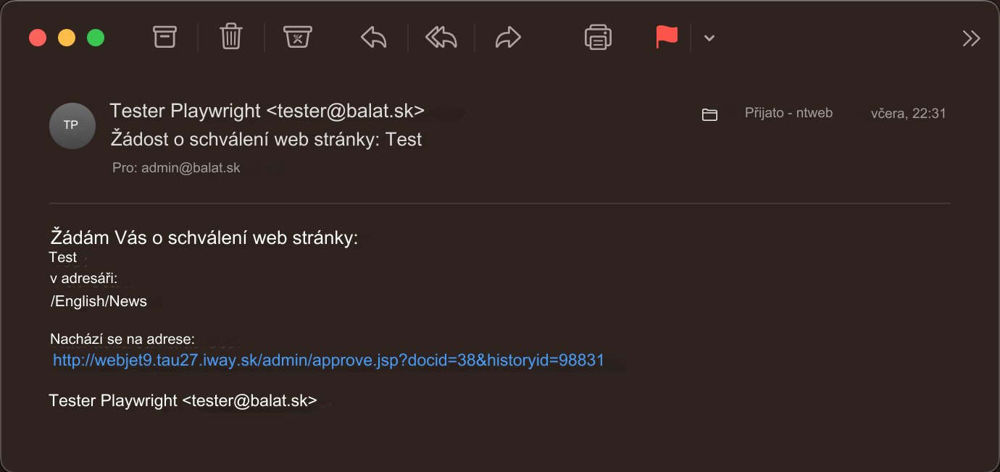
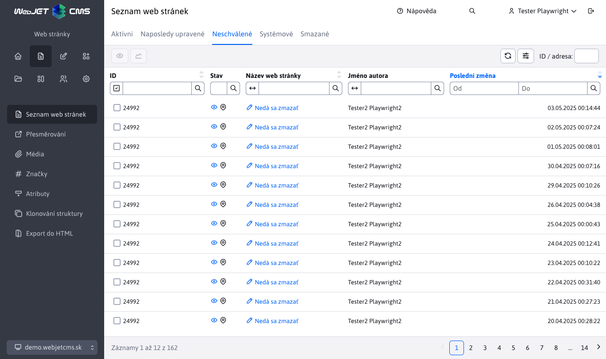

# Schvalování změn

WebJET umožňuje režim, ve kterém jsou změny na web stránce před publikováním na veřejnou část schvalovány definovanými uživateli.

Stránka se na webu zobrazí až po jejím schválení, přičemž o schválení je notifikován i autor stránky. Pokud schvalovatel stránku neschválí, autor stránky bude notifikován emailem, který obsahuje i připomínky ke stránce. Po zapracování připomínek může znovu požádat o schválení.

Podobně funguje i proces smazání, pokud uživatel smaže stránku odešle se žádost schvalovateli a stránka se nadále zobrazuje. Teprve po schválení smazání se stránka smaže (přesune do koše).

## Nastavení schvalování

Schvalování se nastavuje v sekci Uživatelé. Klepnutím na jméno schvalovatele se zobrazí okno s nastaveními uživatele.

Karta Schvalování definuje proces schvalování změn stránek. Pokud administrátorovi nastavíte určitý adresář pro schvalování a nějaký jiný administrátor v tomto adresáři publikuje stránku, tak tato změna/stránka se neobjeví hned na veřejném web sídle, ale zůstane čekat na schválení. Schvalovateli přijde žádost o schválení emailem. Pokud daný adresář schvaluje více administrátorů, přijde email všem, přičemž pokud některý z nich stránku schválí, systém nedovolí jinému administrátorovi stránku schválit znovu (zobrazí se mu informace, že stránka je již schválena).

Klepnutím na tlačítko Přidat se otevře okno, ve kterém můžete vybrat adresář pro schvalování. V poli Akce můžete nastavit následující možnosti:

- Schválení - zašle se email se žádostí o schválení
- Notifikace - uživateli se zašle email s notifikací o změně stránky. Pokud je na daný adresář nastaveno i schvalování, notifikace se pošle až po schválení stránky. Tato akce je užitečná, pokud nepožadujete, aby se stránky musely schvalovat, ale přesto chcete být informováni o všech změnách, které se na stránkách uskuteční.
- Žádná - neprovede se žádná akce. Používá se to, pokud je v systému definováno více zodpovědných administrátorů, přičemž jen jeden schvaluje změny běžných uživatelů. Pokud by jiný zodpovědný administrátor provedl nějakou změnu, musel by mu ji jiný administrátor schválit. To je někdy nežádoucí, proto je třeba ostatním zodpovědným administrátorům nastavit adresář pro schvalování s režimem Žádná, aby v něm mohli provádět změny bez potřeby schvalování.
- Schválení - druhá úroveň - druho úrovňové schvalování. Zašle se email se žádostí o schválení po schválení prvním stupněm (uživatelem který má nastavenou možnost schválení).

Schvalovatelé se vyhledávají ve stromové struktuře směrem od složky, ve které nastala změna ke kořenové složce. První složka s definovaným schvalovatelem se použije. Můžete tak definovat různé schvalovatele pro pod složky (např. Produkty, Novinky) a zároveň pro všechny ostatní složky definovat schvalovatele pro kořenovou složku. Nastane-li změna v Produkty/WebJET CMS použije se schvalovatel pro složku Produkty, pokud nastane změna v Kontakty použije se schvalovatel pro kořenovou složku.

## Proces schvalování

Při změně v sekci, která se schvaluje, se odešle email schvalovateli s odkazem na schválení/zamítnutí změny.

Stránky ke schválení se zobrazují schvalovatelům iv sekci Web stránky v kartě Čekající na schválení.

Klepnutím na odkaz v emailu nebo na název stránky v kartě Čekající na schválení se zobrazí srovnání aktuální a změněné stránky s formulářem ke schválení nebo zamítnutí změny. Text zadaný do pole Komentář se odešle emailem autorovi stránky. Zadejte tam vaše připomínky při neschválení změny.

