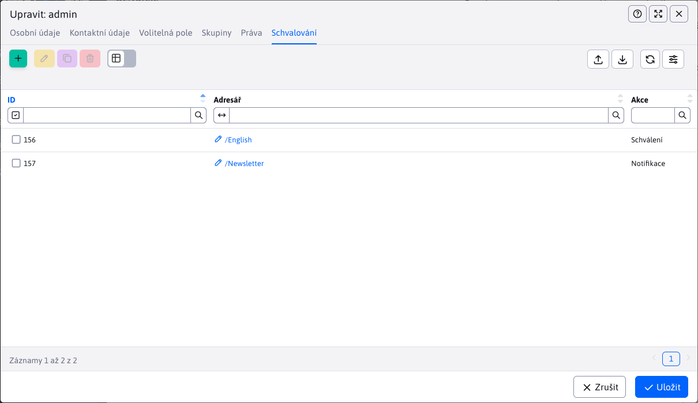
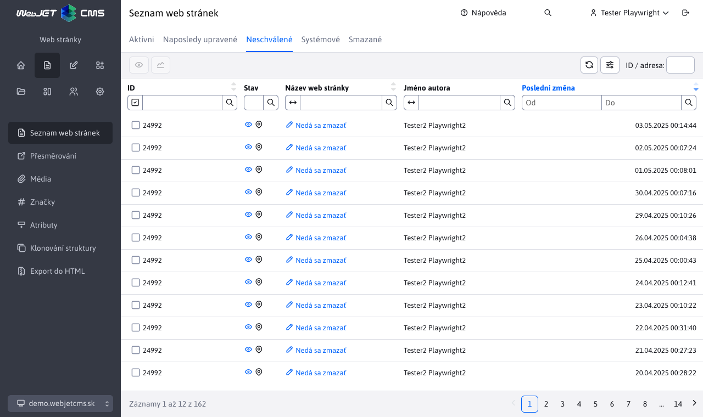

# Schvalování změn

WebJET CMS umožňuje režim, ve kterém jsou změny na webové stránce před publikováním na veřejnou část schvalovány definovanými uživateli. Tento mechanismus zajišťuje kontrolu kvality obsahu a zabraňuje publikování neodsouhlasených změn.

Stránka se na webu zobrazí až po jejím schválení, přičemž o výsledku schválení je autor stránky notifikován emailem. Pokud schvalovatel stránku neschválí, autor stránky obdrží email s připomínkami ke stránce. Po zapracování připomínek může autor znovu požádat o schválení.

Podobně funguje i proces smazání. Pokud uživatel smaže stránku, odešle se žádost schvalovateli a stránka se nadále zobrazuje na veřejné části webu. Teprve po schválení smazání se stránka skutečně smaže (přesune do koše).

## Nastavení schvalování

Schvalování se nastavuje v sekci **Uživatelé**. Klepnutím na jméno schvalovatele se zobrazí okno s nastaveními uživatele, kde přejděte na kartu **Schvalování**.

V kartě **Schvalování** se definuje proces schvalování změn stránek a složek. Pokud administrátorovi nastavíte určitý adresář pro schvalování a jiný administrátor v tomto adresáři publikuje stránku, změna se neobjeví okamžitě na veřejném webovém sídle, ale zůstane čekat na schválení. Schvalovateli přijde žádost o schválení emailem. Pokud daný adresář schvaluje více administrátorů, email přijde všem, přičemž pokud některý z nich stránku schválí, systém nedovolí jinému administrátorovi stránku schválit znovu (zobrazí se mu informace, že stránka je již schválena).

### Přidání složky ke schvalování

Klepnutím na tlačítko **Přidat** se otevře okno, ve kterém vyberte adresář pro schvalování. V poli **Akce** lze nastavit následující možnosti:

- **Schválení** - zašle se email se žádostí o schválení. Změna se neprojeví, dokud schvalovatel změnu neschválí.
- **Notifikace** - uživateli se zašle email s notifikací o změně stránky. Pokud je na daný adresář nastaveno i schvalování, notifikace se pošle až po schválení stránky. Tato akce je užitečná, pokud nepožadujete, aby se stránky musely schvalovat, ale chcete být informováni o všech změnách, které se na stránkách uskuteční.
- **Žádná** - neprovede se žádná akce. Používá se v případě, je-li v systému definováno více zodpovědných administrátorů, přičemž jen jeden schvaluje změny běžných uživatelů. Pokud by jiný zodpovědný administrátor provedl změnu, musel by mu ji jiný administrátor schválit. To je někdy nežádoucí, proto je třeba ostatním zodpovědným administrátorům nastavit adresář pro schvalování s režimem **Žádná**, aby v něm mohli provádět změny bez potřeby schvalování.
- **Schválení - druhá úroveň** - druho-úrovňové schvalování. Žádost o schválení se zašle až po schválení prvním stupněm (uživatelem, který má nastavenou akci **Schválení**).

### Vyhledávání schvalovatelů ve stromové struktuře

Schvalovatelé se vyhledávají ve stromové struktuře směrem od složky, ve které nastala změna, ke kořenové složce. Použije se první složka s definovaným schvalovatelem. Můžete tak definovat různé schvalovatele pro podsložky (např. Produkty, Novinky) a zároveň pro všechny ostatní složky definovat schvalovatele pro kořenovou složku.

**Příklad:** Pokud dojde ke změně ve složce `Produkty/WebJET CMS`, použije se schvalovatel definovaný pro složku `Produkty`. Pokud nastane změna ve složce `Kontakty`, použije se schvalovatel definovaný pro kořenovou složku.

## Proces schvalování

Dojde-li ke změně ve složce (nebo podsložce), která podléhá schvalování, systém ověřuje, zda aktuálně přihlášený uživatel je schvalovatel dané složky. Pokud je schvalovatelem, změna se **automaticky** schválí a okamžitě se aplikuje. Pokud není schvalovatelem, změna se **neaplikuje** a čeká na schválení.

### Podporované operace

Proces schvalování se vztahuje na následující operace:

- **Vytvoření** nové složky nebo stránky
- **Úprava** existující složky nebo stránky
- **Smazání** složky nebo stránky

!>**Upozornění:** Akce **obnovení** složky/stránky z koše do složky, která podléhá schvalování, nepodléhá procesu schvalování. Obnovení do takové složky může provést pouze schvalovatel. Pokud uživatel bez oprávnění schvalovatele zkusí obnovit položku, zobrazí se upozornění, že nemá právo obnovit do této složky a akce se neprovede.

### Průběh procesu schvalování

**1. Notifikace o čekání na schválení**

Po provedení změny se autorovi zobrazí notifikace o tom, že změna čeká na schválení, včetně informace, komu byla odeslána žádost o schválení (může to být i více schvalovatelů).

**2. Email se žádostí o schválení**

Schvalovateli se zašle email se žádostí o schválení. Email obsahuje detaily o změně a odkaz na stránku schvalování. Platí to pro akce nad složkami i stránkami v daných složkách.

**3. Stránka schvalování**

Schvalovatel použije odkaz v emailu, aby se dostal na stránku schvalování. Na této stránce může zkontrolovat detaily změny, přidat komentář a změnu **schválit** nebo **zamítnout**.

Při schvalování stránek se zobrazuje srovnání aktuálně publikované verze a nové verze čekající na schválení. Schvalovatel může zvýraznit rozdíly mezi verzemi, čímž získá přehledný náhled na provedené změny. V pravé části se zobrazuje seznam změněných polí stránky.

**4. Notifikační email o výsledku**

Po schválení nebo zamítnutí se autorovi odešle informační email o výsledku schválení s případnými připomínkami.

Během celého procesu schvalování systém ověřuje, zda uživatel má na danou akci oprávnění a zda složka/stránka nebyla mezitím schválena jiným schvalovatelem, aby se zabránilo duplicitnímu schválení.

## Schvalování složek

Pokud je pro daný adresář nastaven schvalovatel, změny v adresáři se neprojeví okamžitě, ale čekají na schválení.

### Vytvoření složky

Při vytváření nového adresáře se složka vytvoří jako **Nedostupná** (interní) a čeká na schválení. Je-li nastavena možnost generování výchozí stránky, vytvořená stránka se přednastaví s vypnutým zobrazením. Odesílá se **pouze** žádost o schválení vytvoření adresáře - stránka se schválí nebo zamítne spolu s adresářem.

Po **schválení** se složka automaticky nastaví jako dostupná a výchozí stránka se nastaví jako zobrazená.
Po **zamítnutí** se složka ani stránka nevymažou, pouze zůstanou nedostupné/skryté.

### Úprava složky

Při úpravě existujícího adresáře (např. změna názvu, šablony, URL adresy apod.) se změněná verze složky uloží jako **historická** verze, která čeká na schválení. Původní složka zůstane nezměněna, dokud schvalovatel změnu neschválí.

Po **schválení** se změny aplikují a historická verze se stane aktuální verzí.
Po **zamítnutí** se změny neaplikují a historická verze zůstane v kartě **Historie** jako neschválená verze.

### Smazání složky

Při smazání adresáře, který podléhá schvalování, se adresář nesmaže okamžitě. Vytvoří se historická verze s prefixem `[DELETE]` v názvu složky, aby bylo jednoznačné, že se jedná o žádost o smazání.

Po **schválení** se složka přesune do koše.
Po **zamítnutí** se žádost o smazání zahodí a složka zůstane nezměněna.

## Schvalování stránek

Pokud je pro daný adresář nastaven schvalovatel, změny stránek v adresáři se neprojeví okamžitě, ale čekají na schválení. Změněná verze stránky se uloží jako historická verze a původní publikovaná stránka zůstane nezměněna.

### Vytvoření stránky

Při vytvoření nové stránky v adresáři, který podléhá schvalování, se stránka uloží jako nepublikovaná a čeká na schválení. Schvalovateli se zašle email se žádostí o schválení.

Po **schválení** se stránka automaticky publikuje.
Po **zamítnutí** se stránka nepublikuje a autorovi se zašle email s případnými připomínkami.

### Úprava stránky

Při úpravě existující stránky se změněná verze uloží jako **historická** verze, která čeká na schválení. Původní publikovaná verze stránky zůstane nezměněna, dokud schvalovatel změnu neschválí. Schvalovateli se zašle email s porovnáním změn oproti aktuálně publikované verzi.

Po **schválení** se změny aplikují a historická verze se stane aktuální publikovanou verzí.
Po **zamítnutí** se změny neaplikují a historická verze zůstane v kartě **Historie** jako neschválená verze.

### Smazání stránky

Při smazání stránky v adresáři, který podléhá schvalování, se stránka nesmaže okamžitě. Vytvoří se historická verze s prefixem `[DELETE]` v názvu stránky. Stránka zůstane nadále publikována, dokud schvalovatel neschválí její smazání.

Po **schválení** se stránka přesune do koše.
Po **zamítnutí** se žádost o smazání zahodí a stránka zůstane publikována.

## Zobrazení složek/stránek čekajících na schválení

Složky/stránky čekající na schválení se zobrazují na dvou místech:

- V kartě **Neschváleno** - zobrazí se pouze aktuální neschválené verze složku/stránek (dle pod-karty **Stránky** / **Adresáře**), bez historie neschválených verzí.

- V detailu složky/stránky v kartě **Historie** - historické verze čekající na schválení jsou zobrazeny spolu s informacemi o stavu schválení, kdo je schválí/zamítl a kdy.

