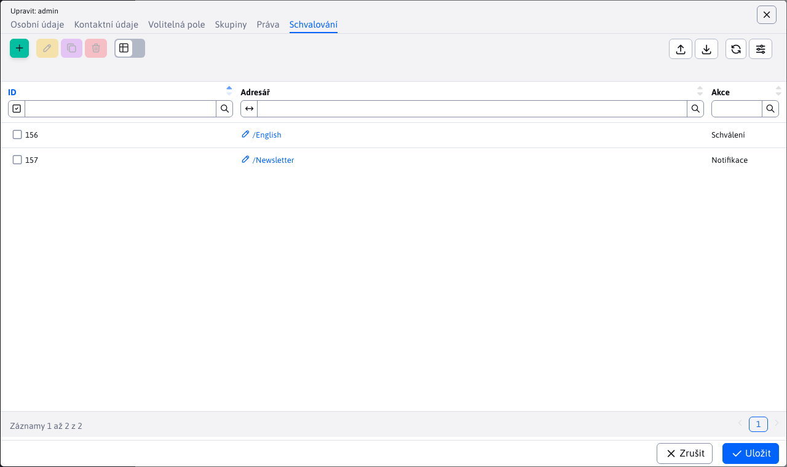

# Schválení změn

WebJET umožňuje režim, ve kterém jsou změny webové stránky před zveřejněním ve veřejné části schvalovány definovanými uživateli.

Stránka se na webu objeví až po jejím schválení a autor stránky je o schválení informován. Pokud schvalovatel stránku neschválí, bude autor stránky vyrozuměn e-mailem, který bude obsahovat i komentáře ke stránce. Po zapracování připomínek může znovu požádat o schválení.

Proces mazání funguje podobně, pokud uživatel stránku smaže, je odeslán požadavek schvalovateli a stránka se nadále zobrazuje. Teprve po schválení odstranění je stránka odstraněna (přesunuta do koše).

## Nastavení schvalování

Schválení se nastavuje v části Uživatelé. Kliknutím na jméno schvalovatele zobrazíte okno s nastavením uživatele.

Karta Schvalování definuje proces schvalování změn na stránkách. Pokud správci nastavíte schvalování určitého adresáře a jiný správce v tomto adresáři zveřejní stránku, změna/stránka se na veřejném webu neobjeví okamžitě, ale zůstane čekat na schválení. Schvalovatel obdrží žádost o schválení e-mailem. Pokud adresář schvaluje více správců, e-mail přijde všem, a pokud jeden z nich stránku schválí, systém nedovolí dalšímu správci stránku znovu schválit (zobrazí se, že stránka je již schválena).

Kliknutím na tlačítko Přidat otevřete okno, ve kterém můžete vybrat adresář ke schválení. V poli Akce můžete nastavit následující možnosti:

- Schválení - bude zaslán e-mail s žádostí o schválení.
- Oznámení - uživateli bude zaslán e-mail s upozorněním na změnu stránky. Pokud je pro adresář nastaveno také schvalování, bude oznámení odesláno po schválení stránky. Tato akce je užitečná, pokud nevyžadujete, aby byly stránky schváleny, ale přesto chcete být informováni o všech změnách, ke kterým na stránkách dojde.
- Žádné - nebude přijato žádné opatření. Používá se v případě, že je v systému definováno více odpovědných správců, přičemž pouze jeden z nich schvaluje změny provedené běžnými uživateli. Pokud by změnu provedl jiný odpovědný správce, musel by ji schválit jiný správce. To je někdy nežádoucí, proto je třeba ostatním odpovědným správcům nastavit schvalovací adresář s režimem Žádný, aby v něm mohli provádět změny bez nutnosti schválení.
- Schválení - druhá úroveň - schválení druhé úrovně. Po schválení první úrovně (uživatelem, který má nastavenou možnost schválení) bude odeslán e-mail s žádostí o schválení.

Schvalovatelé jsou vyhledáváni ve stromové struktuře od složky, ve které došlo ke změně, až po kořenovou složku. Použije se první složka s definovaným schvalovatelem. Můžete tedy definovat různé schvalovatele pro podsložky (např. Produkty, Novinky) a zároveň definovat schvalovatele pro kořenovou složku pro všechny ostatní složky. Pokud dojde ke změně ve složce Produkty/WebJET CMS, použije se schvalovatel pro složku Produkty, pokud dojde ke změně ve složce Kontakty, použije se schvalovatel pro kořenovou složku.

## Schvalovací proces

Když je provedena změna v sekci, která je schvalována, je schvalovateli zaslán e-mail s odkazem na schválení/neschválení změny.

Stránky čekající na schválení se také zobrazují schvalovatelům v části Webové stránky na kartě Čekající.

Kliknutím na odkaz v e-mailu nebo na název stránky na kartě Čekající se zobrazí porovnání aktuální a změněné stránky s formulářem pro schválení nebo zamítnutí změny. Text zadaný do pole Komentář je zaslán e-mailem autorovi stránky. V případě, že změna není schválena, zadejte tam svůj komentář.

