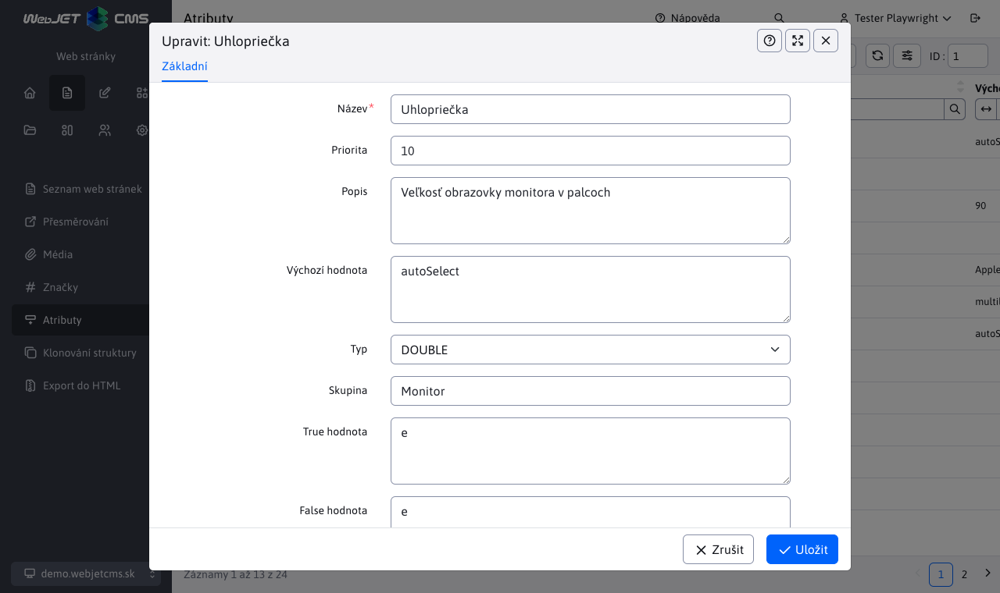
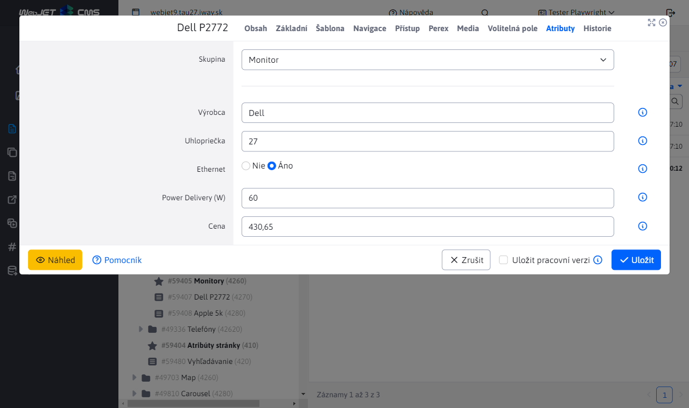
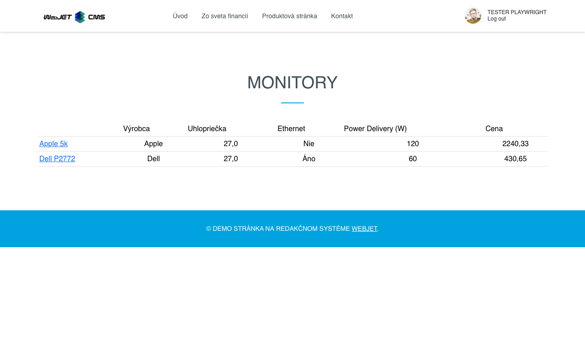

# Atributy stránky

> Atributy stránky umožňují definovat dodatečná pole pro editor web stránky. Mohou být různých datových typů a lze je organizovat do skupin. Obvykle se používají v elektronickém obchodě k definování parametrů produktů.

Výhoda oproti volitelným polím je v teoreticky nekonečném počtu polí a zároveň v možnosti organizovat pole do skupin. V databázi jsou hodnoty ukládány v korektních datových typech, což umožňuje provádět uspořádání pomocí databázových dotazů (volitelná pole i typ číslo datově ukládají jako řetězec).

  <iframe width="560" height="315" src="https://www.youtube.com/embed/e-K-6Z_m-hg" title="YouTube video player" frameborder="0" allow="accelerometer; autoplay; clipboard-write; encrypted-media; gyroscope; picture-in-picture" allowfullscreen></iframe>

## Definice atributů

V menu položce Atributy stránky můžete přidávat/editovat/mazat definici atributů. Takto definované atribut je následně možné nastavovat web stránce.

Atribut má následující pole:
- Název - název atributu. Pro vícejazyčné zobrazení je podporován formát `JAZYK:hodnota|JAZYK:hodnota` Např. `SK:hmotnosť|CZ:hmotnost|EN:weight`.
- Priorita - pořadí atributu v seznamu atributů.
- Popis - rozšířený popis atributu, je na designérovi, kde se tento popis bude na web stránce zobrazovat.
- Výchozí hodnota - výchozí hodnota atributu v editoru stránek (nastaví se pro novou hodnotu).
- Typ - datový typ atributu
  - `STRING` - textové pole
  - `INT` - celočíselná hodnota
  - `BOOL` - binární hodnota ano/ne
  - `DOUBLE` - číselná hodnota s desetinném místem
- Skupina - zařazení atributu do skupiny. Např. pro různé skupiny produktů jako TV, chladničky, počítače máte různé atributy.
- `True hodnota` - zobrazený text pro typ `BOOL` pro zvolenou možnost (např. ano, nebo obsahuje).
- `False hodnota` - zobrazený text pro typ `BOOL` pro nezvolenou možnost (např. ne, nebo neobsahuje).

Pro textové pole je do Výchozí hodnota možné zadat speciální hodnoty:
- `autoSelect` - při zadávání atributu ve stránce se automaticky načítají stávající hodnoty v jiných stránkách a nabídnou se na výběr. Redaktor ale může zadat do pole i novou hodnotu.
- `hodnota1|hodnota2|hodnota3` - pole se zobrazí jako výběrové pole, uživatel může volit pouze ze zadaných hodnot (nemůže zadat novou hodnotu). Jako rozdělovač lze zadat znak `|` nebo znak `,`. Příklad `Apple,Samsung,Xiaomi`.
- `multiline-w-h` - zadávání více řádkového textu (pole typu textová oblast), hodnota `w` reprezentuje počet znaků na řádek a hodnota `h` počet řádků, příklad `multiline-80-10`. Technicky ale z důvodu responzivního zobrazení se pole vždy zobrazí na plnou šířku a tedy hodnota `w` se neaplikuje.

## Nastavení atributů web stránky

Pokud jsou definovány atributy, tak v editoru web stránek se začne zobrazovat karta Atributy. Karta se nezobrazuje při hromadné editaci více stránek najednou, kdy atributy zůstanou zachovány pro každou stránku samostatně.

Pomocí výběrového pole Skupina umíte zvolit skupinu zobrazených atributů. U existující stránky se skupina před nastaví podle prvního atributu, který obsahuje textovou hodnotu v některém atributu.

## Zobrazení atributů na web stránce

Připraveny jsou následující aplikace pro zobrazení atributů stránky:

### Srovnávací tabulka

Srovnávací tabulka zobrazuje všechny stránky ze zadané složky (volitelně včetně pod složek) s hodnotami atributů zadané skupiny:

Do HTML kódu stránky zadejte aplikaci jako:

`!INCLUDE(/components/attributes/atr_table.jsp, group="Monitor")!`

aplikace má následující parametry:
- `group` - skupina atributů, ve výchozím nastavení `default`.
- `dirId` - ID složky web stránek, pokud není zadáno, použije se aktuální složka.
- `includeSub` - určuje, zda se mají načítat i stránky z pod složek (výchozí `true`).
- `includeCurrentPage` - vyloučení aktuální stránky z tabulky (aby se v tabulce nezobrazovala aktuální stránka), ve výchozím nastavení `false`.
- `sortBy` - způsob uspořádání stránek, ve výchozím nastavení podle názvu stránky (`title`), možnosti korespondují vůči atributům `DocDetails` s prefixem `doc.` nebo atributem `AtrDocBean`.

### Vyhledávání/filtrování zobrazených stránek

Zobrazenou tabulku lze filtrovat (vyhledávat) pomocí URL parametrů. Např. při zadání URL adresy `/apps/atributy-stranky/monitory/?atrs_GT_Power+Delivery+(W)=90` se v tabulce zobrazí pouze monitory, jejichž hodnota v atributu `Power Delivery (W)` je větší než 90. Formát URL parametru je `atrs_TYP_MENO` kde typ může mít hodnoty:
- `SS` (substring) - pod řetězec, tedy vyhledávání textové hodnoty, která obsahuje zadaný výraz.
- `EQ` (equal) - hledání přesné shody zadaného výrazu.
- `LT` (less than) - hledání hodnoty která je méně než zadaná hodnota.
- `GT` (greater than) - hledání hodnoty která je více než zadaná hodnota.
- `GTLT` - hledání hodnoty v zadaném intervalu `od:do`. Hodnota je včetně, tedy např. `?atrs_GTLT_Power+Delivery+(W)=60:120` zobrazí také stránky, které mají zadanou hodnotu 60 nebo 120.

Pokud název obsahuje mezeru, můžete použít znak `+` k jejímu nahrazení. Při názvu nemusíte použít diakritiku, název se porovnává s odstraněním diakritiky.

### Atributy aktuálně zobrazené stránky

Atributy aktuálně zobrazené webové stránky. jako seznam vlastností produktu:

Do HTML kódu stránky (nebo ideálně některého pole šablony, aby se aplikace použila na každé stránce produktu) zadejte aplikaci jako:

`!INCLUDE(/components/attributes/attributes.jsp, group="Monitor")!`

aplikace má následující parametry:
- `group` - skupina atributů, ve výchozím nastavení `default`.

### Zobrazení hodnoty konkrétního atributu

Pokud někde ve stránce potřebujete zobrazit hodnotu konkrétního atributu můžete použít aplikaci:

`!INCLUDE(/components/attributes/attribute.jsp, group="Monitor", name="Cena")!`

aplikace má následující parametry:
- `group` - skupina atributů, ve výchozím nastavení `default`.
- `name` - jméno atributu.
