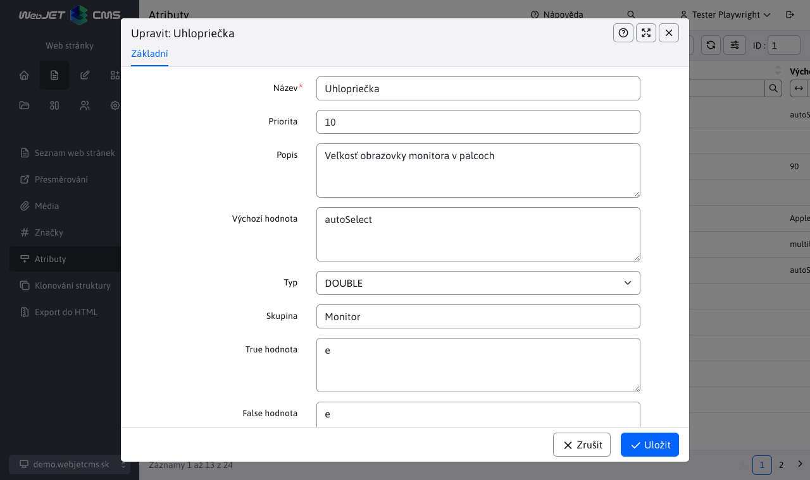
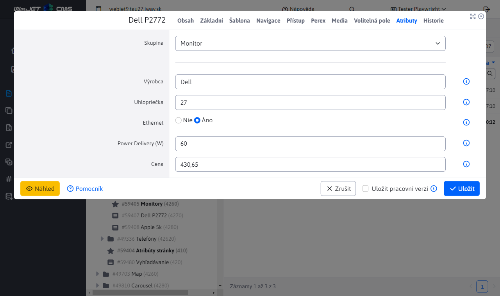
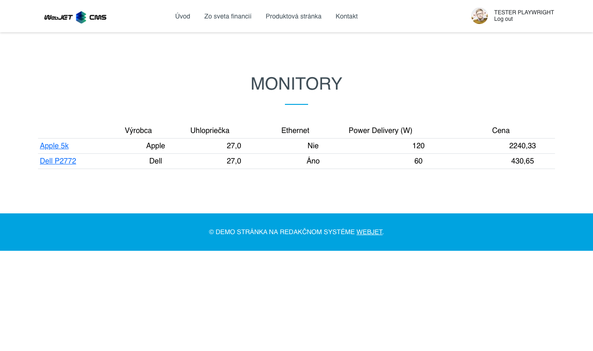

# Atributy stránky

> Atributy stránky umožňují definovat dodatečná pole pro editor web stránky. Mohou být různých datových typů a lze je organizovat do skupin. Obvykle se používají v elektronickém obchodě k definování parametrů produktů.

Výhoda oproti volitelným polím je v teoreticky nekonečném počtu polí a zároveň v možnosti organizovat pole do skupin. V databázi jsou hodnoty ukládány v korektních datových typech, což umožňuje provádět uspořádání pomocí databázových dotazů (volitelná pole i typ číslo datově ukládají jako řetězec).

<div class="video-container">
    <iframe width="560" height="315" src="https://www.youtube.com/embed/e-K-6Z_m-hg" title="YouTube video player" frameborder="0" allow="accelerometer; autoplay; clipboard-write; encrypted-media; gyroscope; picture-in-picture" allowfullscreen></iframe>
</div>

## Definice atributů

V menu položce Atributy stránky můžete přidávat/editovat/mazat definici atributů. Takto definované atribut je následně možné nastavovat web stránce.



Atribut má následující pole:

- Název - název atributu. Pro vícejazyčné zobrazení je podporován formát ```JAZYK:hodnota|JAZYK:hodnota```. ```SK:hmotnosť|CZ:hmotnost|EN:weight```.
- Priorita - pořadí atributu v seznamu atributů.
- Popis - rozšířený popis atributu, je na designérovi kde se tento popis bude na web stránce zobrazovat.
- Výchozí hodnota - výchozí hodnota atributu v editoru stránek (nastaví se pro novou hodnotu).
- Typ - datový typ atributu
  - ```STRING``` - ​​textové pole
  - ```INT``` - ​​celočíselná hodnota
  - ```BOOL``` - ​​binární hodnota ano/ne
  - ```DOUBLE``` - ​​číselná hodnota s desetinném místem
- Skupina - zařazení atributu do skupiny. Např. pro různé skupiny produktů jako TV, chladničky, počítače máte různé atributy.
- ```True hodnota``` - ​​zobrazený text pro typ ```BOOL``` pro zvolenou možnost (např. ano, nebo obsahuje).
- ```False hodnota``` - ​​zobrazený text pro typ ```BOOL``` pro nezvolenou možnost (např. ne, nebo neobsahuje).

Pro textové pole je do Výchozí hodnota možné zadat speciální hodnoty:

- ```autoSelect``` - ​​při zadávání atributu ve stránce se automaticky načítají stávající hodnoty v jiných stránkách a nabídnou se na výběr. Redaktor ale může zadat do pole i novou hodnotu.
- ```hodnota1|hodnota2|hodnota3``` - ​​pole se zobrazí jako výběrové pole, uživatel může volit pouze ze zadaných hodnot (nemůže zadat novou hodnotu). Jako rozdělovač lze zadat znak ```|``` nebo znak ```,```. Příklad ```Apple,Samsung,Xiaomi```.
- ```multiline-w-h``` - ​​zadávání více řádkového textu (pole typu textová oblast), hodnota ```w``` reprezentuje počet znaků na řádek a hodnota ```h``` počet řádků, příklad ```multiline-80-10```. Technicky ale z důvodu responzivního zobrazení se pole vždy zobrazí na plnou šířku a tedy hodnota ```w``` se neaplikuje.

## Nastavení atributů web stránky

Pokud jsou definovány atributy, tak v editoru web stránek se začne zobrazovat karta Atributy. Karta se nezobrazuje při hromadné editaci více stránek najednou, kdy atributy zůstanou zachovány pro každou stránku samostatně.

Pomocí výběrového pole Skupina umíte zvolit skupinu zobrazených atributů. U existující stránky se skupina před nastaví podle prvního atributu, který obsahuje textovou hodnotu v některém atributu.



## Zobrazení atributů na web stránce

Připraveny jsou následující aplikace pro zobrazení atributů stránky:

### Srovnávací tabulka

Srovnávací tabulka zobrazuje všechny stránky ze zadané složky (volitelně včetně pod složek) s hodnotami atributů zadané skupiny:



Do HTML kódu stránky zadejte aplikaci jako:

```!INCLUDE(/components/attributes/atr_table.jsp, group="Monitor")!```

aplikácia má nasledovné parametre:

- ```group``` - skupina atribútov, predvolene ```default```.
- ```dirId``` - ID priečinka web stránok, ak nie je zadané, použije sa aktuálny priečinok.
- ```includeSub``` - určuje, či sa majú načítať aj stránky z pod priečinkov (predvolene ```true```).
- ```includeCurrentPage``` - vylúčenie aktuálnej stránky z tabuľky (aby sa v tabuľke nezobrazovala aktuálna stránka), predvolene ```false```.
- ```sortBy``` - spôsob usporiadania stránok, predvolene podľa názvu stránky (```title```), možnosti korešpondujú voči atribútom ```DocDetails``` s prefixom ```doc.``` alebo atribútom ```AtrDocBean```.

### Vyhľadávanie/filtrovanie zobrazených stránok

Zobrazenú tabuľku je možné filtrovať (vyhľadávať) pomocou URL parametrov. Napr. pri zadaní URL adresy ```/apps/atributy-stranky/monitory/?atrs_GT_Power+Delivery+(W)=90``` sa v tabuľke zobrazia len monitory, ktorých hodnota v atribúte ```Power Delivery (W)``` je väčšia ako 90. Formát URL parametra je ```atrs_TYP_MENO``` kde typ môže mať hodnoty:

- ```SS``` (substring) - pod reťazec, čiže vyhľadávanie textovej hodnoty, ktorá obsahuje zadaný výraz.
- ```EQ``` (equal) - hľadanie presnej zhody zadaného výrazu.
- ```LT``` (less than) - hľadanie hodnoty ktorá je menej ako zadaná hodnota.
- ```GT``` (greater than) - hľadanie hodnoty ktorá je viac ako zadaná hodnota.
- ```GTLT``` - hľadanie hodnoty v zadanom intervale ```od:do```. Hodnota je vrátane, teda napr. ```?atrs_GTLT_Power+Delivery+(W)=60:120``` zobrazí aj stránky, ktoré majú zadanú hodnotu 60 alebo 120.

Ak názov obsahuje medzeru, môžete použiť znak ```+``` na jej nahradenie. Pri názve nemusíte použiť diakritiku, názov sa porovnáva s odstránením diakritiky.

### Atribúty aktuálne zobrazenej stránky

Atribúty aktuálne zobrazenej web stránky, napr. ako zoznam vlastností produktu:


Do HTML kódu stránky (alebo ideálne niektorého poľa šablóny, aby sa aplikácia použila na každej stránke produktu) zadajte aplikáciu ako:

```!INCLUDE(/components/attributes/attributes.jsp, group="Monitor")!```

aplikácia má nasledovné parametre:

- ```group``` - skupina atribútov, predvolene ```default```.

### Zobrazenie hodnoty konkrétneho atribútu

Ak niekde v stránke potrebujete zobraziť hodnotu konkrétneho atribútu môžete použiť aplikáciu:

```!INCLUDE(/components/attributes/attribute.jsp, group="Monitor", name="Cena")!```

aplikácia má nasledovné parametre:

- ```group``` - skupina atribútov, predvolene ```default```.
- ```name``` - meno atribútu.