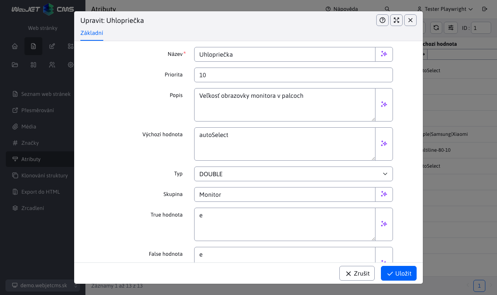

# Atributy stránky

> Atributy stránky umožňují definovat další pole pro editor webové stránky. Mohou mít různé datové typy a mohou být uspořádána do skupin. Obvykle se používají v elektronickém obchodě k definování parametrů produktu.

Výhodou oproti volitelným polím je teoreticky nekonečný počet polí a možnost uspořádat pole do skupin. V databázi jsou hodnoty uloženy ve správných datových typech, což umožňuje provádět řazení pomocí databázových dotazů (nepovinná pole i datový typ číslo jsou uloženy jako řetězec).

  <iframe width="560" height="315" src="https://www.youtube.com/embed/e-K-6Z_m-hg" title="Přehrávač videí YouTube" frameborder="0" allow="accelerometer; autoplay; clipboard-write; encrypted-media; gyroscope; picture-in-picture" allowfullscreen></iframe>

## Definice atributů

V položce nabídky Atributy stránky můžete přidávat/upravovat/mazat definice atributů. Takto definovaný atribut pak lze nastavit na webové stránce.

Atribut má následující pole:
- Name - název atributu. Pro vícejazyčné zobrazení je podporován následující formát `JAZYK:hodnota|JAZYK:hodnota`, např. `SK:hmotnosť|CZ:hmotnost|EN:weight`.
- Priorita - pořadí atributu v seznamu atributů.
- Popis - rozšířený popis atributu, záleží na návrháři, kde se tento popis na webové stránce zobrazí.
- Výchozí hodnota - výchozí hodnota atributu v editoru stránky (nastavená pro novou hodnotu).
- Type - datový typ atributu
  - `STRING` - textové pole
  - `INT` - celočíselná hodnota
  - `BOOL` - binární hodnota ano/ne
  - `DOUBLE` - číselná hodnota s desetinným místem
- Skupina - zařazení atributu do skupiny. Např. pro různé skupiny výrobků, jako jsou televize, ledničky, počítače, máte různé atributy.
- `True hodnota` - text zobrazený pro typ `BOOL` pro vybranou možnost (např. ano nebo zahrnuje).
- `False hodnota` - text zobrazený pro typ `BOOL` pro nevybranou možnost (např. ne nebo neobsahuje).

Do pole Výchozí hodnota pro text lze zadat speciální hodnoty:
- `autoSelect` - při zadávání atributu na stránce se automaticky načtou existující hodnoty na jiných stránkách a nabídnou se k výběru. Editor však může do pole zadat i novou hodnotu.
- `hodnota1|hodnota2|hodnota3` - pole je zobrazeno jako výběrové pole, uživatel může vybírat pouze ze zadaných hodnot (nemůže zadat novou hodnotu). Jako oddělovač je možné zadat znak `|` nebo znak `,`. Příklad `Apple,Samsung,Xiaomi`.
- `multiline-w-h` - zadávání víceřádkového textu (pole typu textová oblast), hodnota `w` představuje počet znaků na řádek a hodnota `h` počet řádků, příklad `multiline-80-10`. Technicky vzato, ale kvůli responzivnímu zobrazení se pole vždy zobrazuje na celou šířku, a proto se hodnota `w` se nepoužije.

## Nastavení atributů webové stránky

Pokud jsou atributy definovány, začne se v Editoru webové stránky zobrazovat karta Atributy. Karta se nezobrazí při hromadných úpravách více stránek najednou, kdy budou atributy zachovány pro každou stránku zvlášť.

Pomocí pole pro výběr skupiny můžete vybrat skupinu zobrazených atributů. U existující stránky je skupina přednastavena podle prvního atributu, který obsahuje textovou hodnotu v atributu.

## Zobrazení atributů na webové stránce

Následující aplikace jsou připraveny zobrazovat atributy stránek:

### Srovnávací tabulka

Srovnávací tabulka zobrazí všechny stránky v zadané složce (volitelně včetně podsložek) s hodnotami atributů zadané skupiny:

V kódu HTML stránky zadejte aplikaci jako:

`!INCLUDE(/components/attributes/atr_table.jsp, group="Monitor")!`

aplikace má následující parametry:
- `group` - skupina atributů, ve výchozím nastavení `default`.
- `dirId` - ID složky webu, pokud není zadáno, použije se aktuální složka.
- `includeSub` - určuje, zda se mají načítat také stránky z podsložek (ve výchozím nastavení `true`).
- `includeCurrentPage` - vyloučit aktuální stránku z tabulky (aby se aktuální stránka v tabulce nezobrazovala), ve výchozím nastavení `false`.
- `sortBy` - způsob uspořádání stránek, ve výchozím nastavení podle názvu stránky (`title`), možnosti odpovídají atributům `DocDetails` s předponou `doc.` nebo atribut `AtrDocBean`.

### Vyhledávání/filtrace zobrazených stránek

Zobrazenou tabulku lze filtrovat (vyhledávat) pomocí parametrů URL. Například při zadání adresy URL `/apps/atributy-stranky/monitory/?atrs_GT_Power+Delivery+(W)=90` pouze monitory, jejichž hodnota v atributu `Power Delivery (W)` je větší než 90. Formát parametru URL je následující `atrs_TYP_MENO` kde typ může nabývat hodnot:
- `SS` (podřetězec) - podřetězec, tj. hledání textové hodnoty, která obsahuje zadaný výraz.
- `EQ` (equal) - hledá přesnou shodu zadaného výrazu.
- `LT` (méně než) - vyhledá hodnotu, která je menší než zadaná hodnota.
- `GT` (větší než) - vyhledá hodnotu, která je větší než zadaná hodnota.
- `GTLT` - hledání hodnoty v zadaném intervalu `od:do`. Hodnota je včetně, např. `?atrs_GTLT_Power+Delivery+(W)=60:120` zobrazí také stránky s hodnotou 60 nebo 120.

Pokud název obsahuje mezeru, můžete použít příkaz `+` nahradit. V názvu nemusíte používat diakritiku, název se porovnává s odstraněnou diakritikou.

### Atributy aktuálně zobrazené stránky

Atributy aktuálně zobrazené webové stránky, např. jako seznam vlastností produktu:

V kódu HTML stránky (nebo ideálně v jednom z polí šablony, aby se aplikace používala na každé stránce produktu) zadejte aplikaci jako:

`!INCLUDE(/components/attributes/attributes.jsp, group="Monitor")!`

aplikace má následující parametry:
- `group` - skupina atributů, ve výchozím nastavení `default`.

### Zobrazení hodnoty konkrétního atributu

Pokud potřebujete někde na stránce zobrazit hodnotu určitého atributu, můžete použít aplikaci:

`!INCLUDE(/components/attributes/attribute.jsp, group="Monitor", name="Cena")!`

aplikace má následující parametry:
- `group` - skupina atributů, ve výchozím nastavení `default`.
- `name` - název atributu.
