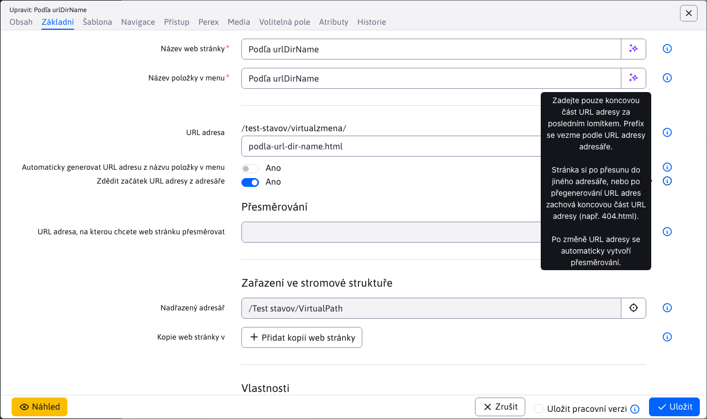
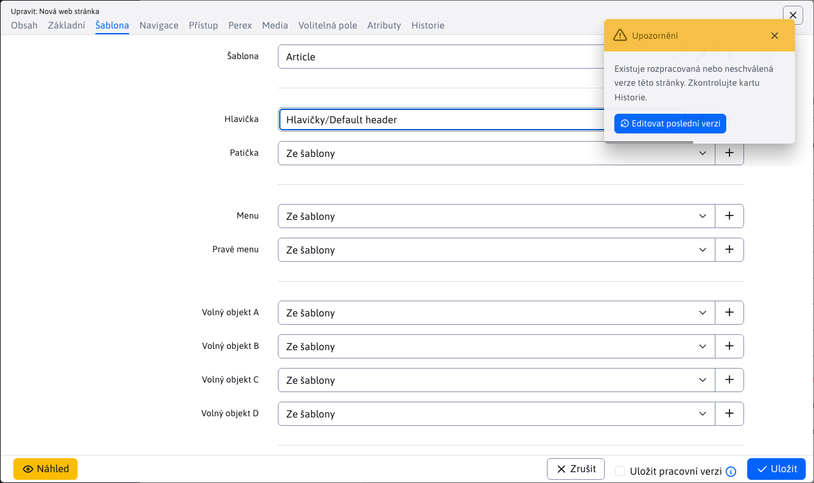
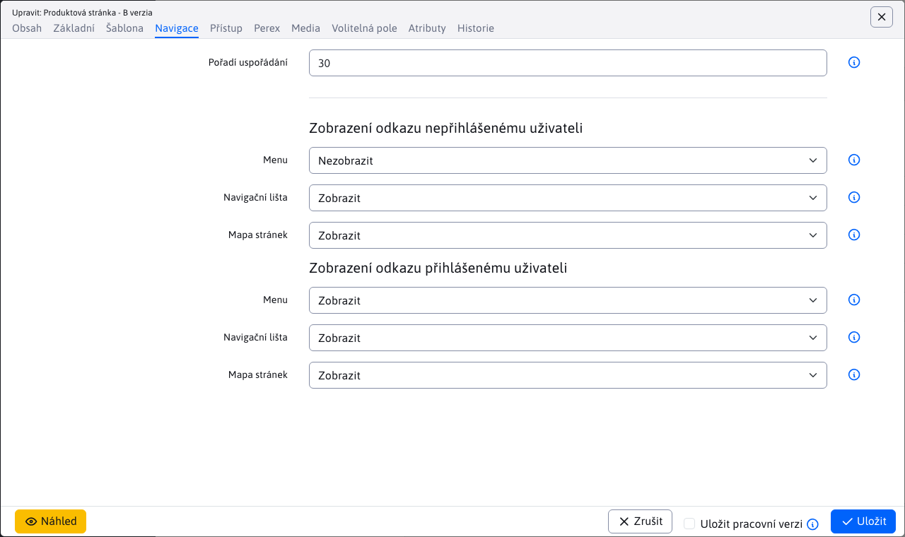
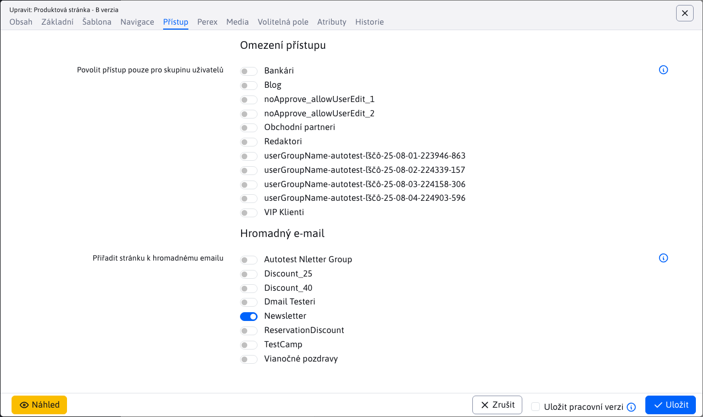
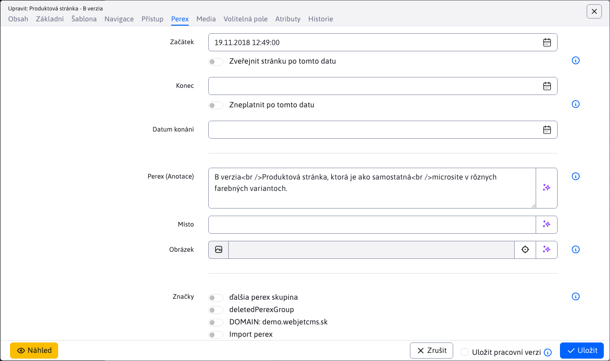
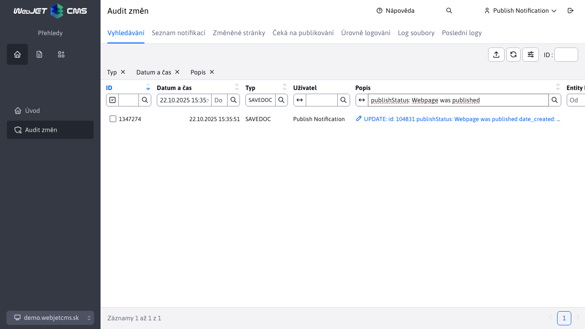

# Editace web stránky

Editor web stránek je univerzální nástroj pro úpravu a tvorbu web stránek. Při editaci stávající web stránky se vám do hlavního okna editoru načte obsah uložené web stránky. Při tvorbě nové stránky je okno editoru prázdné a vy můžete začít s psaním jejího obsahu.

Pokud jdete vytvořit novou web stránku, nejprve se musíte nastavit do správného adresáře, ve kterém se má web stránka nacházet a následně kliknutím na ikonu "Přidat" se vám zobrazí okno editoru.

## Karta obsah

V kartě „Obsah“ lze upravovat obsahovou část samotné webové stránky. Editace stránek nabízí standardní funkce úpravy obsahu dokumentů podobné funkcím běžně používaných v aplikacích MS Word a Excel. Většina příkazů je přístupná pomocí formátovacích tlačítek z nástrojové lišty editoru. Kontextové funkce jsou přístupné po kliknutí pravým tlačítkem myši nad příslušným objektem stránky. obrázkem, tabulkou, označeným blokem textu a pod.

Dostupné jsou více typů editorů podle nastavení skupiny šablon nebo šablony (pole Typ editoru stránek). Aktuálně jsou podporovány následující typy editorů:
- Standardní - editor typu `WYSIWYG`, tedy vizuální editor ve kterém to co vidíte na obrazovce se také uloží. Práce je podobná práci v MS Word, kdy umíte jednoduše označit text, nastavit tučné písmo, vkládat obrázky atp.
- HTML editor - při otevření se zobrazí HTML kód stránky. Je určen pro speciální stránky, jejichž kód by byl porouchaný u editoru typu `WYSIWYG` Např. stránky pro hromadný email, které obsahují celý HTML kód včetně hlavičky a patičky. Kód je v takovém případě typicky dodán z externí agentury a je pouze vložen do stránky bez potřeby jeho změn.
- Page Builder - režim skládání web stránky z [připravených bloků](pagebuilder.md), umožňuje jednoduše bloky upravovat, přidávat, přesouvat pořadí atp. Je určen k vytváření komplexních web stránek.

## Karta základní

Nejdůležitějším parametrem každé web stránky je její titulek (nadpis). Titulek se zadává do textového pole v kartě Základní. Pokud vytváříte novou web stránku v prázdné složce, tak si systém automaticky přebere titulek z názvu této složky. V opačném případě je tam při vytvoření nové web stránky text „Nová web stránka“, který samozřejmě musíte změnit na smysluplný název definující obsah web stránky. Titulek se zadává normálně s diakritikou i mezerami jako obyčejný text.

Hlavní stránka složky má standardně synchronizovaný [název web stránky s názvem složky](group.md#synchronizace-názvu-složky-a-web-stránky).

Každá stránka, která má být veřejně zobrazitelná na web sídle musí mít zadané „Ano“ v části **Zobrazovat**. Pokud nemá takové nastavení, je pro návštěvníka nedostupná. Dostupná bude jen pro přihlášeného administrátora, aby během tvorby web stránky viděl, jak bude skutečně vypadat.

### Zařazení ve stromové struktuře

Web stránku můžete uložit do **více složek**, jejichž seznam je v sekci Zařazení ve stromové struktuře. Hlavní složka je označena jako Nadřazená složka, dodatečné jsou v části Kopie web stránky v. Technicky vzniknou kopie web stránky ve všech zvolených složkách. Při uložení libovolné stránky se zkopírují všechny údaje do ostatních kopií web stránky kromě:
- URL adresa - stránce a jejím kopiím lze URL adresu v případě potřeby modifikovat (není-li zvolena možnost Automaticky generovat URL adresu z názvu položky v menu)
- Pořadí uspořádání - v případě potřeby můžete kopii stránky nastavit vhodné pořadí uspořádání

V případě, že **vymažete kopii web stránky** tak bude přesunuta do koše. Než bude tato kopie v koši, tak originální stránka z nadřazené složky bude mít při editaci změněnu adresu složky kopie na koš. Samozřejmě můžete dále přidávat další kopie a to i do složky, odkud jsme vymazali tu první kopii. Vymazané kopie web stránky se po permanentním vymazání z koše již nadále nebudou zobrazovat jako existující kopie při editaci originální stránky.

V případě, že **vymažete originální web stránku** z nadřazené složky, ta se přesune do koše, aniž by to ovlivnilo již existující kopie této stránky. Upozorňujeme ale, že při editaci stránky bude mít vypnutý atribut Zobrazovat, který samozřejmě můžete znovu zapnout pro zobrazování stránek. Po permanentním **vymazání originální** web stránky z koše se **permanentně vymažou všechny její kopie**. To znamená, že tyto kopie již nebudou nadále dostupné (ani v koši) a nebudou se dát obnovit.

### URL adresa

V poli URL adresa nastavujete adresu web stránky na internetu (část za doménovým jménem). `/produkty/webjet-cms/funkcie.html`.

Pole se **při uložení nové web stránky automaticky vyplní** podle URL adresy složky a pole Název položky v menu, nemusíte jej manuálně vyplňovat.

Z pohledu optimalizace pro vyhledávače by URL adresa stránky měla obsahovat klíčová slova. Ty ale musí být ideální i v titulku stránky, nadpisech a textu stránky.

Pokud URL adresu stránky změníte, automaticky se vytvoří přesměrování v aplikaci Přesměrování cest. Pokud jiná stránka odkazuje na původní URL adresu bude přesměrována na novou adresu stránky.

#### Automaticky generovat URL adresu z názvu položky v menu

Při zvolení této možnosti se bude URL adresa stránky automaticky měnit:
- při změně hodnoty pole Název položky v menu
- při změně hodnoty pole URL adresa složky, ve které se web stránka nachází ale i rodičovských složek
- při přesunu web stránky do jiné složky

Při změně URL adresy stránky se automaticky vytvoří přesměrování v aplikaci Přesměrování cest ze staré URL adresy na novou.

#### Zdědit začátek URL adresy z adresáře

Při této volbě můžete zadat koncovou URL web stránky, přičemž její začátek se převezme z rodičovských adresářů. Je to vhodné, pokud potřebujete aby stránka měla vždy stejné koncové URL, například `404.html` nebo `cta.html`.

Hodnota URL adresy se bude měnit při:
- při změně hodnoty pole URL adresa složky, ve které se web stránka nachází ale i rodičovských složek
- při přesunu web stránky do jiné složky

přičemž jak je napsáno výše koncová část se přebere podle zadané hodnoty.

Při změně URL adresy stránky se automaticky vytvoří přesměrování v aplikaci Přesměrování cest ze staré URL adresy na novou.

### Poznámka redaktora

V kartě Základny je pole Poznámka redaktora. Zadaný text se zobrazí v horní části editoru jako upozornění pro všechny redaktory/administrátory při editaci dané web stránky. Jedná se o interní atribut, který se nezobrazuje ve veřejné části web sídla. Poznámka se neukládá do historie stránky, je vždy aktualizována zadanou/aktuální hodnotou.

Umožňuje zobrazovat informace jako: **Upozornění: na stránku vede odkaz z VOP, nikdy neměňte adresu stránky**.

## Správa více domén

Pokud je WebJET [nastaven na správu více domén](../../frontend/setup/README.md#správa-více-domén) tak v kartě Základny se pro složky v kořenové složce zobrazuje pole Doména.

### Vytvoření nové domény

Pokud potřebujete vytvořit novou doménu postupujte následovně:
- Klepněte na ikonu pro přidání nové složky
- Zadejte potřebné údaje jako Název složky atd.
- Změňte nadřazenou složku na kořenovou složku.
- Po nastavení na kořenovou složku se zobrazí pole Doména, zadejte doménové jméno.
- Uložte složku kliknutím na tlačítko Přidat.

Složka se vytvoří a ve WebJET CMS vznikne nová doména a automaticky se na ni přepne seznam web stránek. Dostupné domény se zobrazují v záhlaví administrace ve výběrovém poli domén. Můžete se na mezi nimi přepínat přes toto výběrové pole.

Poznámka: kromě přidání domény ve WebJET CMS je třeba její nastavení na aplikačním serveru. Aplikační server spravuje pouze domény, které zná. Pokud používáte Tomcat může správce serveru v `conf/server.xml` nastavit `defaultHost="domena.sk"` na elementu `<Engine` pro směrování všech domén na `domena.sk`, nebo musí implicitně definovat domény pomocí `<Alias>www.domena.sk</Alias>` pro příslušné `<Host` elementy. Samozřejmě doporučujeme také vytvořit httpS certifikáty pro jednotlivé domény.

### Přejmenování domény

Přejmenování domény provedete v editačním okně složky. V poli doména zadejte novou hodnotu a zvolte možnost **Změnit přesměrování domény, konfigurační proměnné a překladové texty s prefixem domény**. Při zaškrtnutí této možnosti se provedou změny:
- Zadaná doména se nastaví i všem podsložkám.
- Doména se nastaví také pro složku `Systém`.
- Změní se doména ze staré hodnoty na novou v přesměrování cest, konfiguračních proměnných a překladových textech.

Máte-li v doméně více kořenových složek (např. podle jazyků), proveďte změnu domény postupně na všech složkách.

## Karta Šablona

Každá web stránka musí mít nastavenou designovou šablonu. O správné nastavení šablony se stará administrátor, který je definuje pro jednotlivé složky web sídla. Při vytvoření nové stránky ve složce se nastaví šablona podle nastavení složky. Standardně byste při své práci neměli potřebovat měnit šablonu webové stránky.

V polích můžete v případě potřeby změnit hlavičku/patičku/menu a volné objekty ve vybrané šabloně (pokud např. potřebujete mít na stránce jinou patičku, nebo specifické menu).

Pole pro výběr šablony obsahuje ikonu tužky, kliknutím na ni se otevře dialogové okno s editací šablony (pokud např. potřebujete upravit nějaké její vlastnosti). Klepnutím na ikonu + můžete vytvořit novou šablonu.

U polí hlavička/patička/menu/volný objekt při výběru konkrétní stránky se zobrazí ikona tužky pro možnost úpravy zvolené stránky. Můžete tak snadno upravit např. hlavičku přímo během editace web stránky.

## Karta navigace

V kartě Navigace lze upravovat další možnosti zobrazování stránky ve stromových strukturách (zobrazení stránky v menu, navigační liště nebo mapě stránky). Zobrazení lze rozlišit podle přihlášení uživatele.

Pole Pořadí uspořádání určuje pořadí stránky v menu a v mapě stránek. Čím je číslo vyšší tím níže bude stránka umístěna.

## Karta přístup

V části „Přístup“ je možné pro danou stránku spravovat kdo a za jakých podmínek může ke stránce přistupovat. Pokud je stránka určena pro aplikaci hromadný email je možné definovat také zařazení do email skupiny (typu newsletra).

## Karta perex

V kartě Perex můžete nastavit platnost zobrazení stránky, nebo nastavit její opožděné zveřejnění nebo změnu. Umíte stránce přiřadit i vhodné značky pro její kategorizování.

Pole **Datum začátku**, **Datum konce** a **Datum konání** se obvykle používají pouze u novinek, tiskových zpráv, událostí a konferencí. Pole **Datum začátku** a **Datum konce** mají však i speciální funkci v případě, že chcete načasovat publikování nebo zrušení stránky od jistého časového okamžiku v budoucnosti. Tato funkce je aktivována po zaškrtnutí políčka **Zveřejnit stránku po tomto datu**, resp. **Odveřejnit stránku po tomto datu**. Hodnotu polí **Datum začátku** a **Datum konce** je nutné vyplnit pro všechny události a konference v kalendáři událostí. Pro novinky stačí zadat datum začátku.

Perex (Anotace) obsahuje stručný popis, čeho se stránka týká. Neměl by být delší než cca 160 znaků. Perex se používá hlavně při psaní novinek, tiskových zpráv, událostí a konferencí, kde představuje krátký popis k článku, který je zobrazen v seznamu zpráv.

Obrázek můžete definovat přes ikonku, která se nachází za políčkem **Obrázek**.

### Publikování web stránky

Pokud jste si načasovali publikování web stránky a chcete být o tomto publikování jako **autor stránky** informován, stačí nastavit konfigurační proměnnou `webpagesNotifyAutorOnPublish`. Přednastavená hodnota je **true**, čili vždy po publikování nové verze web stránky se jejímu autorovi odešle následující informační email.

Konec emailu obsahuje odkaz na stránku, kde můžete zkontrolovat novou verzi stránky. Pokud si tyto informační emaily nepřejete, musíte nastavit hodnotu konfigurační proměnné `webpagesNotifyAutorOnPublish` na **false**.

Tato akce se [Audituje](../../sysadmin/audit/README.md) kde typ auditu je `SAVEDOC` a popis auditované akce obsahuje informaci `publishStatus: Webpage was published`, díky čemuž víte akce publikování jednoduše najít.

## Karta média

V kartě Média umíte spravovat dokumenty a soubory související s danou stránkou. Více informací v [sekci Média](media.md).

Klepnutím na tlačítko „přidat“ se vám zobrazí formulář pro přidání odkazu.

V poli „Linka“ si volíte, kam má daný odkaz směřovat. U Dokumentů ke stažení si tlačítkem Vybrat zvolíte dokument, u Souvisejících odkazů konkrétní Web stránku.

Název představuje text, který bude zobrazen na web stránce. Proto by měl být definován jako normální text (s diakritikou a mezerami).

V poli Náhledový obrázek lze odkazu nastavit vhodný náhledový obrázek, pokud to aplikace média vložená ve stránce/šabloně používá.

Uspořádání definuje pořadí odkazů. Média přiřazená do různých skupin se navzájem neovlivňují. Čísla pořadí mohou být i stejná, v takovém případě seřadí systém odkazy podle abecedy.

!>**Upozornění:** nově přidané médium se na web stránce začne zobrazovat až po uložení web stránky. Umíte tak v případě potřeby časovat přidání média spolu s web stránkou, pokud stránce nastavíte opožděné publikování.

## Karta volitelná pole

V kartě Volitelná pole lze web stránce a adresáři nastavovat volitelné atributy (hodnoty, texty) podle vaší potřeby. Hodnoty lze následně přenést a použít v šabloně stránky. Typy (text, číslo, výběrové pole, výběr souboru...) a názvy polí lze nastavit dle potřeby, více informací je v sekci [Volitelná pole](../../frontend/webpages/customfields/README.md).

## Karta historie

V kartě Historie se zobrazují publikované historické verze web stránky a aktuálně rozpracované (ještě nepublikované) verze. Při publikování rozpracované verze se z historie smažou dočasné/pracovní verze stránky, v historii se ponechají jen publikované verze.

V případě schvalování/zamítnutí stránky se zobrazuje i jméno uživatele, který danou verzi schválil, nebo zamítl.

Více informací je v sekci [Historie](history.md).

## Uložit pracovní verzi

Po zvolení možnosti Uložit pracovní verzi před kliknutím na tlačítko Uložit se upravená web stránka uloží jako pracovní verze do historie. Nebude dostupná pro návštěvníky web sídla.

Umožní vám to i několik dní připravovat novou verzi textu web stránky bez dopadu na aktuálně zveřejněnou verzi pro návštěvníky. Po uložení pracovní verze a znovu otevření editoru web stránek se zobrazí hlášení, že existuje rozpracovaná verze stránky. Přejděte do karty Historie, označte řádek v tabulce s verzí, kterou chcete do editoru otevřít (typicky nejnovější verze na vrchu) a klikněte na žlutou ikonu Edituj stránku.

Po každém uložení pracovní verze se tato ponechá v kartě Historie, budete tam tedy mít více záznamů. Kvůli efektivitě ale po kliknutí na Uložit bez zvolené možnosti Uložit pracovní verzi (tedy při vypublikování pro návštěvníky web sídla) se smažou všechny vaše pracovní verze web stránky.

Zároveň při uložení pracovní verze se nezavře okno editoru, můžete tak pokračovat v práci.

## Náhled stránky

Klepnutím na tlačítko `Náhľad` v patičce okna editoru se otevře nová karta v prohlížeči s náhledem kompletní stránky bez potřeby jejího uložení. Můžete tak provést změny ve stránce a prohlédnout si jak reálně bude vypadat po jejím uložení.

Zároveň pokud okno náhledu nezavřete se náhled automaticky aktualizuje při uložení stránky. To je výhodné využití s funkcí [Uložit pracovní verzi](#uložit-pracovní-verzi) kde můžete přesunout okno náhledu např. na druhý monitor a mít ho stále otevřeno během práce. Při každém uložení se vám náhled automaticky aktualizuje.

  <iframe width="560" height="315" src="https://www.youtube.com/embed/6OSTrMJj8z4" title="YouTube video player" frameborder="0" allow="accelerometer; autoplay; clipboard-write; encrypted-media; gyroscope; picture-in-picture" allowfullscreen></iframe>

## Kolaborace více redaktorů

Aby nedošlo k případu, že jednu stránku editují současně dva různí uživatelé, systém WebJET vás v takovém případě upozorní hlášením, že na stránce v současnosti již někdo pracuje. Znamená to, že editovanou stránku má již někdo načtenou v editoru. V takové situaci musíte opustit editor a počkat, dokud dotyčný uživatel neskončí svou práci, abyste si navzájem nepřepsali své úpravy.

Doporučujeme, abyste po ukončení práce a uložení/publikování stránky opustili editor stránek, minimalizujete tím možnost zobrazení hlášení pro jiného redaktora.

Takovou vlastnost mají také aplikace, postup práce tedy platí pro všechny části, nejen pro editor stránek.

## Nástrojový panel

Při zobrazení web stránky se v pravém horním rohu zobrazuje nástrojový panel WebJET:

Kromě data poslední úpravy web stránky nabízí následující možnosti po kliknutí na:
- DocID web stránky se otevře stránka v editoru web stránek.
- Název složky se zobrazí složka web stránky.
- Název šablony se otevře šablona stránky v editoru.
- Jméno uživatele, který naposledy web stránku změnil otevře novou email zprávu danému redaktorovi.

Nástrojový panel se zobrazuje:
- Pokud jste před zobrazením stránky tím navštívili sekci Web stránky v administraci.
- Konfigurační proměnná `disableWebJETToolbar` je nastavena na hodnotu `false`.

Kromě těchto podmínek lze zobrazit panel pomocí URL parametru `?NO_WJTOOLBAR=true` pro jeho vypnutí nebo `?NO_WJTOOLBAR=false` pro jeho zapnutí.`true` se nebude zobrazovat dokud se neodhlásíte z administrace.
