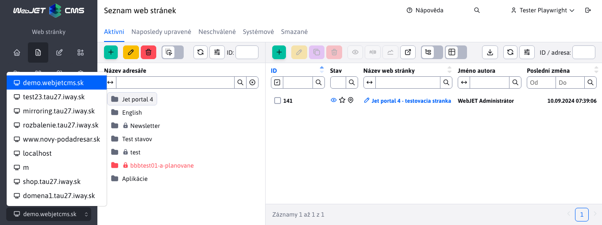

# Úprava webové stránky

Editor webových stránek je univerzální nástroj pro úpravu a vytváření webových stránek. Při úpravě existující webové stránky se obsah uložené webové stránky načte do hlavního okna editoru. Při vytváření nové stránky je okno editoru prázdné a můžete začít psát obsah.

Pokud chcete vytvořit novou webovou stránku, musíte nejprve nastavit správný adresář, ve kterém má být webová stránka umístěna, a poté kliknutím na ikonu "Přidat" zobrazit okno editoru.

## Obsah karty

Na kartě "Obsah" můžete upravit obsah samotné webové stránky. Úprava stránky nabízí standardní funkce pro úpravu obsahu dokumentu podobné těm, které se běžně používají v programech MS Word a Excel. Většina příkazů je přístupná pomocí formátovacích tlačítek z panelu nástrojů editoru. Kontextové funkce jsou přístupné po kliknutí pravým tlačítkem myši na příslušný objekt stránky, např. obrázek, tabulku, vybraný blok textu atd.

V závislosti na nastavení skupiny šablon nebo šablony (pole Typ editoru stránky) je k dispozici několik typů editorů. V současné době jsou podporovány následující typy editorů:
- Standardní - typ editoru `WYSIWYG`, vizuální editor, ve kterém se ukládá i to, co vidíte na obrazovce. Práce se podobá práci v MS Word, kde můžete snadno vybírat text, nastavovat tučné písmo, vkládat obrázky atd.
- Editor HTML - po otevření se zobrazí kód HTML stránky. Je určen pro speciální stránky, jejichž kód by se při použití editoru, jako je např. `WYSIWYG`, např. stránky hromadných e-mailů, které obsahují veškerý kód HTML včetně záhlaví a zápatí. V tomto případě je kód obvykle dodáván externí agenturou a je pouze vložen do stránky bez nutnosti jeho změny.
- Page Builder - způsob tvorby webových stránek z [připravené bloky](pagebuilder.md), umožňuje snadno upravovat bloky, přidávat, přesouvat pořadí atd. Je určen pro vytváření komplexních webových stránek.

## Základní karta

Nejdůležitějším parametrem každé webové stránky je její titulek. Nadpis se zadává do textového pole na kartě Základní. Pokud vytvoříte novou webovou stránku v prázdné složce, systém automaticky převezme název z názvu této složky. V opačném případě je při vytváření nové webové stránky uveden text "Nová webová stránka", který je ovšem nutné změnit na smysluplný titulek, který definuje obsah webové stránky. Název se obvykle zadává s diakritikou i mezerami jako prostý text.

Domovská stránka složky je ve výchozím nastavení synchronizována. [název webové stránky s názvem složky.](group.md#synchronizace-názvu-složky-a-webové-stránky).

Na každé stránce, která má být veřejně přístupná na webu, musí být v poli "Ano" uvedeno "Ano". **Zobrazit**. Pokud toto nastavení nemá, není pro návštěvníka k dispozici. Bude k dispozici pouze přihlášenému správci, aby viděl, jak bude webová stránka během procesu vytváření skutečně vypadat.

### Zařazení do stromové struktury

Webovou stránku můžete uložit do **více složek**, jejichž seznam je uveden v části Klasifikace stromové struktury. Hlavní složka je označena jako Nadřazená složka, další složky jsou v Kopie webové stránky v. Technicky se kopie webové stránky vytvoří ve všech vybraných složkách. Při uložení libovolné stránky se do ostatních kopií webové stránky zkopírují všechna data kromě:
- Adresa URL - stránka a její kopie mohou mít v případě potřeby upravenou adresu URL (pokud není vybrána možnost Automaticky generovat adresu URL z názvu položky nabídky).
- Pořadí rozvržení - v případě potřeby můžete nastavit vhodné pořadí rozvržení pro kopii stránky.

V případě, že **odstranit kopii webové stránky** takže bude přesunuta do koše. Zatímco je tato kopie v koši, adresa původní stránky z nadřazené složky se při úpravách změní na adresu složky s kopií do koše. Samozřejmě můžete pokračovat v přidávání dalších kopií, a to i do složky, ze které jsme odstranili první kopii. Odstraněné kopie webové stránky se po trvalém odstranění z koše již nebudou při úpravách původní stránky zobrazovat jako existující kopie.

V případě, že **odstranit původní webovou stránku** z nadřazené složky, bude přesunuta do koše, aniž by byly ovlivněny existující kopie této stránky. Všimněte si však, že při úpravách stránky bude mít vypnutý atribut Zobrazit, který samozřejmě můžete opět zapnout, aby se stránka zobrazila. Po trvalém **vymazání původního** webové stránky z koše pomocí **trvale odstranit všechny jeho kopie**. To znamená, že tyto kopie již nebudou k dispozici (ani v koši) a nebude možné je obnovit.

### Adresa URL

V poli Adresa URL nastavíte adresu webové stránky na internetu (část za názvem domény), např. `/produkty/webjet-cms/funkcie.html`.

Pole je **při ukládání nové webové stránky se automaticky vyplní.** podle adresy URL složky a pole Název položky v nabídce, nemusíte je vyplňovat ručně.

Z hlediska optimalizace pro vyhledávače by adresa URL stránky měla obsahovat klíčová slova. Ta by však měla být v ideálním případě obsažena také v názvu stránky, nadpisech a textu stránky.

Pokud změníte adresu URL stránky, v aplikaci Path Redirects se automaticky vytvoří přesměrování. Pokud na původní adresu URL odkazuje jiná stránka, bude přesměrována na novou adresu stránky.

#### Automatické generování adresy URL z názvu položky nabídky

Pokud tuto možnost vyberete, adresa URL stránky se automaticky změní:
- při změně hodnoty pole Název položky nabídky
- při změně hodnoty pole URL adresu složky, ve které se webová stránka nachází, ale také nadřazených složek.
- při přesunu webové stránky do jiné složky

Při změně adresy URL stránky se v aplikaci Path Redirects automaticky vytvoří přesměrování ze staré adresy URL na novou.

#### Zdědění začátku adresy URL z adresáře

Pomocí této možnosti můžete zadat koncovou adresu URL webové stránky, přičemž počáteční adresa URL bude převzata z nadřazených adresářů. To je užitečné, pokud potřebujete, aby stránka měla vždy stejnou koncovou adresu URL, např. `404.html` nebo `cta.html`.

Hodnota URL se změní, když:
- při změně hodnoty pole URL adresu složky, ve které se webová stránka nachází, ale také nadřazených složek.
- při přesunu webové stránky do jiné složky

zatímco jak je napsáno výše, koncová část se bere podle zadané hodnoty.

Při změně adresy URL stránky se v aplikaci Path Redirects automaticky vytvoří přesměrování ze staré adresy URL na novou.

### Poznámka redakce

Na kartě Základna je pole Poznámka editora. Zadaný text se zobrazí v horní části editoru jako upozornění pro všechny editory/administrátory při úpravách webové stránky. Jedná se o interní atribut, který se nezobrazuje ve veřejné části webu. Poznámka se neukládá do historie stránky, vždy se aktualizuje zadanou/aktuální hodnotou.

Umožňuje zobrazit informace, jako jsou: **Upozornění: na stránky vede odkaz z VOP, adresu stránek nikdy neměňte**.

## Správa více domén

Pokud WebJET [nastavení pro správu více domén](../../frontend/setup/README.md#správa-více-domén) takže na kartě Základní se pro složky v kořenové složce zobrazí pole Doména.

### Vytvoření nové domény

Pokud potřebujete vytvořit novou doménu, postupujte podle následujících kroků:
- Kliknutím na ikonu přidáte novou složku
- Zadejte potřebné údaje, například Název složky atd.
- Změňte nadřazenou složku na kořenovou složku.
- Po nastavení kořenové složky se zobrazí pole Doména, do kterého zadejte název domény.
- Uložte složku kliknutím na tlačítko Přidat.

Vytvoří se složka a ve WebJET CMS se vytvoří nová doména, na kterou se automaticky přepne seznam webových stránek. Dostupné domény se zobrazí v záhlaví administrace v poli pro výběr domény. Prostřednictvím tohoto výběrového pole lze mezi nimi přepínat.

Poznámka: kromě přidání domény v systému WebJET CMS je třeba ji nastavit i na aplikačním serveru. Aplikační server spravuje pouze domény, které zná. Pokud používáte Tomcat, správce serveru v okně `conf/server.xml` Nastavení `defaultHost="domena.sk"` o prvcích `<Engine` pro směrování všech domén do `domena.sk`, nebo musí implicitně definovat doménu pomocí příkazu `<Alias>www.domena.sk</Alias>` pro příslušné `<Host` prvky. Samozřejmě doporučujeme také vytvořit certifikáty httpS pro jednotlivé domény.

### Přejmenování domény

Doménu přejmenujete v okně úprav složky. Do pole Doména zadejte novou hodnotu a vyberte možnost **Změna přesměrování domény, konfiguračních proměnných a překladových textů s předponou domény**. Pokud je tato možnost zaškrtnuta, provedou se změny:
- Zadaná doména se nastaví také pro všechny subdomény.
- Doména je nastavena také pro složku `Systém`.
- Změní doménu ze staré hodnoty na novou hodnotu v přesměrování cest, konfiguračních proměnných a textech překladu.

Pokud máte v doméně více kořenových složek (například podle jazyka), proveďte změnu domény postupně u všech složek.

## Šablona karty

Každá webová stránka musí mít nastavenou šablonu návrhu. O správné nastavení šablony se stará správce, který je definuje pro jednotlivé složky webu. Při vytváření nové stránky ve složce se šablona nastaví podle nastavení složky. Ve výchozím nastavení by nemělo být nutné šablonu webové stránky během práce měnit.

V polích můžete v případě potřeby změnit záhlaví/zápatí/menu a volné objekty ve vybrané šabloně (například pokud potřebujete jiné zápatí nebo konkrétní menu na stránce).

Pole pro výběr šablony obsahuje ikonu tužky, kliknutím na ni se otevře dialogové okno pro úpravu šablony (pokud potřebujete například upravit některé její vlastnosti). Klepnutím na ikonu + vytvoříte novou šablonu.

V polích záhlaví/zápatí/menu/volný objekt se při výběru konkrétní stránky zobrazí ikona tužky, která umožňuje vybranou stránku upravit. Můžete tak snadno upravovat např. záhlaví přímo při editaci webové stránky.

## Karta Navigace

Na kartě Navigace můžete upravit další možnosti zobrazení stránky ve stromové struktuře (zobrazení stránky v nabídce, navigačním panelu nebo mapě webu). Zobrazení lze rozlišit podle přihlášení uživatele.

Pole Pořadí uspořádání určuje pořadí stránky v nabídce a v mapě stránek. Čím vyšší číslo, tím níže bude stránka umístěna.

## Přístup ke kartě

V části "Přístup" můžete spravovat, kdo a za jakých podmínek může na stránku přistupovat. Pokud je stránka určena pro aplikaci hromadné elektronické pošty, je možné definovat také přiřazení ke skupině elektronické pošty (typ newsletteru).

## Karta perex

Na kartě Perex můžete nastavit platnost zobrazení stránky nebo nastavit její odložení či změnu. Stránce můžete také přiřadit příslušné značky a zařadit ji do kategorie.

Pole Začátek, Konec a Datum se obvykle používají pouze pro zprávy, tiskové zprávy, události a konference. Pole Začátek a Konec však mají také speciální funkci, pokud chcete načasovat zveřejnění nebo zrušení stránky od určitého okamžiku v budoucnosti. Tato funkce se aktivuje, když zaškrtnete políčka "Zveřejnit stránku po tomto datu", respektive "Zrušit zveřejnění stránky po tomto datu". Hodnoty polí Začátek a Konec musí být vyplněny pro všechny události a konference v kalendáři událostí. U zpravodajských událostí stačí zadat datum zahájení.

Perex (Anotace) obsahuje stručný popis toho, čeho se stránka týká. Neměl by být delší než 160 znaků. Perex se používá hlavně při psaní zpráv, tiskových zpráv, událostí a konferencí, kde se jedná o stručný popis článku, který se zobrazuje v seznamu zpráv. Obrázek můžete definovat pomocí ikony, která se zobrazí za polem Obrázek

## Mediální karta

Na kartě Média můžete spravovat dokumenty a soubory související se stránkou. Další informace naleznete v části [Mediální sekce](media.md).

Kliknutím na tlačítko "přidat" se zobrazí formulář pro přidání odkazu.

V poli "Odkaz" vyberete, kam má odkaz směřovat. U dokumentů ke stažení se tlačítkem Vybrat vybere dokument a u Souvisejících odkazů konkrétní webová stránka.

Nadpis představuje text, který se zobrazí na webové stránce. Proto by měl být definován jako normální text (s diakritikou a mezerami).

V poli Náhledový obrázek lze nastavit odkaz na vhodný náhledový obrázek, pokud jej aplikace médií vložená do stránky/šablony používá.

Uspořádání určuje pořadí odkazů. Média přiřazená do různých skupin se navzájem neovlivňují. Pořadová čísla mohou být také stejná, v takovém případě systém seřadí odkazy podle abecedy.

**Varování:** nově přidaná média se na webové stránce začnou zobrazovat až po uložení webové stránky. Tímto způsobem můžete v případě potřeby načasovat přidání médií spolu s webovou stránkou, pokud nastavíte odložení publikování stránky.

## Karta Volitelná pole

Na kartě Volitelná pole můžete nastavit volitelné atributy (hodnoty, texty) webové stránky a adresáře podle svých potřeb. Tyto hodnoty pak můžete přenést a použít v šabloně stránky. Typy (text, číslo, výběrové pole, výběr souboru...) a názvy polí lze nastavit podle potřeby, viz oddíl [Volitelná pole](../../frontend/webpages/customfields/README.md).

## Karta Historie

Na kartě Historie se zobrazují publikované historické verze webové stránky a aktuální rozpracované (dosud nepublikované) verze. Při publikování rozpracované verze se dočasné/pracovní verze stránky z historie odstraní a v historii zůstanou pouze publikované verze.

V případě schválení/odmítnutí stránky se zobrazí také jméno uživatele, který verzi schválil nebo odmítl.

Více informací najdete v části [Historie](history.md).

## Uložení pracovní verze

Pokud před kliknutím na tlačítko Uložit vyberete možnost Uložit pracovní verzi, upravená webová stránka se uloží do historie jako pracovní verze. Nebude k dispozici návštěvníkům webu.

To vám umožní strávit několik dní přípravou nové verze textu webové stránky, aniž by to ovlivnilo aktuálně zveřejněnou verzi pro návštěvníky. Po uložení pracovní verze a opětovném otevření editoru webové stránky se zobrazí zpráva, že je k dispozici rozpracovaná verze stránky. Přejděte na kartu Historie, vyberte v tabulce řádek s verzí, kterou chcete v editoru otevřít (obvykle nejnovější verzi nahoře), a klikněte na žlutou ikonu Upravit stránku.

Pokaždé, když uložíte pracovní verzi, zůstane na kartě Historie, takže tam budete mít více záznamů. Kvůli efektivitě však kliknutím na tlačítko Uložit bez zaškrtnuté možnosti Uložit pracovní verzi (tj. když ji zveřejníte pro návštěvníky webu) odstraníte všechny pracovní verze webu.

Uložením pracovní verze se zároveň nezavře okno editoru, takže můžete pokračovat v práci.

## Náhled stránky

Klikněte na tlačítko `Náhľad` v zápatí okna editoru se v prohlížeči otevře nová karta s náhledem celé stránky bez nutnosti jejího uložení. Na stránce můžete provádět změny a podívat se, jak bude vypadat po uložení.

Pokud okno náhledu nezavřete, náhled se při uložení stránky automaticky aktualizuje. To je výhodné použití s [Uložení pracovní verze](#uložit-pracovní-verzi) kde můžete okno náhledu přesunout například na druhý monitor a nechat ho otevřené během práce. Při každém uložení se náhled automaticky aktualizuje.

  <iframe width="560" height="315" src="https://www.youtube.com/embed/6OSTrMJj8z4" title="Přehrávač videí YouTube" frameborder="0" allow="accelerometer; autoplay; clipboard-write; encrypted-media; gyroscope; picture-in-picture" allowfullscreen></iframe>

## Spolupráce několika redaktorů

Abyste zabránili současným úpravám stejné stránky dvěma různými uživateli, WebJET vás upozorní, že na stránce právě někdo pracuje. To znamená, že někdo již načetl upravovanou stránku v editoru. V takové situaci musíte opustit editor a počkat, až dotyčný uživatel dokončí svou práci, abyste si vzájemně nepřepsali úpravy.

Doporučujeme, abyste po dokončení práce a uložení/publikování stránky opustili editor stránky, čímž se minimalizuje možnost zobrazení zprávy jinému editoru.

Tuto funkci mají i aplikace, takže pracovní postup se vztahuje na všechny části, nejen na editor stránek.

