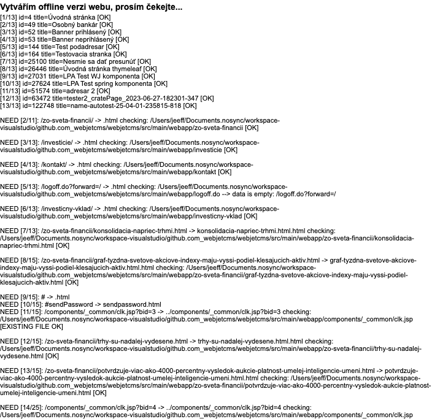

# Export do HTML

Přes aplikaci **Export do HTML** lze exportovat web stránky do HTML formátu a následně je v omezené míře použít v offline prostředí. Export funguje na principu stahování výsledných web stránek a jejich uložení do HTML souboru

Vygenerované stránky se uloží do složky `/html`.

## Proces generování HTML souborů

Po zadání ID složky, pro kterou chcete vytvořit offline verzi, a kliknutí na **OK** se spustí proces generování HTML souborů. Tento proces může trvat několik desítek minut podle počtu stránek v dané větvi web sídla.

Čekejte, až celý proces skončí. Během toho by se vám v okně měla zobrazovat informace o počtu již vygenerovaných stránek ao celkovém počtu stránek. Výsledkem je složka `/html` obsahující HTML kód jednotlivých stránek a případně ZIP archiv se zvolenými složkami (do ZIP archivu se automaticky přidává i složka `/html`).

## Vytvoření ZIP archivu

Pro vytvoření ZIP archivu je třeba zvolit možnost **Zálohování systému**, můžete také vybrat, které složky se do ZIP archivu mají zahrnout. Upozorňujeme, že objem dat ve zvolených složkách může být velký a ZIP soubor se nemusí vygenerovat správně (omezení je na 2GB soubor).

## Exportované soubory

Vygenerované stránky se uloží do složky `/html` a po zvolení možnosti Zálohování systému se výsledný ZIP soubor uloží do kořenové složky.

!> **Upozornění:** po vytvoření exportu doporučujeme ihned smazat celou složku `/html` a také ZIP archiv s názvem začínajícím na `offline-` v kořenové složce serveru.
