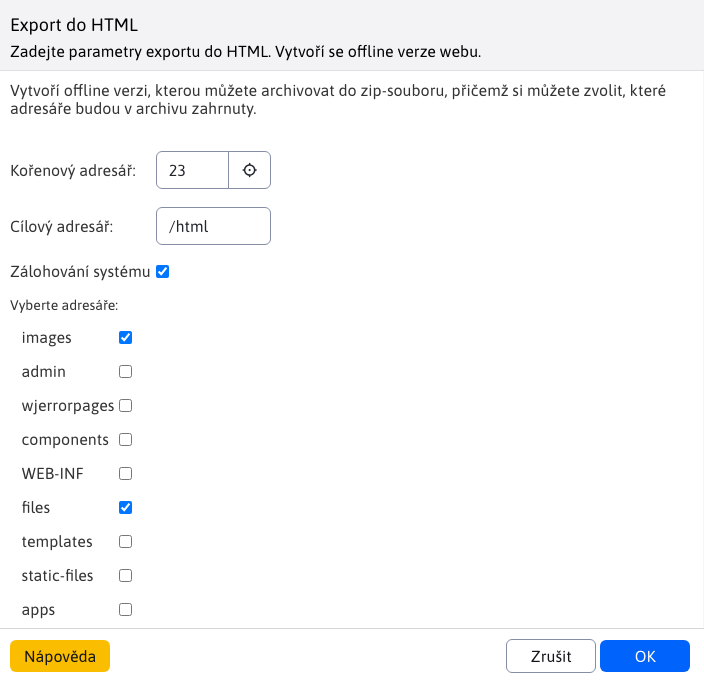
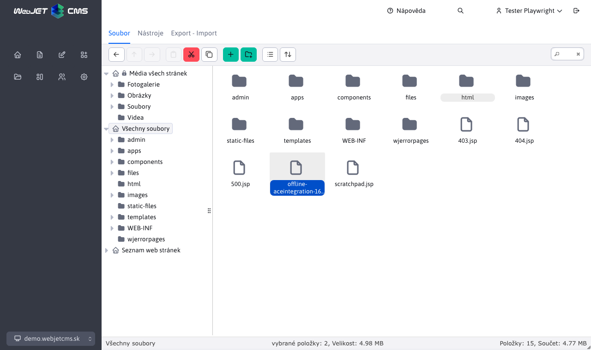

# Export do HTML

Prostřednictvím aplikace **Export do HTML** je možné exportovat webové stránky do formátu HTML a následně je omezeně používat v offline prostředí. Export funguje na principu stažení výsledných webových stránek a jejich uložení do souboru HTML.

Vygenerované stránky se ukládají do složky `/html`.

## Proces generování souborů HTML

Po zadání ID složky, pro kterou chcete vytvořit offline verzi, a kliknutí na tlačítko . **OK** zahájí proces generování souborů HTML. Tento proces může trvat několik desítek minut v závislosti na počtu stránek v dané větvi webu.

Počkejte na dokončení celého procesu. Během této doby byste měli v okně vidět informace o počtu již vygenerovaných stránek a celkovém počtu stránek. Výsledkem je složka `/html` obsahující HTML kód každé stránky a případně archiv ZIP s vybranými složkami (složka je automaticky přidána do archivu ZIP `/html`).

## Vytvoření archivu ZIP

Chcete-li vytvořit archiv ZIP, musíte vybrat možnost **Zálohování systému**, můžete také vybrat složky, které mají být do archivu ZIP zahrnuty. Upozorňujeme, že množství dat ve vybraných složkách může být velké a soubor ZIP nemusí být vygenerován správně (limit je do 2 GB souboru).

## Exportované soubory

Vygenerované stránky se ukládají do složky `/html` a po výběru možnosti Zálohování systému se výsledný soubor ZIP uloží do kořenové složky.

!> **Varování:** po vytvoření exportu doporučujeme celou složku ihned smazat. `/html` a také archiv ZIP s názvem začínajícím na `offline-` v kořenové složce serveru.
