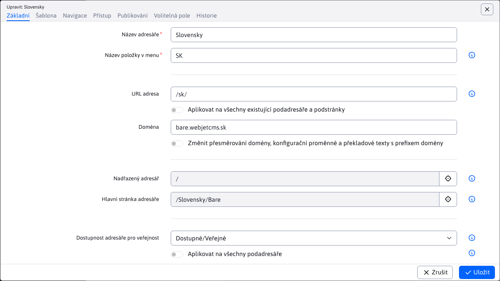

# Složka web stránky

Všechny stránky jsou uspořádány do složek a tvoří stromovou strukturu webu. Složky jsou zařazeny podle pořadí, které mají nastaveny jako jeden ze svých parametrů. Základní strukturu tvoří hlavní složku, často členěnou podle jazykových mutací webu a může být libovolně členěna pomocí podsložek podle logické struktury webu.

Po kliknutí na složku ve stromové struktuře se zobrazí web stránky ve vybrané složce.

# Karta Základní

- Název složky
- Název položky v menu - název, který se bude zobrazovat v navigační liště (drobečková navigace / breadcrumb) a v generovaném menu web stránky.
- URL adresa - název, který se použije pro vygenerování adresy stránek (URL) v tomto adresáři. Pokud obsahuje značku / na začátku, tak se vygenerovaná URL adresa začne zadanou adresou bez ohledu na rodičovskou složku. Pokud se zadá hodnota - tak se při generování URL adres tato složka přeskočí.
  - Aplikovat na všechny existující podsložky a podstránky - pokud zaškrtnete a složku uložíte, vygeneruje se nová URL adresa všem podstránkám té složky a podsložek.
- Doména - pokud používáte Multi Domain WebJET a upravujete kořenový adresář sem zadáváte doménu pro kterou se zobrazují stránky v tomto adresáři (a podadresářích).
  - Změnit přesměrování domény, konfigurační proměnné a překladové texty s prefixem domény - pokud změníte doménu a zvolíte tuto možnost doméně se změní i ve stávajících přesměrování, konfiguračních proměnných a překladových klíčích s prefixem původní domény.
- Nadřazená složka - složka, která je rodičem této složky. Určuje, kde se bude tato složka nacházet ve stromové struktuře.
- Hlavní stránka složky - web stránka, která bude použita jako hlavní web stránka složky po kliknutí na název složky v menu.
- Dostupnost složky pro veřejnost - určuje zda se jedná o veřejnou, nebo neveřejnou (interní) složku. Neveřejná složka se běžným návštěvníkům nezobrazuje ve stromové struktuře navigace (zobrazuje se pouze v admin části). Stránky v neveřejné složce nelze vyhledat a nezobrazují se v menu.

## Karta Šablona

- Šablona - šablona pro danou složku, použije se k nastavení šablony při vytvoření nové stránky v této složce.
  - Aplikovat na všechny existující podsložky a podstránky - pokud zaškrtnete a složku uložíte, nastaví se zvolená šablona všem podstránkám a podsložkám této složky.
  - Vynutit šablonu složky při zobrazení stránky - pokud je zvolena tato možnost ignoruje se nastavená šablona nebo webové stránce a vynutí se použití nastavené šablony ve složce.
- Jazyk - jazyk stránek v této složce. Standardní možnost je Jazyk se přebírá ze šablony, při kterém se jazykové nastavení přebírá z definice použité šablony stránky.
  - Jazyk ovlivňuje vložené aplikace – texty které aplikace vypisuje se řídí zvoleným jazykem.
  - WebJET automaticky vyhledá i jazykové mutace přiřazených hlaviček, patiček a menu. Pokud má šablona nastavenou hlavičku s názvem "default hlavička" nebo "SK-default hlavička" automaticky při zobrazení stránky s nastaveným jazykem EN WebJET vyhledá stránku "EN-default hlavička".
- HTML kód nové stránky - určuje, co se zobrazí v editoru po kliknutí na ikonu Přidat web stránku. Buď je to prázdná stránka nebo připravená stránka ze složky /System/Šablony.
- HTML kód do hlaviček podstránek – volitelně můžete zadat HTML kód, který se přímo vloží do HTML kódu web stránky v tomto adresáři. Např. specifickou META značku pro vyhledávače, nebo JavaScript kód potřebný pro tuto web stránku.

## Karta Navigace

- Pořadí uspořádání - určuje pořadí zobrazování složek v rámci rodičovské složky (ve stromové struktuře).
- Přegenerovat pořadí stránek a adresářů v tomto adresáři (včetně podsložek) - pokud zvolíte upraví pořadí stránek a složek tak, aby automaticky měly zvyšovanou hodnotu pořadí uspořádání po 10.
- Menu - informace jak se má adresář zobrazovat v menu:
  - Zobrazit - zobrazuje se hlavní stránka a podsložky
  - Nezobrazit - složka a podsložky se v menu nebude zobrazovat
  - Bez podsložek - v menu se zobrazí pouze hlavní stránka složky
  - Zobrazit včetně web stránek - v menu se zobrazí stránky i složky. Pro všechny stránky složky zobrazí zaškrtávací políčko Základní údaje -> Zobrazit v menu
- Navigační lišta - způsob zobrazení složky v navigační liště (navbar/breadcrumb):
  - Stejně jako menu – způsob zobrazení je shodný se zobrazením v navigačním menu.
  - Zobrazit - složka se vždy bude zobrazovat.
  - Nezobrazit - složka se nebude zobrazovat.
- Mapa stránek - způsob zobrazení složky v mapě stránek:
  - Stejně jako menu – způsob zobrazení je shodný se zobrazením v navigačním menu.
  - Zobrazit - složka se vždy bude zobrazovat.
  - Nezobrazit - složka se nebude zobrazovat.
- Aplikovat na všechny podsložky - nastavená hodnota se aplikuje i na stávající podsložky.

Způsob zobrazení je rozdělen na přihlášeného a nepřihlášeného návštěvníka. Můžete tak jednotlivé položky v menu skrýt, pokud uživatel není přihlášen, nebo naopak například. položku Přihlášení nezobrazovat, pokud je uživatel přihlášen.

## Karta přístup

Na kartě přístup nastavujete oprávnění pro přístup ke stránkám v této složce. Pokud zvolíte některou uživatelskou skupinu nebude obsah složky veřejně dostupný. Bude dostupný pouze přihlášenému návštěvníkovi, který patří do jedné z vybraných uživatelských skupin.

!>**Upozornění:** nejedná se o nastavení oprávnění pro administrátory, ale pro vytvoření tzn. zaheslované sekce na web stránce (pro návštěvníky stránky)

- Povolit přístup pouze pro skupinu uživatelů - pokud zvolíte některou skupinu uživatelů bude pro zobrazení stránky vyžadováno přihlášení uživatele z dané skupiny. Přiřadit stránku k hromadnému emailu - stránka bude dostupná pro hromadný email uživatelů ve zvolené skupině. Lze takto kategorizovat odesílané hromadné emaily dle preferencí návštěvníků.
- Stránka s formulářem pro přihlášení - pokud máte vytvořenou speciální stránku s přihlašovacím formulářem zde ji nastavte. Stránka je rekurzivně vyhledáváno ke kořenovému adresáři, takže nemusí být nastaveno pro všechny složky, stačí pro kořenový adresář.
- Použít základní nastavení - smaže nastavenou stránku pro přihlášení a použije standardní/základní přihlašovací formulář.

## Karta Publikování

V této kartě můžete nastavit publikování změny uložení složky do budoucnosti. Pokud nastavíte datum a čas změny a zvolíte možnost Naplánovat provedení změn a složku uložíte, tak změny, které jste provedli se neprojeví ihned, ale až po zadaném datu a čase. Můžete tak např. zveřejnit novou sekci webu až v určitý čas. Publikovaná verze bude mít hodnotu Menu na Nezobrazovat, nebude se tedy zatím zobrazovat v menu. V načasované verzi např. na zítra ráno nastavíte hodnotu na Zobrazit. Zítra ráno se tedy začne adresář zobrazovat v menu.

Pokud existuje naplánovaná verze pro publikování v této kartě ji uvidíte a můžete ji smazat nebo načíst její hodnoty do formuláře.

## Karta Volitelná pole

Pole A - Pole D: [volitelné pole](../../frontend/webpages/customfields/README.md) které lze použít k přenesení hodnot do HTML šablony.

## Karta Historie

Zobrazí historii změn v nastavení složky s datem a jménem redaktora, který změnu provedl. Klepnutím na ikonu tužky můžete načíst danou změnu do editoru složky.

## Synchronizace názvu složky a web stránky

Konfigurační proměnná `syncGroupAndWebpageTitle` nastavena na hodnotu `true` zajišťuje synchronizaci názvu složky a názvu **hlavní** web stránky. To znamená, že pokud se změní název složky, automaticky se změní název hlavní webové stránky tak, aby byl stejný a naopak.

Existují však výjimky, kdy tato synchronizace nenastane ani pokud je zapnuta tato konfigurační proměnná.

### Výjimka 1

Výjimka nastává pro kořenové složky, ve kterých se název složky a stránky nesynchronizuje.

Příklad: Máme kořenovou složku SK a v ní stránku s názvem Úvod, název složky a web stránky se nesynchronizuje.

### Výjimka 2

Tato výjimka nastává, pokud je stránka nastavena jako **hlavní** stránka pro **více složek**.

Příklad: Máme složku Jazyk. Tato složka obsahuje podsložku Čeština. Obě složky mají jako hlavní web stránku nastavenou stejnou stránku (její web není podstatný). V takovém případě nastane výjimka.

### Výjimka 3

Tato výjimka nastává pokud se **hlavní** stránka složky nenachází přímo v dané složce.

Příklad: Máme složku Jazyk, která obsahuje stránky Čeština a Anglie. Máme druhou složku Novinky. Výjimka nastává-li hlavní stránka složky Novinky je stránka Čeština, která se nachází v jiné složce.
