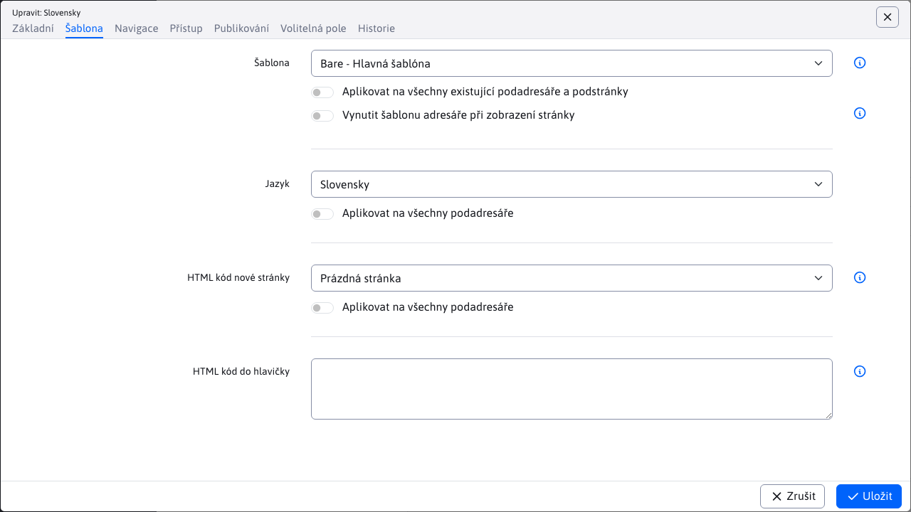

# Složka webové stránky

Všechny stránky jsou uspořádány do složek a tvoří stromovou strukturu webu. Složky jsou řazeny podle pořadí, které mají nastaveno jako jeden z parametrů. Základní struktura se skládá z hlavní složky, která se často dělí podle jazyka webu a může být libovolně členěna podsložkami podle logické struktury webu.

Po kliknutí na složku ve stromové struktuře se zobrazí webové stránky ve vybrané složce.

# Základní karta

- Název složky
- Název položky nabídky - název, který se bude zobrazovat v navigačním panelu (drobečková navigace) a ve vygenerované nabídce webové stránky.
- URL - název, který bude použit pro generování adresy stránky (URL) v tomto adresáři. Pokud obsahuje na začátku znak /, bude vygenerovaná adresa URL začínat zadanou adresou bez ohledu na nadřazený adresář. Pokud je zadána hodnota -, generování URL tuto složku přeskočí.
  - Použít na všechny existující podsložky a podstránky - pokud zaškrtnete a uložíte složku, vygeneruje se nová adresa URL pro všechny podstránky této složky a podsložek.
- Doména - pokud používáte Multi Domain WebJET a upravujete kořenový adresář, zadáte zde doménu, pro kterou se zobrazují stránky v tomto adresáři (a podadresářích).
  - Změna přesměrování, konfiguračních proměnných a překladových textů s prefixem domény - pokud změníte doménu a vyberete tuto možnost, změní se doména také ve stávajících přesměrováních, konfiguračních proměnných a překladových klíčích s prefixem původní domény.
- Nadřazená složka - složka, která je nadřazená této složce. Určuje, kde bude tato složka umístěna ve stromové struktuře.
- Domovská stránka složky - webová stránka, která se použije jako hlavní webová stránka složky po kliknutí na název složky v nabídce.
- Dostupnost veřejné složky - určuje, zda je složka veřejná nebo neveřejná (interní). Neveřejná složka se běžným návštěvníkům nezobrazuje ve stromové struktuře navigace (zobrazuje se pouze v oblasti správce). Stránky v neveřejné složce nelze vyhledávat a nezobrazují se v nabídce.

## Šablona karty

- Šablona - šablona pro složku, slouží k nastavení šablony při vytváření nové stránky v této složce.
  - Použít na všechny existující podsložky a podstránky - pokud zaškrtnete a uložíte složku, vybraná šablona se použije na všechny podstránky a podsložky této složky.
  - Vynutit šablonu složky při zobrazení stránky - pokud je tato možnost vybrána, bude nastavená šablona na webové stránce ignorována a ve složce bude vynuceno použití nastavené šablony.
- Jazyk - jazyk stránek v této složce. Výchozí volba je Jazyk se přebírá ze šablony, kde se nastavení jazyka přebírá z definice použité šablony stránky.
  - Jazyk ovlivňuje vložené aplikace - texty, které aplikace tiskne, se řídí zvoleným jazykem.
  - WebJET také automaticky vyhledává jazykové verze souvisejících záhlaví, zápatí a nabídek. Pokud má šablona záhlaví pojmenované "výchozí záhlaví" nebo "výchozí záhlaví EN", WebJET při zobrazení stránky s jazykem EN nastaveným na "výchozí záhlaví EN" automaticky vyhledá stránku "výchozí záhlaví EN".
- Kód HTML nové stránky - určuje, co se zobrazí v editoru po kliknutí na ikonu Přidat webovou stránku. Je to buď prázdná stránka, nebo připravená stránka ze složky /Systém/Šablony.
- Kód HTML v záhlaví podstránek - volitelně můžete zadat kód HTML, který bude přímo vložen do kódu HTML webové stránky v tomto adresáři. Například specifický tag META pro vyhledávače nebo kód JavaScriptu potřebný pro tuto webovou stránku.

## Karta Navigace

- Pořadí uspořádání - určuje pořadí, v jakém se složky zobrazují v nadřazené složce (ve stromové struktuře).
- Přegenerovat pořadí stránek a adresářů v tomto adresáři (včetně podadresářů) - pokud je vybráno, upraví pořadí stránek a adresářů tak, aby se automaticky zvýšila hodnota pořadí o 10.
- Menu - informace o tom, jak se má adresář zobrazit v menu:
  - Zobrazení - zobrazí hlavní stránku a podsložky.
  - Nezobrazovat - složka a podsložky se v nabídce nezobrazí.
  - Žádné podsložky - v nabídce se zobrazuje pouze hlavní stránka složky
  - Zobrazit včetně webových stránek - v nabídce se zobrazí stránky i složky. Pro všechny stránky složky se zobrazí zaškrtávací políčko Základní údaje -> Zobrazit v nabídce.
- Navigační panel - způsob zobrazení složky v navigačním panelu (navbar/breadcrumb):
  - Stejně jako menu - zobrazení je totožné s navigačním menu.
  - Zobrazit - složka se zobrazí vždy.
  - Nezobrazovat - složka se nezobrazí.
- Mapa webu - způsob zobrazení složky v mapě webu:
  - Stejně jako menu - zobrazení je totožné s navigačním menu.
  - Zobrazit - složka se zobrazí vždy.
  - Nezobrazovat - složka se nezobrazí.
- Použít na všechny podsložky - nastavená hodnota se použije i na stávající podsložky.

Způsob zobrazení se dělí na přihlášeného a nepřihlášeného návštěvníka. Jednotlivé položky nabídky můžete skrýt, pokud uživatel není přihlášen, nebo naopak, např. nezobrazovat položku Přihlášení, pokud je uživatel přihlášen.

## Přístup ke kartě

Na kartě přístupu nastavíte oprávnění pro přístup ke stránkám v této složce. Pokud vyberete skupinu uživatelů, obsah složky nebude veřejně přístupný. Bude přístupný pouze přihlášenému návštěvníkovi, který patří do jedné z vybraných skupin uživatelů.

!>**Varování:** nejedná se o nastavení oprávnění pro správce, ale o vytvoření sekce chráněné heslem na webové stránce (pro návštěvníky stránky).

- Povolit přístup pouze skupině uživatelů - pokud vyberete skupinu uživatelů, uživatel z této skupiny bude muset být pro zobrazení stránky přihlášen. Přiřadit stránku k hromadnému e-mailu - stránka bude dostupná pro hromadný e-mail uživatelů z vybrané skupiny. Odesílané hromadné e-maily je možné tímto způsobem kategorizovat podle preferencí návštěvníků.
- Stránka přihlašovacího formuláře - pokud jste vytvořili speciální stránku přihlašovacího formuláře, nastavte ji zde. Stránka je rekurzivně prohledávána až do kořenového adresáře, takže nemusí být nastavena pro všechny složky, ale pouze pro kořenový adresář.
- Použít základní nastavení - odstraní nastavenou přihlašovací stránku a použije standardní/základní přihlašovací formulář.

## Karta Publikování

Na této kartě můžete nastavit publikování změn uložení složky do budoucna. Pokud nastavíte datum a čas změny a vyberete možnost Naplánovat provedení změn a uložit složku, nebudou provedené změny platit okamžitě, ale až po uplynutí zadaného data a času. Můžete například publikovat novou část webu až v určitý čas. Zveřejněná verze bude mít hodnotu Menu nastavenou na hodnotu Nezobrazovat, takže se zatím nebude zobrazovat v menu. V časově omezené verzi, například pro zítřejší ráno, nastavíte hodnotu Zobrazit. Zítra ráno se tedy adresář začne v nabídce zobrazovat.

Pokud je na této kartě plánovaná verze ke zveřejnění, uvidíte ji a můžete ji odstranit nebo načíst její hodnoty do formuláře.

## Karta Volitelná pole

Pole A - pole D: [nepovinné pole](../../frontend/webpages/customfields/README.md) které lze použít k předávání hodnot šabloně HTML.

## Karta Historie

Zobrazí historii změn nastavení složky s datem a jménem editora, který změnu provedl. Kliknutím na ikonu tužky načtete změnu do editoru složky.

## Synchronizace názvu složky a webové stránky

Konfigurační proměnná `syncGroupAndWebpageTitle` nastavit na `true` synchronizuje název složky a název **Hlavní stránka** webové stránky. To znamená, že pokud se změní název složky, automaticky se změní i název hlavní webové stránky a naopak.

Existují však výjimky, kdy k této synchronizaci nedojde, i když je tato konfigurační proměnná povolena.

### Výjimka 1

Výjimka nastává u kořenových složek, kde se název složky a stránky nesynchronizuje.

Příklad: máme kořenovou složku SK a v ní stránku s názvem Home, název složky a název webové stránky nejsou synchronizovány.

### Výjimka 2

Tato výjimka nastane, pokud je stránka nastavena jako **Hlavní stránka** stránku pro **více složek**.

Příklad: máme složku Jazyk. Tato složka obsahuje podsložku s názvem Slovenština. Obě složky mají nastavenou stejnou stránku jako hlavní webová stránka (její umístění není důležité). V tomto případě dojde k výjimce.

### Výjimka 3

Tato výjimka nastane, pokud **Hlavní stránka** stránka složky se nenachází přímo v této složce.

Příklad: máme složku Language, která obsahuje slovenské a anglické stránky. Máme druhou složku Novinky. Výjimka nastane, pokud je hlavní stránkou složky News slovenská stránka, která se nachází v jiné složce.
