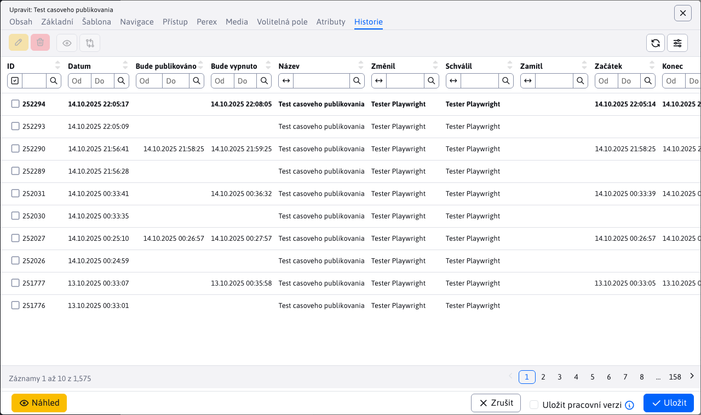

# Historie

V kartě Historie se zobrazují publikované historické verze web stránky a **aktuálně rozpracované (ještě nepublikované) verze**. Při publikování rozpracované verze se z historie smažou dočasné/pracovní verze stránky a v historii se ponechá publikovaná verze.

Plánované verze (budoucí) mají ve sloupci **Bude publikováno** zobrazené datum, kdy daná verze bude/byla publikována. Pokud máte naplánovanou stránku pro publikování a chcete ji zrušit stačí ji smazat.

Stránky, které mají nastavenou možnost **Odveřejnit stránku po tomto datu** zobrazují datum ve sloupci **Bude vypnuto**. V daném čase se vypne veřejné zobrazování web stránky (stránka nebude pro veřejnost dostupná). Pokud potřebujete vypnutí stránky zrušit, je třeba upravit danou verzi a plánované vypnutí zrušit jejím znovu uložením.

Tučným písmem je zvýrazněna aktuálně zveřejněná verze stránky.

Sloupce datum začátku a datum konce zobrazují nastavená data v kartě Perex v editoru stránek.

V případě schvalování/zamítnutí stránky se zobrazuje i jméno uživatele, který danou verzi schválil, nebo zamítl.

Zvolením řádku a kliknutím na ikonu lze provést akce:
-  - Editovat stránku - zvolená verze se načte z historie do editoru. Umožňuje vám nově publikovat starší verzi stránky.
-  - Smazat - smaže stránku z historie, lze použít pouze na stránky s naplánovaným publikováním (mají vyplněné datum v **Bude publikováno**).
-  - Zobrazit stránku - zobrazí zvolenou web stránku z historie. Upozorňujeme, že v historii se ukládá text stránky, pokud dojde ke změně šablony (např. v patičce stránky) toto nebude reflektováno při zobrazení.
-  - Porovnat stránku - zobrazí se vám nové okno, které je rozděleno na dvě části s obsahem aktuální a nové verze stránky. Obě části jsou vzájemně synchronizovány, takže se vám při prohlížení obsahu pohybují současně. V okně srovnání máte také možnost zvýraznit změny uložené verze z historie vůči aktuální publikované verzi web stránky. Tato operace se provede po kliknutí na odkaz "Zvýraznit rozdíly" v horní části okna.
