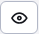
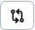

# Historie

Na kartě Historie jsou zobrazeny publikované historické verze webové stránky a **aktuální verze ve vývoji (dosud nezveřejněné)**. Při publikování rozpracované verze jsou dočasné/pracovní verze stránky z historie odstraněny a v historii je ponechána publikovaná verze.

Plánované verze (budoucí) mají ve sloupci **Bude zveřejněno** datum, kdy bude/byla verze zveřejněna. Pokud máte stránku naplánovanou ke zveřejnění a chcete ji zrušit, stačí ji smazat.

Stránky s nastavenou možností **Zveřejnit stránku po tomto datu** zobrazit datum ve sloupci **Bude vypnuta**. V tomto okamžiku bude veřejné zobrazení webové stránky zakázáno (stránka bude pro veřejnost nedostupná). Pokud potřebujete vypnutí zrušit, musíte upravit verzi a zrušit naplánované vypnutí opětovným uložením.

Tučným písmem je zvýrazněna aktuálně zveřejněná verze stránky.

Sloupce s počátečním a koncovým datem zobrazují údaje nastavené na kartě Perex editoru stránky.

V případě schválení/odmítnutí stránky se zobrazí také jméno uživatele, který verzi schválil nebo odmítl.

Výběrem řádku a kliknutím na ikonu lze provádět akce:
-  - Upravit stránku - vybraná verze se načte z historie do editoru. Umožňuje znovu publikovat starší verzi stránky.
-  - Smazat - odstraní stránku z historie, lze použít pouze pro stránky s plánovaným publikováním (mají vyplněné datum). **Bude zveřejněno**).
-  - Zobrazit stránku - zobrazí vybranou webovou stránku z historie. Upozorňujeme, že v historii je uložen text stránky, pokud se změní šablona (např. v zápatí stránky), neprojeví se to v zobrazení.
-  - Porovnání stránky - zobrazí se nové okno rozdělené na dvě části s obsahem aktuální a nové verze stránky. Obě části jsou vzájemně synchronizovány, takže se při prohlížení obsahu pohybují současně. V okně pro porovnání máte také možnost zvýraznit změny uložené verze z historie oproti aktuální zveřejněné verzi webové stránky. To provedete klepnutím na odkaz "Zvýraznit rozdíly" v horní části okna.
