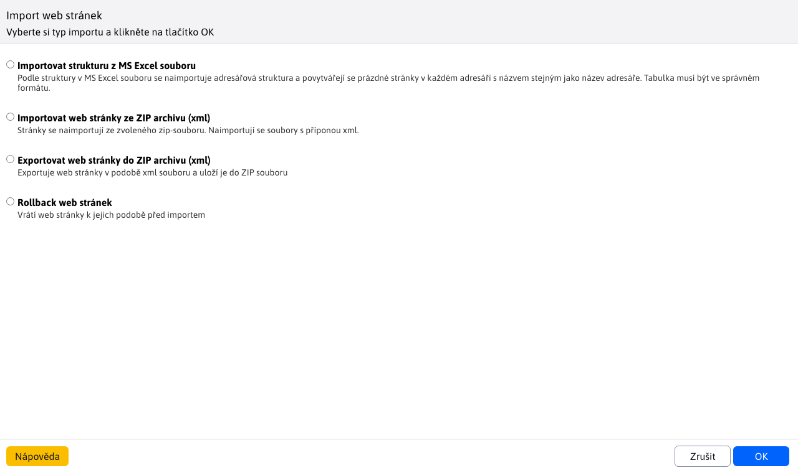
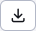
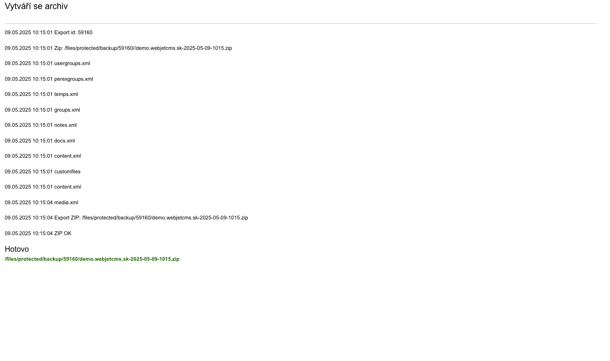
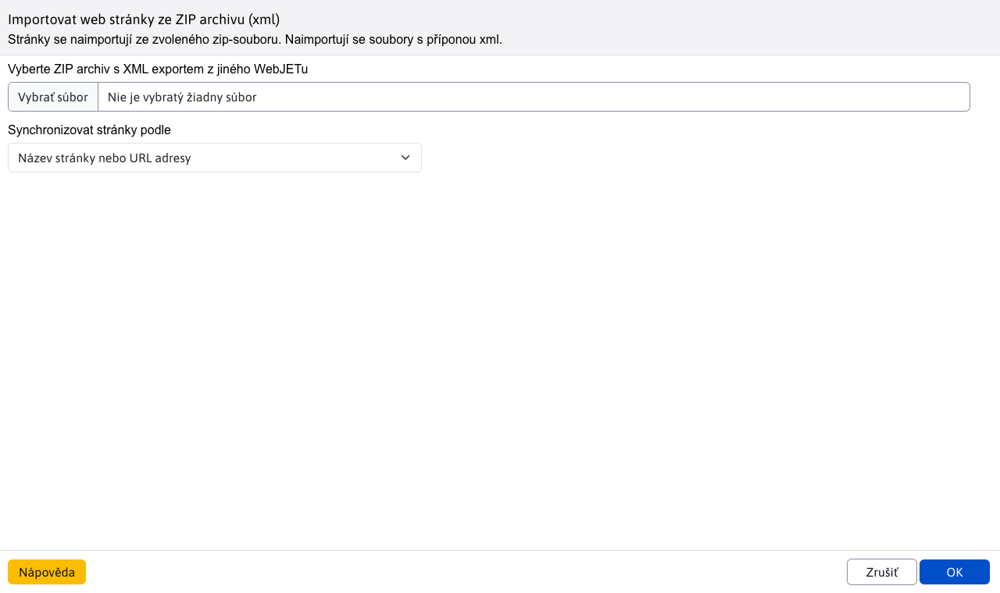
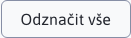
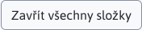
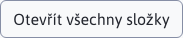
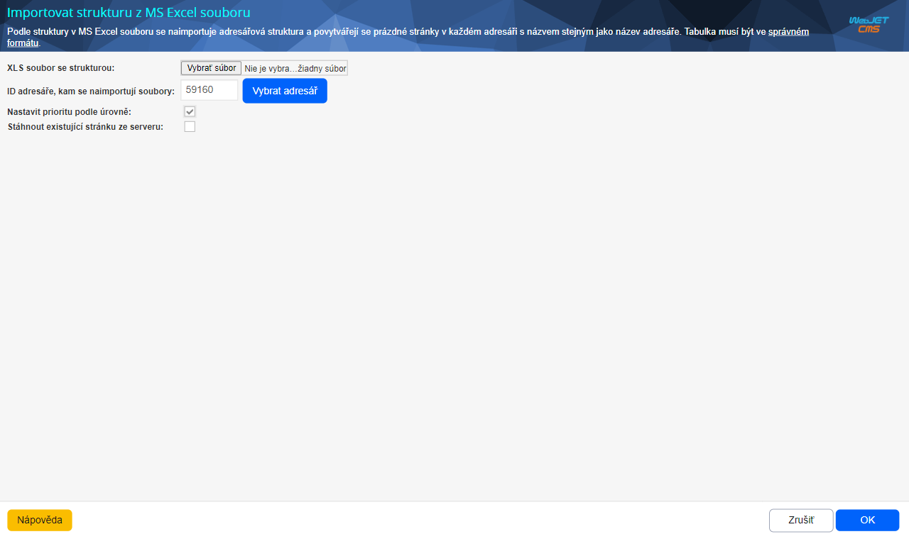
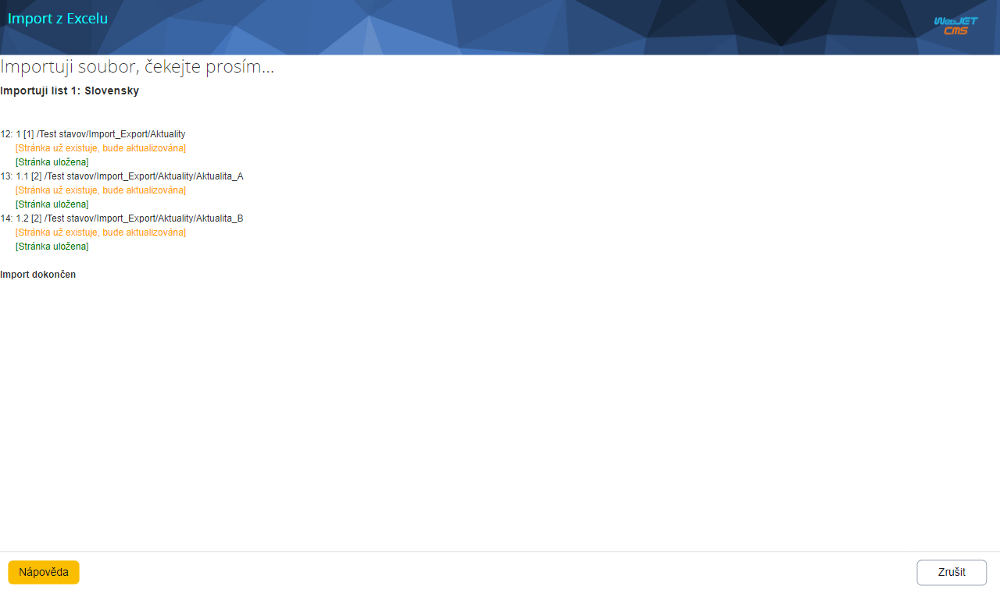

# Import a export web stránek

Export webových stránek exportuje webové stránky včetně jejich textu, stromové struktury a vložených obrázků a souborů. Umožňuje snadno přenášet obsah mezi více instancemi WebJET CMS. mezi produkčním a testovacím prostředím. Při importu je zobrazeno okno, ve kterém jsou porovnány jednotlivé stránky s možností volby stránek, které se skutečně naimportují. Umíte tak zkontrolovat a potvrdit údaje před jejich importem.

Pokud připravujete nové web sídlo, můžete předem připravit stromovou strukturu web sídla a tu naimportovat do WebJET CMS.

## Exportování web stránek

Nejprve se ujistěte, zda se nacházíte v adresáři, který chcete exportovat. Stiskněte tlačítko  a počkejte na zobrazení okna. Pro standardní export obsahu zvolte v tomto okně možnost **Exportovat web stránky do ZIP archivu (xml)** a spusťte export ve zvolené větvi stromu stránek tlačítko s textem **OK**.

Výstup by měl vypadat podobně jako na následujícím obrázku. Úplně na konci výstupu se zobrazí odkaz na ZIP soubor ke stažení. Nabídnutý soubor si stáhnete na váš počítač. Tento soubor budete moci následně použít k importu na jiném prostředí CMS WebJET.

## Importování web stránek ze ZIP archivu

Nejprve se ujistěte, zda se nacházíte v adresáři, do kterého chcete import aplikovat. Stiskněte tlačítko  a počkejte na zobrazení okna. V okně zvolte možnost **Importovat web stránky ze ZIP archivu (xml)** a stiskněte tlačítko s textem **OK**. Budete vyzváni k nahrání ZIP souboru, který by měl být ve stejném stavu jako když byl vyexportován přes možnost **Exportovat web stránky do ZIP archivu (xml)**. Jakékoli experimentování s jeho obsahem může mít za následek nesprávné fungování importu s důsledkem poškození výsledného obsahu web sídla.

Máte také možnost zvolit hodnotu **Synchronizovat stránky podle**, kterou rozhodnete, podle jakého parametru se bude kontrolovat, zda stránka již existuje nebo ne. Na výběr máte možnosti:
- **Názvu stránky nebo URL adresy**, považuje se za existující, pokud se shoduje v názvu nebo URL adrese s jinou existující stránkou
- **URL adresy**, považuje se existující, pokud se shoduje v URL adrese s jinou existující stránkou
- **Žádné**, nezáleží na stránce, ta se bude **vždy považovat za novou**, tedy můžete přidat duplikáty stávajících stránek
- **Volitelné pole A** / **Volitelné pole B** / **Volitelné pole C**, máte možnost porovnávat stránky podle vámi zadaných specifických hodnot jako například [speciálně vygenerovaného ID](../../frontend/webpages/customfields/README.md#unikátní-identifikátor). Nastavíte-li na začátku vytváření web stránek možnost Unikátní identifikátor každá stránka získá unikátní srovnávací řetězec.

Po nahrání zip souboru a potvrzení vložení tlačítko s textem **OK** počkejte, ať systém soubor zpracuje, dokud vám nezobrazí **srovnávací tabulku pro import**.

### Srovnávací tabulka pro import

V tabulce se nacházejí pod sebou postupně nejprve Web stránky, poté Soubory, které jsou následovány dalšími daty modulů, pokud byly v exportu nějaké přítomny. Tabulka obsahuje 4 sloupce:
- **Vzdálená adresa** – název stránky/souboru v ZIP souboru
- **Stav** – informace o tom, zda již stejný objekt v cílovém úložišti existuje
- **Synchronizovat** – zaškrtávací políčko, které vymezuje synchronizaci pouze na konkrétní položky ze seznamu
- **Lokální adresa** – název a umístění stránky/souboru na cílovém úložišti (ve WebJETu, do kterého importuji)

Nad tabulkou se nacházejí dvě zaškrtávací pole:
- **Vytvořit chybějící šablony**
- **Vytvořit chybějící skupiny uživatelů**

!> Jejich zaškrtnutí nechávám ke zvážení, doporučeno je však ponechat jejich zaškrtnutí.

**Statistická hlavička**

HLavička stránky obsahuje přehled statistik importování. Zobrazuje přehled, kolik složek / stránek / souborů ... bylo zvoleno k synchronizaci. Tyto statistiky se aktualizují v při každé změně. Hlavička nabízí také několik užitečných tlačítek jako:
- , označí všechny dostupné možnosti v tabulce
- , od-značí všechny dostupné možnosti v tabulce
- , skryje všechny web stránky patřící složce v tabulce
- , odkryje (ukáže) všechny web stránky patřící složce v tabulce

Po projetí celého seznamu a po zvolení zaškrtávacích políček na položkách, které chcete synchronizovat můžete kliknout tlačítko **Synchronizovat** ve spodní části okna. Tím pádem se provede synchronizace dat, web stránkám se vy-publikuje nový obsah, původní soubory budou přepsány novými.

K webové stránce se exportují i použité obrázky a soubory. Pokud je ve stránce použita aplikace Bannerový systém, Galerie nebo Anketa, exportují se i základní data těchto aplikací. Můžete zvolit možnosti importu dat pro danou aplikaci.

## Import struktury z Excel souboru

Před importem se ujistěte, zda se nacházíte v adresáři, do kterého chcete import aplikovat. Stiskněte tlačítko  a počkejte na zobrazení okna. V okně zvolte možnost **Importovat strukturu z Excel souboru** a stiskněte tlačítko s textem **OK**. Zobrazí se Vám nastavení importu, které Vás vyzve k zadání `XLS` souboru se strukturou. Nezapomeňte, že **souboru musí být typu XLS**. Nemůže být typu `XLSX` ani `XLSM` pouze právě XLS. Dostupné jsou i další možnosti importu:
- ID složky, kde se na-importují soubory, tato možnost bude přednastavena podle dříve zvolené složky, ale stále se dá změnit (změnit cílovou složku)
- Nastavit prioritu podle úrovně - priorita uspořádání se nastaví podle vnoření ve stromové struktuře, čím je stránka hlouběji, tím bude mít větší číslo priority. Význam to má při vyhledávání a uspořádání výsledků podle priority, aby stránky na nižší úrovni byly spíše ve výsledcích vyhledávání – předpokládá se, že stránka sekce je významnější než její pod-stránka.
- Stáhnout existující stránku ze serveru - pro vytvořené stránky lze stáhnout text ze stávajícího web sídla. Je možné zadat i počáteční a koncový HTML kód oříznutí, podle kterého se ve staženém HTML kódu identifikuje samotný text stránky. Stahuje se jen samotný text bez obrázků a přiložených souborů.

Po nahrání souboru a případně úpravě nastavení importu se proces spustí stisknutím tlačítka s textem **OK**. Podle struktury v Excel souboru se na-importuje adresářová struktura a vytvoří se prázdné stránky v každém adresáře s názvem stejným jako název adresáře. Postupně budou vypsány jednotlivé vytvořené stránky (is celou adresou ve struktuře). Čekejte, dokud celý proces neskončí a nebude vypsáno hlášení o ukončení importu.

