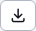
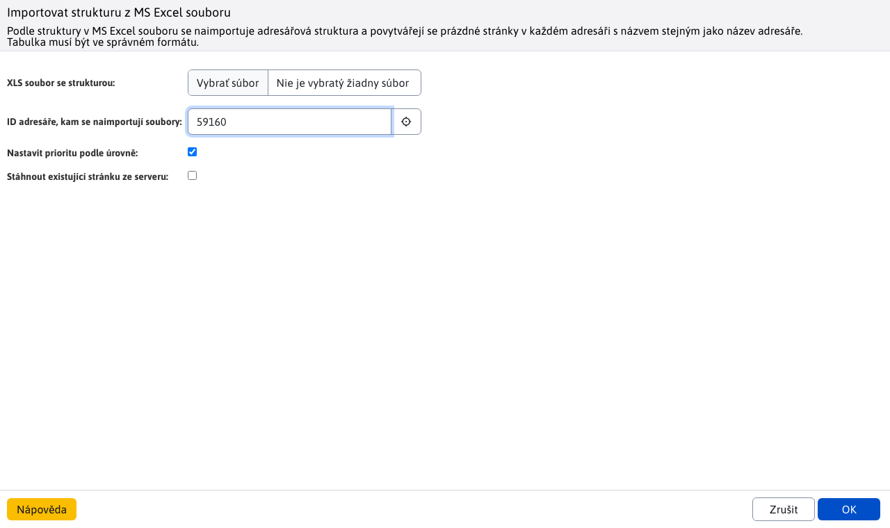

# Import a export webových stránek

Export webových stránek exportuje webové stránky včetně jejich textu, stromové struktury a vložených obrázků a souborů. Umožňuje snadný přenos obsahu mezi více instancemi systému WebJET CMS, např. mezi produkčním a testovacím prostředím. Při importu se zobrazí okno, ve kterém se porovnávají jednotlivé stránky, s možností výběru skutečně importovaných stránek. Data tak můžete před importem zkontrolovat a potvrdit.

Pokud připravujete nový web, můžete si předem připravit stromovou strukturu webu a importovat ji do systému WebJET CMS.

## Exportování webových stránek

Nejprve se ujistěte, že se nacházíte v adresáři, který chcete exportovat. Stiskněte tlačítko  a počkejte, až se zobrazí okno. Pro standardní export obsahu vyberte v tomto okně možnost **Export webových stránek do archivu ZIP (xml)** a spustit export ve vybrané větvi stromu stránek tlačítkem s textem **OK**.

Výstup by měl vypadat podobně jako na následujícím obrázku. Na samém konci výstupu se zobrazí odkaz na soubor ZIP ke stažení. Nabízený soubor stáhnete do svého počítače. Tento soubor pak budete moci použít k importu v jiném prostředí systému WebJET CMS.

## Import webových stránek z archivu ZIP

Nejprve se ujistěte, že se nacházíte v adresáři, do kterého chcete import použít. Stiskněte tlačítko  a počkejte, až se zobrazí okno. V okně vyberte možnost **Import webových stránek z archivu ZIP (xml)** a stiskněte tlačítko s textem **OK**. Budete vyzváni k nahrání souboru ZIP, který by měl být ve stejném stavu, v jakém byl exportován prostřednictvím nástroje. **Export webových stránek do archivu ZIP (xml)**. Jakékoli experimentování s jeho obsahem může vést k nesprávnému fungování importu s následkem poškození výsledného obsahu webových stránek.

Po nahrání souboru zip a potvrzení vložení klikněte na tlačítko s textem **OK** Počkejte, až systém zpracuje soubor a zobrazí srovnávací tabulku pro import.

Nad tabulkou jsou dvě zaškrtávací políčka:
- Vytvoření chybějících šablon
- Vytvoření chybějících skupin uživatelů

Jejich zaškrtnutí nechávám na zvážení, ale doporučuji je nechat zaškrtnuté.

V tabulce jsou nejprve uvedeny webové stránky, poté soubory a následně další údaje modulu, pokud byly v exportu přítomny. Tabulka obsahuje 4 sloupce:
- Vzdálená adresa - název stránky/souboru v souboru ZIP
- Stav - informace o tom, zda stejný objekt již existuje v cílovém úložišti.
- Synchronizovat - zaškrtávací políčko, které definuje synchronizaci pouze s určitými položkami ze seznamu
- Místní adresa - název a umístění stránky/souboru v cílovém úložišti (ve WebJETu, do kterého importuji).

Po projití celého seznamu a zaškrtnutí políček u položek, které chcete synchronizovat, můžete kliknout na tlačítko . **Synchronizace** v dolní části okna. Tím se data synchronizují, nový obsah se zveřejní na webových stránkách a původní soubory se přepíší novými.

Použité obrázky a soubory se také exportují na webovou stránku. Pokud je na stránce použita aplikace Banner, Galerie nebo Anketa, jsou exportována také základní data těchto aplikací. Můžete vybrat možnosti importu dat pro danou aplikaci.

## Import struktury ze souboru aplikace Excel

Před importem se ujistěte, že se nacházíte v adresáři, do kterého chcete import použít. Stiskněte tlačítko  a počkejte, až se zobrazí okno. V okně vyberte možnost **Import struktury ze souboru aplikace Excel** a stiskněte tlačítko s textem **OK**. Zobrazí se nastavení importu, které vás vyzve k zadání. `XLS` struktura souboru. Nezapomeňte, že **soubor musí být typu XLS**. Nemůže být typu `XLSX` ani `XLSM` pouze XLS. K dispozici jsou i další možnosti importu:
- ID složky, kam importovat soubory, tato možnost bude přednastavena podle dříve vybrané složky, ale lze ji změnit (změnit cílovou složku).
- Nastavení priority podle úrovně - priorita rozložení se nastavuje podle vnoření do stromové struktury, čím je stránka hlouběji, tím vyšší je číslo priority. Význam to má při vyhledávání a řazení výsledků podle priority, takže stránky nižší úrovně jsou ve výsledcích vyhledávání dříve - předpokládá se, že stránka sekce je důležitější než její podstránka.
- Stáhnout existující stránku ze serveru - u vytvořených stránek je možné stáhnout text z existujícího webu. Je také možné zadat počáteční a koncový ořezový kód HTML, podle kterého se ve staženém kódu HTML identifikuje vlastní text stránky. Stahuje se pouze samotný text bez obrázků a připojených souborů.

Po nahrání souboru a případné úpravě nastavení importu se proces spustí stisknutím tlačítka s textem **OK**. Podle struktury v souboru Excel se naimportuje adresářová struktura a v každém adresáři se vytvoří prázdné stránky se stejným názvem jako název adresáře.Jednotlivé vytvořené stránky (včetně celé adresy ve struktuře) se postupně vypisují. Vyčkejte, dokud se celý proces nedokončí a nezobrazí se zpráva o dokončení importu.

