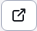

# Kontrola odkazů a prázdných stránek

> Na webových stránkách můžete po výběru složky a stisknutí tlačítka  zobrazí tabulku se seznamem nefunkčních odkazů a prázdných stránek.

Aplikace zkontroluje odkazy a webové stránky z vybrané složky a také ze všech podsložek. Výsledek se zobrazí na 3 kartách:
- Nefunkční odkazy - odkazy, které neexistují. Kontrolují se pouze místní odkazy, nikoli odkazy na externí stránky (začínající na http).
- Zakázané stránky - stránky, jejichž zobrazení je zakázáno.
- Prázdné stránky - stránky, které jsou prázdné (méně než 100 znaků, tento počet lze nastavit v proměnné conf. `linkCheckEmptyPageSize`).

Všechny karty obsahují tabulku s webovou stránkou a popisem chyby. Tabulka obsahuje sloupce:
- ID - `id` webové stránky (`docid`).
- Stránka - cesta (struktura složek) a název webové stránky. Kliknutím na odkaz zobrazíte webovou stránku pro úpravy.
- Chyba - popis chyby zjištěné při kontrole odkazu a stránky.
- Adresa URL - adresa URL nefunkčního odkazu nebo adresa URL stránky (na kartě Prázdné stránky). Kliknutím na odkaz se zobrazená Url adresa otevře v novém okně.
