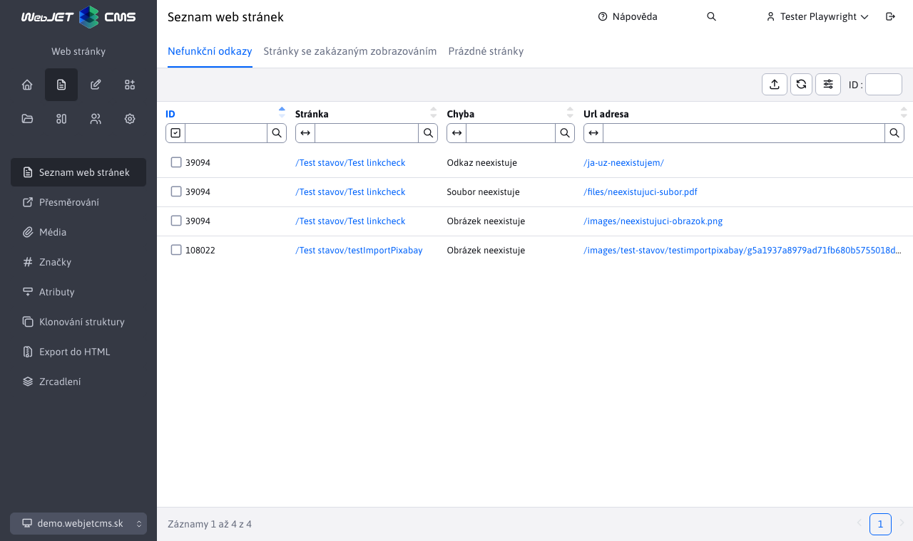

# Kontrola odkazů a prázdných stránek

> Ve web stránkách po zvolení složky a následném stisknutí tlačítka  se zobrazí tabulka s výpisem chybných odkazů a prázdných stránek.

Aplikace zkontroluje odkazy a webové stránky ze zvolené složky a také ze všech pod složek. Výsledek zobrazí ve 3 kartách:
- Nefunkční odkazy – odkazy které neexistují. Kontrolují se pouze lokální odkazy, nikoli odkazy na externí stránky (začínající na http).
- Stránky se zakázaným zobrazováním - stránky, které mají vypnuté zobrazení.
- Prázdné stránky - stránky, které jsou prázdné (mají méně než 100 znaků, tento počet lze nastavit v konf. proměnné `linkCheckEmptyPageSize`).

Všechny karty obsahují tabulku zobrazující web stránky a popis chyby. Tabulka obsahuje sloupce:
- ID - `id` webové stránky (`docid`).
- Stránka - cesta (složková struktura) a název web stránky. Klepnutím na odkaz zobrazí editace web stránky.
- Chyba - popis nalezené chyby při kontrole odkazu a stránky.
- Url adresa - URL adresa nefunkčního odkazu, nebo URL adresa stránky (v kartě Prázdné stránky). Klepnutím na odkaz se v novém okně otevře zobrazená Url adresa.
