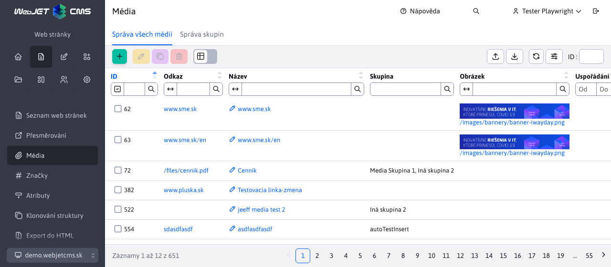

# Média

## Zobrazení ve web stránce

Média slouží k přiřazení souvisejících souborů / obrázků / odkazů k aktuální stránce.

Zobrazují se v editoru web stránek v kartě média, kde lze zadat Název, skupinu (média lze řadit do více skupin podle potřeb), linku na soubor/stránku, náhledový obrázek (je-li třeba) a prioritu uspořádání.

Média lze používat pro různé účely:
- seznam souvisejících souborů ke stránce
- seznam souvisejících stránek k aktuální stránce
- seznam audio/video souborů ke stránce (obrázky, animace, videa)

Ve stránce / šabloně je v aplikaci Média možné získat seznam médií podle ID stránky a skupiny médií.

Upozornění: aplikace média zobrazuje pouze média:
- Odkazující na existující soubor (pokud se soubor smaže médium se automaticky přestane zobrazovat).
- Vloženo dříve než je datum a čas uložení web stránky (po přidání nového média uložte web stránku pro jeho zobrazení). Umožňuje to časovat zobrazení nových médií - jednoduše je přidejte k web stránce, nastavte její časové zobrazení do budoucna a přidaná média se zobrazí až po časovém publikování web stránky.

## Správa všech médií

V menu Web stránky/Média/Správa všech médií lze vyhledávat a spravovat všechna média **napříč všemi web stránkami** v aktuálně zobrazené doméně. Při filtrování můžete do pole Web stránka zadat její název, nebo celou cestu, nebo i přímo ID stránky (docid).

Při editaci/vytváření nového média je zapotřebí zadání názvu média a výběr web stránky pomocí stromové struktury.

Zobrazení této možnosti **vyžaduje právo** "Média - Správa všech média".

## Správa média skupin

Pomocí média skupin můžete organizovat zadávaná média do skupin. Například "Soubory ke stažení" nebo "Související odkazy". Spravují se v menu Web stránky/Média/Správa skupin a **vyžadují právo** "Média - Správa skupin".

Pomocí aplikace Média následně do web stránky (nebo v šabloně např. v pravém menu, nebo pod textem web stránky) zobrazíte média web stránky podle vybrané skupiny médií.

Skupina médií může mít nastaveno omezení pro zobrazení skupiny jen v určitém adresáři web stránek.

## Implementační detaily

Všechny Média záznamy jsou filtrovány podle právě zvolené domény.

V případě záznamů z **Správa všech médií** je parametr jména tabulky nastavován na hodnotu **documents** automaticky na pozadí. Pro identifikaci zda se jedná o volání datatabulky právě z této sekce zajišťuje url parametr `isCalledFromTable=true`.
