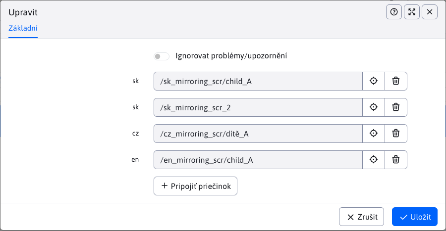

# Složky

Sekce obsahuje přehled provázaných složek pod společným synchronizačním identifikátorem `syncId`.

## Struktura tabulky

Abychom uměli v tabulce číst, musíme pochopit strukturu tabulky, kde:
- **Řádky**, každý řádek obsahují všechny složky (přesnější cesty ke složkám), které jsou navzájem provázány stejnou hodnotou parametru `syncId` (minimálně jedna složka)
- **Sloupce** se dělí následovně:
  - **SyncID**, hodnota synchronizačního identifikátoru, kterým jsou složky v řádku provázány
  - **Stav**, ikony, které upozorňují na speciální stavy (více v sekci [stav provázání](./groups#stav-provázání))
  - **cs, en, ...**, jsou automaticky generovány sloupce, kde každý sloupec obsahuje složky pro danou jazykovou mutaci. Tento jazyk se získá ze složky nebo šablony složky. Počet sloupců v tabulce se dynamicky mění a závisí na tom, v kolika jazykových mutacích provázané složky jsou. Pokud hodnota ve sloupci chybí, tak neexistuje pro daný `syncId` provázaná složka v dané jazykové mutaci.

!>**Upozornění:** v případě existence více provázaných složek se stejnou hodnotou `syncId` a ve stejné jazykové mutaci, jejich hodnoty se ve sloupci pro danou jazykovou mutaci spojí, takže hodnota ve sloupci bude obsahovat cesty k více složkám.

## Stav provázání

Sloupec **Stav** nabízí pomocí ikon rychlý přehled o stavu převázání. Podporuje následující stavy:
- <i class="ti ti-exclamation-circle" style="color: #ff4b58;" ></i>, ikona zodpovědná stavu **Špatné mapování**. Převázání složky nabude tento stav v případě objevení více provázaných složek ve stejné jazykové mutaci.
- <i class="ti ti-alert-triangle" style="color: #fabd00;" ></i>, ikona zodpovědná stavu **Nerovnoměrné vnoření**. Převázání složky nabude tento stav v případě rozdílné hloubky provázaných složek od kořenové složky.
- **nic**, žádná ikona se nezobrazuje v případě pokud provázání je korektní (nespadá do předchozích stavů)

### Špatné mapování

Jelikož provázané by měly být pouze složky se stejným obsahem pouze v jiné jazykové mutaci, nedává smysl mít provázáno více složek ve stejné jazykové mutaci. Proto se taková provázání vyhodnocují jako **špatné mapování**.

### Nerovnoměrné vnoření

Protože provázané by měly být stejné struktury, rozdílné hloubky provázaných složek indikují chybu mezi strukturami. Oproti **špatnému mapování** nemusí jít hned o chybu, taková provázání jsou označena pro lepší hledání případných chyb.

## Vymazání/zrušení převázání

Při vymazání/zrušení celého provázání zaniká stávající synchronizační parametr `syncId`, protože už nemá co provázat. Pro každou složku, která byla provázána, se provede akce **rozvázání složky**.

### Rozvázání složky

Akce rozvázání složky kaskádovitě odstraní synchronizační parametr `syncId` pro zvolenou složku jako i každou její podsložku. Tato změna se týká i stránek v těchto složkách, které také ztratí nastaven `syncId`.

## Editace provázání

Při editaci provázání se zobrazí každá provázaná složka jako výběrové pole adresáře stránek i se zkratkou jazyka jako štítkem.

Na následujícím obrázku můžeme vidět příklad **špatného mapování**, kde je provázáno více složek ve stejné jazykové mutaci, konkrétně v případě `sk` jazyka.

### Změna složek

Při editaci lze provázané složky změnit. V takovém případě bude nahrazené složce odstraněn synchronizační parametr `syncId`, na složce se vyvolá akce [rozvázání složky](./groups#rozvázání-složky) a nově zvolené složce se přidá parametr `syncId`.

Pro zvolené složky není povoleno:
- duplicitní zvolení téže složky
- zvolení složky s nastaveným `syncId` (samozřejmě jiným než právě upravované). Pokud stále budete trvat na provázání dané složky, nejprve musíte zrušit její aktuální provázání (odstranit `syncId`) a až následně jej můžete provázat s jinou složkou (přidat nové `syncId`).
- výběr více složek ve stejné jazykové mutaci (chyba [špatné mapování](./groups#špatné-mapování))
- výběr složek v různé hloubce (chyba [nerovnoměrné vnoření](./groups#nerovnoměrné-vnoření))

Každá z těchto chyb se kontroluje. Pokud se taková chyba objeví při pokusu o změnu, akce bude zablokována.

!>**Upozornění:** editor poskytuje možnost **Ignorovat problémy/upozornění**. Zvolením této možnosti víte uložit i záznamy, které obsahují chyby **špatné mapování** a **nerovnoměrné vnoření**. Tuto ochranu umíte vypnout na vlastní zodpovědnost, pokud to situace vyžaduje.

### Přidání složky

Tabulka neumožňuje vytvoření zcela nového provázání (nového `syncId`) ale umožňuje přidání (provázání) nových složek k již existujícím. V editoru při editaci záznamu se nachází tlačítko

<button id="add-sync-btn" class="btn btn-outline-secondary" onclick="showNewSelector(groupsMirroringTable)">
  <i class="ti ti-plus" ></i>

   Připojit složku 
</button>

pomocí kterého umíte přidat nová pole pro výběr adresářů stránek. Když zobrazíte maximální povolený počet polí (povolených provázání) tlačítko se skryje.

### Odstranění převázání

Akcí změny složky víte prakticky odstranit celé provázání. Tato situace nastane, když odstraníte všechny provázané složky.
